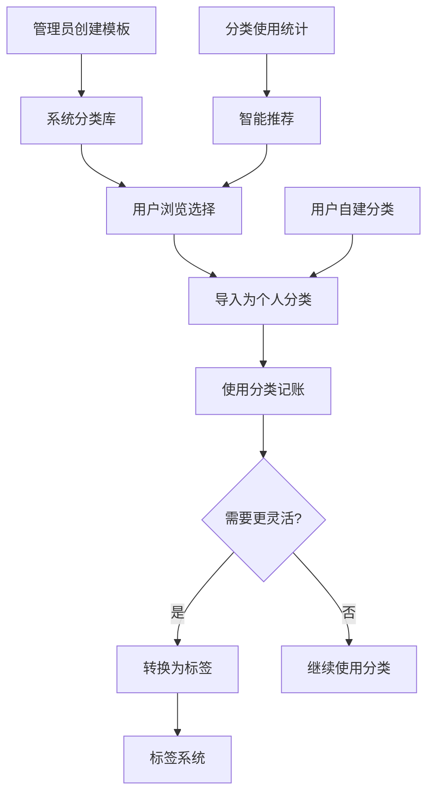

# Jive Money 分类功能设计文档 v2.0
## （增强交互功能版）

---

## 1. 概述

### 1.1 背景
Jive Money 需要一个强大而灵活的分类管理系统，支持系统预设分类、用户自定义分类，以及分类到标签的转换功能。本设计参考了 Maybe 财务管理系统的优秀实践，并结合 Jive Money 的特点进行了优化。

### 1.2 目标
- 提供完善的三层分类体系（系统模板 → 用户分类 → 标签）
- 支持分类的层级管理（父子关系）
- 实现分类到标签的灵活转换
- 提供智能分类推荐和自动分类功能
- 支持多账本分类隔离

### 1.3 核心特性
- 🏗️ **三层架构**：系统模板、用户分类、标签系统
- 🌳 **层级支持**：最多两级分类（父-子）
- 🔄 **灵活转换**：分类可转换为标签
- 🎨 **个性定制**：自定义颜色、图标、名称
- 📊 **使用统计**：追踪分类使用频率
- 🌍 **多语言**：中英文双语支持
- 📱 **跨平台**：Flutter + Rust 架构
- 🎯 **交互增强**：可点击查看交易、拖拽调整层级、批量操作

## 2. 系统架构

### 2.1 整体架构
```
┌─────────────────────────────────────────────────┐
│                  前端层 (Flutter)                 │
│  ┌──────────┐ ┌──────────┐ ┌──────────┐        │
│  │分类管理UI│ │分类库浏览│ │转换对话框│        │
│  └──────────┘ └──────────┘ └──────────┘        │
└─────────────────────────────────────────────────┘
                        ↓ API
┌─────────────────────────────────────────────────┐
│                  服务层 (Rust)                    │
│  ┌──────────────┐ ┌──────────────┐             │
│  │CategoryService│ │ConversionSvc │             │
│  └──────────────┘ └──────────────┘             │
└─────────────────────────────────────────────────┘
                        ↓
┌─────────────────────────────────────────────────┐
│                   数据层                          │
│  ┌──────────┐ ┌──────────┐ ┌──────────┐        │
│  │系统模板库│ │用户分类表│ │标签表    │        │
│  └──────────┘ └──────────┘ └──────────┘        │
└─────────────────────────────────────────────────┘
```

### 2.2 数据流程


## 3. 数据模型设计

### 3.1 系统分类模板 (system_category_templates)
```sql
CREATE TABLE system_category_templates (
    id UUID PRIMARY KEY,
    name VARCHAR(100) NOT NULL,
    name_en VARCHAR(100),
    name_zh VARCHAR(100),
    description TEXT,
    classification VARCHAR(20) NOT NULL, -- income/expense/transfer
    color VARCHAR(7) NOT NULL,
    icon VARCHAR(50),
    category_group VARCHAR(50),
    
    -- 元数据
    version VARCHAR(20),
    is_active BOOLEAN DEFAULT true,
    is_featured BOOLEAN DEFAULT false,
    global_usage_count INTEGER DEFAULT 0,
    tags TEXT[], -- 标签数组
    
    -- 审计字段
    created_by UUID,
    created_at TIMESTAMP,
    updated_at TIMESTAMP,
    
    INDEX idx_group (category_group),
    INDEX idx_classification (classification),
    INDEX idx_featured (is_featured)
);
```

### 3.2 用户分类 (user_categories)
```sql
CREATE TABLE user_categories (
    id UUID PRIMARY KEY,
    user_id UUID NOT NULL,
    ledger_id UUID NOT NULL,
    
    -- 基础信息
    name VARCHAR(100) NOT NULL,
    color VARCHAR(7) NOT NULL,
    icon VARCHAR(50),
    classification VARCHAR(20) NOT NULL,
    
    -- 层级关系
    parent_id UUID REFERENCES user_categories(id),
    position INTEGER DEFAULT 0,
    
    -- 来源追踪
    source_type VARCHAR(20), -- system/custom/imported
    template_id UUID REFERENCES system_category_templates(id),
    template_version VARCHAR(20),
    
    -- 个性化
    custom_name VARCHAR(100),
    custom_color VARCHAR(7),
    custom_icon VARCHAR(50),
    
    -- 统计
    usage_count INTEGER DEFAULT 0,
    last_used_at TIMESTAMP,
    
    -- 状态
    is_active BOOLEAN DEFAULT true,
    is_deleted BOOLEAN DEFAULT false,
    deleted_at TIMESTAMP,
    
    -- 审计
    created_at TIMESTAMP,
    updated_at TIMESTAMP,
    
    UNIQUE INDEX idx_user_ledger_name (user_id, ledger_id, name),
    INDEX idx_parent (parent_id),
    INDEX idx_usage (usage_count DESC)
);
```

### 3.3 分类组 (category_groups)
```sql
CREATE TABLE category_groups (
    id UUID PRIMARY KEY,
    key VARCHAR(50) UNIQUE NOT NULL,
    name VARCHAR(100) NOT NULL,
    name_en VARCHAR(100),
    name_zh VARCHAR(100),
    description TEXT,
    icon VARCHAR(50),
    display_order INTEGER,
    is_active BOOLEAN DEFAULT true,
    created_at TIMESTAMP,
    updated_at TIMESTAMP
);
```

### 3.4 批量操作记录 (category_batch_operations)
```sql
CREATE TABLE category_batch_operations (
    id UUID PRIMARY KEY,
    user_id UUID NOT NULL,
    operation_type VARCHAR(20) NOT NULL, -- recategorize/convert/merge
    original_data JSONB,
    affected_transactions INTEGER DEFAULT 0,
    can_revert BOOLEAN DEFAULT true,
    reverted_at TIMESTAMP,
    created_at TIMESTAMP,
    expires_at TIMESTAMP,
    
    INDEX idx_user_created (user_id, created_at DESC)
);
```

## 4. API 设计

### 4.1 系统模板 API

#### 获取模板列表
```http
GET /api/v1/category-templates
Query Parameters:
  - group: string (可选) 按组筛选
  - classification: string (可选) income/expense/transfer
  - featured: boolean (可选) 只获取推荐
  - search: string (可选) 搜索关键词
  - page: number (默认1)
  - limit: number (默认20)

Response:
{
  "data": [
    {
      "id": "uuid",
      "name": "餐饮美食",
      "name_en": "Food & Dining",
      "color": "#eb5429",
      "icon": "utensils",
      "classification": "expense",
      "group": "daily_expense",
      "is_featured": true,
      "tags": ["热门", "必备"]
    }
  ],
  "pagination": {
    "total": 100,
    "page": 1,
    "limit": 20
  }
}
```

#### 批量导入模板
```http
POST /api/v1/categories/import
Body:
{
  "template_ids": ["uuid1", "uuid2"],
  "ledger_id": "uuid",
  "options": {
    "skip_existing": true,
    "customize": [
      {
        "template_id": "uuid1",
        "custom_name": "外出就餐",
        "custom_color": "#ff0000"
      }
    ]
  }
}

Response:
{
  "imported": 5,
  "skipped": 2,
  "failed": 0,
  "categories": [...]
}
```

### 4.2 用户分类 API

#### 创建分类
```http
POST /api/v1/categories
Body:
{
  "name": "自定义分类",
  "classification": "expense",
  "color": "#6471eb",
  "icon": "tag",
  "parent_id": null,
  "ledger_id": "uuid"
}
```

#### 更新分类
```http
PUT /api/v1/categories/{id}
Body:
{
  "name": "新名称",
  "color": "#4da568",
  "position": 2
}
```

#### 获取分类列表
```http
GET /api/v1/categories
Query Parameters:
  - ledger_id: string (必需)
  - include_subcategories: boolean
  - sort_by: string (position/name/usage_count)
  - classification: string
```

#### 获取分类下的交易
```http
GET /api/v1/categories/{id}/transactions
Query Parameters:
  - date_from: string
  - date_to: string
  - sort_by: date|amount
  - sort_order: asc|desc
  - page: number
  - limit: number

Response:
{
  "transactions": [...],
  "summary": {
    "total_amount": 5000.00,
    "average_amount": 250.00,
    "transaction_count": 20,
    "date_range": {
      "from": "2024-01-01",
      "to": "2024-12-31"
    }
  },
  "pagination": {...}
}
```

### 4.3 分类转换 API

#### 转换为标签
```http
POST /api/v1/categories/{id}/convert-to-tag
Body:
{
  "tag_name": "餐饮",
  "apply_to_transactions": true,
  "delete_category": false,
  "transaction_date_range": {
    "from": "2024-01-01",
    "to": "2024-12-31"
  }
}

Response:
{
  "tag": {
    "id": "uuid",
    "name": "餐饮",
    "color": "#eb5429"
  },
  "transactions_updated": 150,
  "category_status": "retained|deleted"
}
```

#### 合并分类
```http
POST /api/v1/categories/merge
Body:
{
  "source_ids": ["uuid1", "uuid2"],
  "target_id": "uuid3",
  "merge_transactions": true,
  "delete_sources": true
}
```

#### 层级调整 API
```http
PUT /api/v1/categories/{id}/hierarchy
Body:
{
  "parent_id": "uuid|null",  // null 表示提升为主分类
  "position": 2               // 在新层级中的位置
}
```

#### 批量重分类 API
```http
POST /api/v1/transactions/batch-recategorize
Body:
{
  "transaction_ids": ["uuid1", "uuid2"],
  "target_category_id": "uuid",
  "add_tag": "原分类名",  // 可选
  "create_batch_record": true  // 创建批次记录以支持撤销
}

Response:
{
  "batch_id": "uuid",
  "affected_count": 25,
  "success": true
}
```

#### 撤销批量操作 API
```http
POST /api/v1/transactions/batch-undo/{batch_id}

Response:
{
  "reverted_count": 25,
  "success": true
}
```

## 5. 前端实现

### 5.1 核心组件

#### CategoryManagementPage
```dart
class CategoryManagementPage extends StatefulWidget {
  // 主要功能：
  // - 分类列表展示（树形结构）
  // - 拖拽排序
  // - 批量操作
  // - 搜索和筛选
  // - 使用统计展示
  // - 点击数量查看交易明细
}
```

#### CategoryLibraryDialog
```dart
class CategoryLibraryDialog extends StatefulWidget {
  // 系统模板浏览
  // - 分组展示
  // - 搜索功能
  // - 批量选择
  // - 预览和自定义
}
```

#### CategoryToTagDialog
```dart
class CategoryToTagDialog extends StatefulWidget {
  // 转换确认对话框
  // - 影响范围预览
  // - 转换选项设置
  // - 进度显示
}
```

#### CategoryTransactionsPage
```dart
class CategoryTransactionsPage extends StatefulWidget {
  final Category category;
  
  // 功能特性：
  // - 显示分类下所有交易
  // - 支持日期范围筛选
  // - 支持排序（日期/金额）
  // - 批量操作（重新分类）
  // - 统计汇总（总金额、平均值）
}
```

### 5.2 状态管理

```dart
class CategoryProvider extends ChangeNotifier {
  List<UserCategory> _categories = [];
  List<SystemCategoryTemplate> _templates = [];
  CategoryActionHistory _history = CategoryActionHistory();
  
  // 分类管理
  Future<void> loadCategories(String ledgerId);
  Future<void> createCategory(CategoryCreateRequest request);
  Future<void> updateCategory(String id, CategoryUpdateRequest request);
  Future<void> deleteCategory(String id, {DeletionOptions? options});
  
  // 模板管理
  Future<void> loadTemplates();
  Future<void> importTemplates(List<String> templateIds);
  
  // 转换功能
  Future<void> convertToTag(String categoryId, ConversionOptions options);
  Future<void> mergeCategories(List<String> sourceIds, String targetId);
  
  // 排序和层级
  void reorderCategories(int oldIndex, int newIndex);
  Future<void> updateHierarchy(CategoryHierarchyUpdate update);
  
  // 批量操作
  Future<BatchResult> batchRecategorize(BatchRecategorizeRequest request);
  Future<void> undoBatchChange(String batchId);
  
  // 交易相关
  Future<List<Transaction>> getCategoryTransactions(String categoryId, {DateRange? range});
  
  // 撤销功能
  bool get canUndo => _history.canUndo;
  Future<void> undo() => _history.undo();
}
```

## 6. 高级交互功能设计

### 6.1 分类交易明细查看

#### 功能实现
用户点击分类项的交易数量，可以直接查看该分类下的所有交易明细。

```dart
class CategoryListItem extends StatelessWidget {
  Widget build(BuildContext context) {
    return ListTile(
      title: Text(category.name),
      subtitle: Text('${category.classification}'),
      trailing: Row(
        mainAxisSize: MainAxisSize.min,
        children: [
          // 可点击的交易数量
          InkWell(
            onTap: () => _showCategoryTransactions(context),
            child: Container(
              padding: EdgeInsets.symmetric(horizontal: 12, vertical: 4),
              decoration: BoxDecoration(
                color: Colors.blue.withOpacity(0.1),
                borderRadius: BorderRadius.circular(12),
              ),
              child: Row(
                children: [
                  Icon(Icons.receipt_long, size: 16),
                  SizedBox(width: 4),
                  Text(
                    '${category.usageCount}',
                    style: TextStyle(
                      fontWeight: FontWeight.bold,
                      color: Colors.blue,
                    ),
                  ),
                ],
              ),
            ),
          ),
          PopupMenuButton(...), // 操作菜单
        ],
      ),
    );
  }
  
  void _showCategoryTransactions(BuildContext context) {
    Navigator.push(
      context,
      MaterialPageRoute(
        builder: (_) => CategoryTransactionsPage(
          category: category,
          // 支持筛选和排序
          filters: TransactionFilters(
            categoryId: category.id,
            dateRange: DateRange.lastMonth(),
          ),
        ),
      ),
    );
  }
}
```

### 6.2 分类删除验证

#### 删除策略
当分类有关联交易时，提供多种处理选项：

```dart
class CategoryDeletionDialog extends StatefulWidget {
  final Category category;
  final int transactionCount;
  
  @override
  Widget build(BuildContext context) {
    if (transactionCount == 0) {
      // 无交易，直接删除确认
      return SimpleConfirmDialog(
        title: '删除分类',
        message: '确定要删除分类"${category.name}"吗？',
        onConfirm: () => _deleteCategory(),
      );
    }
    
    // 有交易，提供选项
    return AlertDialog(
      title: Text('删除分类'),
      content: Column(
        mainAxisSize: MainAxisSize.min,
        children: [
          Text('分类"${category.name}"有 $transactionCount 笔交易'),
          SizedBox(height: 16),
          Text('请选择处理方式：'),
          
          RadioListTile(
            title: Text('移动到其他分类'),
            subtitle: Text('将交易转移到指定分类'),
            value: DeletionOption.moveToCategory,
            groupValue: _selectedOption,
            onChanged: (value) => setState(() {
              _selectedOption = value;
              _showCategorySelector = true;
            }),
          ),
          
          if (_showCategorySelector)
            CategorySelector(
              onSelected: (category) => _targetCategory = category,
              exclude: [widget.category.id],
            ),
          
          RadioListTile(
            title: Text('转换为标签'),
            subtitle: Text('创建同名标签并应用到交易'),
            value: DeletionOption.convertToTag,
            groupValue: _selectedOption,
            onChanged: (value) => setState(() {
              _selectedOption = value;
            }),
          ),
          
          RadioListTile(
            title: Text('设为未分类'),
            subtitle: Text('清除交易的分类信息'),
            value: DeletionOption.uncategorize,
            groupValue: _selectedOption,
            onChanged: (value) => setState(() {
              _selectedOption = value;
            }),
          ),
        ],
      ),
      actions: [
        TextButton(
          onPressed: () => Navigator.pop(context),
          child: Text('取消'),
        ),
        ElevatedButton(
          onPressed: _selectedOption != null ? _processDeletion : null,
          child: Text('确认删除'),
        ),
      ],
    );
  }
}
```

### 6.3 分类层级调整

#### 拖拽调整层级
支持将子分类移动成为：
- 其他父分类的子分类
- 独立的父分类
- 同级别重排序

```dart
class CategoryTreeView extends StatefulWidget {
  @override
  Widget build(BuildContext context) {
    return DragAndDropTree<Category>(
      tree: _buildTree(),
      onNodeReorder: (node, newParent, newIndex) {
        _handleReorder(node, newParent, newIndex);
      },
      nodeBuilder: (context, node) {
        return CategoryNodeWidget(
          category: node.data,
          level: node.level,
          onDragStart: () => _highlightDropTargets(node),
          onDragEnd: () => _clearHighlights(),
        );
      },
      // 拖拽规则
      canAcceptDrop: (draggedNode, targetNode) {
        // 不能拖到自己的子节点
        if (_isDescendant(targetNode, draggedNode)) return false;
        // 最多两层
        if (targetNode.level >= 1 && draggedNode.hasChildren) return false;
        // 分类类型必须一致
        if (draggedNode.data.classification != targetNode.data.classification) {
          return false;
        }
        return true;
      },
    );
  }
  
  void _handleReorder(node, newParent, newIndex) async {
    final updates = CategoryHierarchyUpdate(
      categoryId: node.data.id,
      newParentId: newParent?.data.id,
      newPosition: newIndex,
    );
    
    await categoryProvider.updateHierarchy(updates);
    
    // 显示操作反馈
    ScaffoldMessenger.of(context).showSnackBar(
      SnackBar(
        content: Text('已${newParent == null ? "提升为主分类" : "移动到${newParent.data.name}"}'),
        action: SnackBarAction(
          label: '撤销',
          onPressed: () => categoryProvider.undoLastChange(),
        ),
      ),
    );
  }
}
```

### 6.4 快速批量更改交易分类

```dart
class BatchRecategorizeDialog extends StatefulWidget {
  final Category sourceCategory;
  final List<Transaction> transactions;
  
  @override
  Widget build(BuildContext context) {
    return Dialog(
      child: Container(
        width: 600,
        child: Column(
          children: [
            // 标题栏
            AppBar(
              title: Text('批量更改分类'),
              automaticallyImplyLeading: false,
              actions: [
                IconButton(
                  icon: Icon(Icons.close),
                  onPressed: () => Navigator.pop(context),
                ),
              ],
            ),
            
            // 选择范围
            Padding(
              padding: EdgeInsets.all(16),
              child: Column(
                children: [
                  Text('从 "${sourceCategory.name}" 移动交易'),
                  SizedBox(height: 16),
                  
                  // 筛选条件
                  Row(
                    children: [
                      Expanded(
                        child: DateRangeSelector(
                          onChanged: (range) => _filterTransactions(range),
                        ),
                      ),
                      SizedBox(width: 16),
                      Chip(
                        label: Text('${_selectedTransactions.length} 笔交易'),
                        avatar: Icon(Icons.check_circle),
                      ),
                    ],
                  ),
                  
                  // 交易预览
                  Container(
                    height: 200,
                    child: ListView.builder(
                      itemCount: _selectedTransactions.length,
                      itemBuilder: (context, index) {
                        final tx = _selectedTransactions[index];
                        return CheckboxListTile(
                          title: Text(tx.description),
                          subtitle: Text('${tx.amount} - ${tx.date}'),
                          value: tx.isSelected,
                          onChanged: (value) => _toggleTransaction(tx),
                        );
                      },
                    ),
                  ),
                  
                  Divider(),
                  
                  // 目标分类选择
                  Text('移动到分类：'),
                  CategorySelector(
                    exclude: [sourceCategory.id],
                    onSelected: (category) => _targetCategory = category,
                  ),
                  
                  // 额外选项
                  CheckboxListTile(
                    title: Text('同时添加标签'),
                    subtitle: Text('为移动的交易添加原分类名作为标签'),
                    value: _addTagOption,
                    onChanged: (value) => setState(() => _addTagOption = value),
                  ),
                ],
              ),
            ),
            
            // 操作按钮
            Padding(
              padding: EdgeInsets.all(16),
              child: Row(
                mainAxisAlignment: MainAxisAlignment.end,
                children: [
                  TextButton(
                    onPressed: () => Navigator.pop(context),
                    child: Text('取消'),
                  ),
                  SizedBox(width: 16),
                  ElevatedButton.icon(
                    icon: Icon(Icons.swap_horiz),
                    label: Text('确认更改 (${_selectedTransactions.length})'),
                    onPressed: _targetCategory != null ? _processBatchChange : null,
                  ),
                ],
              ),
            ),
          ],
        ),
      ),
    );
  }
}
```

## 7. 业务逻辑实现

### 7.1 分类导入流程
```rust
async fn import_category_templates(
    &self,
    user_id: String,
    ledger_id: String,
    template_ids: Vec<String>,
    options: ImportOptions,
) -> Result<ImportResult> {
    let mut imported = 0;
    let mut skipped = 0;
    let mut categories = Vec::new();
    
    for template_id in template_ids {
        // 1. 获取模板
        let template = self.get_template(template_id).await?;
        
        // 2. 检查是否已存在
        if options.skip_existing {
            if self.category_exists(&user_id, &ledger_id, &template.name).await? {
                skipped += 1;
                continue;
            }
        }
        
        // 3. 创建用户分类
        let mut category = UserCategory::from_template(template);
        category.user_id = user_id.clone();
        category.ledger_id = ledger_id.clone();
        
        // 4. 应用自定义
        if let Some(custom) = options.get_customization(&template_id) {
            category.apply_customization(custom);
        }
        
        // 5. 保存
        let saved = self.save_category(category).await?;
        categories.push(saved);
        imported += 1;
    }
    
    Ok(ImportResult {
        imported,
        skipped,
        failed: 0,
        categories,
    })
}
```

### 7.2 分类转标签流程
```rust
async fn convert_category_to_tag(
    &self,
    category_id: String,
    options: ConversionOptions,
) -> Result<ConversionResult> {
    // 1. 获取分类信息
    let category = self.get_category(category_id).await?;
    
    // 2. 创建对应标签
    let tag = Tag {
        name: options.tag_name.unwrap_or(category.name.clone()),
        color: category.color.clone(),
        icon: category.icon.clone(),
        metadata: json!({
            "source": "category",
            "category_id": category.id,
            "converted_at": Utc::now(),
        }),
        ..Default::default()
    };
    
    let tag = self.tag_service.create_tag(tag).await?;
    
    // 3. 更新交易记录
    let mut transactions_updated = 0;
    if options.apply_to_transactions {
        let transactions = self.get_category_transactions(
            &category_id,
            options.date_range.clone(),
        ).await?;
        
        for transaction in transactions {
            self.add_tag_to_transaction(transaction.id, tag.id.clone()).await?;
            transactions_updated += 1;
        }
    }
    
    // 4. 处理原分类
    let category_status = if options.delete_category {
        self.delete_category(category_id).await?;
        CategoryStatus::Deleted
    } else {
        CategoryStatus::Retained
    };
    
    Ok(ConversionResult {
        tag,
        transactions_updated,
        category_status,
    })
}
```

### 7.3 批量删除处理
```rust
async fn delete_category_with_options(
    &self,
    category_id: String,
    options: DeletionOptions,
) -> Result<DeletionResult> {
    let category = self.get_category(category_id).await?;
    let transactions = self.get_category_transactions(&category_id, None).await?;
    
    // 创建批次记录以支持撤销
    let batch_record = BatchOperation {
        operation_type: OperationType::CategoryDeletion,
        original_data: json!({
            "category": category.clone(),
            "transactions": transactions.clone(),
            "options": options.clone(),
        }),
        affected_transactions: transactions.len() as i32,
        can_revert: true,
        expires_at: Utc::now() + chrono::Duration::hours(24),
        ..Default::default()
    };
    
    let batch_id = self.save_batch_record(batch_record).await?;
    
    match options.strategy {
        DeletionStrategy::MoveToCategory(target_id) => {
            // 批量更新交易分类
            for tx in transactions {
                self.update_transaction_category(tx.id, Some(target_id.clone())).await?;
            }
        },
        DeletionStrategy::ConvertToTag => {
            // 创建标签并应用
            let tag = self.create_tag_from_category(&category).await?;
            for tx in transactions {
                self.add_tag_to_transaction(tx.id, tag.id.clone()).await?;
                self.update_transaction_category(tx.id, None).await?;
            }
        },
        DeletionStrategy::Uncategorize => {
            // 清除分类
            for tx in transactions {
                self.update_transaction_category(tx.id, None).await?;
            }
        },
    }
    
    // 删除分类
    self.delete_category(category_id).await?;
    
    Ok(DeletionResult {
        batch_id,
        transactions_affected: transactions.len(),
        strategy_used: options.strategy,
    })
}
```

## 8. 默认分类库

### 8.1 分类组定义
```yaml
category_groups:
  - key: income
    name: 收入类别
    name_en: Income
    name_zh: 收入类别
    icon: trending-up
    order: 1
    
  - key: daily_expense
    name: 日常消费
    name_en: Daily Expenses
    name_zh: 日常消费
    icon: shopping-cart
    order: 2
    
  - key: housing
    name: 居住相关
    name_en: Housing
    name_zh: 居住相关
    icon: home
    order: 3
    
  - key: health_education
    name: 健康教育
    name_en: Health & Education
    name_zh: 健康教育
    icon: heart
    order: 4
    
  - key: entertainment_social
    name: 娱乐社交
    name_en: Entertainment & Social
    name_zh: 娱乐社交
    icon: users
    order: 5
    
  - key: financial
    name: 金融理财
    name_en: Financial
    name_zh: 金融理财
    icon: dollar-sign
    order: 6
    
  - key: business
    name: 商务办公
    name_en: Business
    name_zh: 商务办公
    icon: briefcase
    order: 7
```

### 8.2 预设分类模板（示例）
```yaml
templates:
  # 收入类
  - name: 工资收入
    name_en: Salary
    name_zh: 工资收入
    group: income
    classification: income
    color: "#10B981"
    icon: circle-dollar-sign
    is_featured: true
    tags: [必备, 常用]
    description: "月薪、年薪等固定工资收入"
    
  - name: 奖金收入
    name_en: Bonus
    name_zh: 奖金收入
    group: income
    classification: income
    color: "#059669"
    icon: award
    tags: [常用]
    description: "年终奖、绩效奖金等"
    
  # 日常消费
  - name: 餐饮美食
    name_en: Food & Dining
    name_zh: 餐饮美食
    group: daily_expense
    classification: expense
    color: "#EF4444"
    icon: utensils
    is_featured: true
    tags: [热门, 必备]
    description: "餐厅用餐、外卖、咖啡等"
    
  - name: 交通出行
    name_en: Transportation
    name_zh: 交通出行
    group: daily_expense
    classification: expense
    color: "#F97316"
    icon: car
    is_featured: true
    tags: [热门, 必备]
    description: "打车、公交、地铁、加油等"
    
  - name: 购物消费
    name_en: Shopping
    name_zh: 购物消费
    group: daily_expense
    classification: expense
    color: "#F59E0B"
    icon: shopping-cart
    is_featured: true
    tags: [热门]
    description: "服装、化妆品、日用品等购物"
    
  # 居住相关
  - name: 房租房贷
    name_en: Rent & Mortgage
    name_zh: 房租房贷
    group: housing
    classification: expense
    color: "#8B5A2B"
    icon: home
    is_featured: true
    tags: [必备]
    description: "月租、房贷还款等"
    
  - name: 水电煤气
    name_en: Utilities
    name_zh: 水电煤气
    group: housing
    classification: expense
    color: "#8B5A2B"
    icon: zap
    tags: [必备]
    description: "水费、电费、燃气费等"
    
  # 健康教育
  - name: 医疗健康
    name_en: Healthcare
    name_zh: 医疗健康
    group: health_education
    classification: expense
    color: "#DC2626"
    icon: heart-pulse
    is_featured: true
    tags: [重要]
    description: "看病、买药、体检等"
    
  - name: 教育培训
    name_en: Education
    name_zh: 教育培训
    group: health_education
    classification: expense
    color: "#0EA5E9"
    icon: graduation-cap
    tags: [重要]
    description: "学费、培训费、考试费等"
    
  # 娱乐社交
  - name: 娱乐休闲
    name_en: Entertainment
    name_zh: 娱乐休闲
    group: entertainment_social
    classification: expense
    color: "#7C3AED"
    icon: gamepad-2
    tags: [热门]
    description: "游戏、KTV、电影等娱乐"
    
  - name: 旅游度假
    name_en: Travel
    name_zh: 旅游度假
    group: entertainment_social
    classification: expense
    color: "#7C3AED"
    icon: plane
    tags: [热门]
    description: "旅游、酒店、景点门票等"
    
  # 金融理财
  - name: 投资理财
    name_en: Investment
    name_zh: 投资理财
    group: financial
    classification: expense
    color: "#059669"
    icon: trending-up
    tags: [理财]
    description: "购买股票、基金等投资"
    
  - name: 银行手续费
    name_en: Bank Fees
    name_zh: 银行手续费
    group: financial
    classification: expense
    color: "#059669"
    icon: banknote
    description: "转账费、年费等银行费用"
```

## 9. 实施计划

### Phase 1: 数据模型和基础架构（Week 1）
- [ ] **Day 1-2**: 创建数据库表结构
  - 系统分类模板表
  - 用户分类表
  - 分类组表
  - 批量操作记录表
- [ ] **Day 3-4**: 实现 Rust 领域模型
  - Category, CategoryTemplate 结构体
  - 分类服务接口定义
- [ ] **Day 5**: 搭建基础 API 框架
  - 路由定义
  - 中间件配置
- [ ] **Day 6-7**: 创建 Flutter 模型类和基础 Provider

### Phase 2: 系统模板功能（Week 2）
- [ ] **Day 1-2**: 实现模板管理 API
  - 获取模板列表
  - 模板搜索和筛选
- [ ] **Day 3**: 创建默认模板数据
  - 7大类别组数据
  - 50+ 预设分类模板
- [ ] **Day 4-5**: 开发模板浏览界面
  - 分组展示
  - 搜索功能
- [ ] **Day 6-7**: 实现模板导入功能
  - 批量选择和导入
  - 自定义选项

### Phase 3: 用户分类管理（Week 3）
- [ ] **Day 1-2**: 实现分类 CRUD API
  - 创建、读取、更新、删除
  - 层级关系处理
- [ ] **Day 3-4**: 开发分类管理界面
  - 树形结构显示
  - 分类详情编辑
- [ ] **Day 5**: 实现拖拽排序
  - SortableJS 集成
  - 位置更新API
- [ ] **Day 6-7**: 添加使用统计
  - 统计数据计算
  - 可点击查看交易明细

### Phase 4: 转换和高级功能（Week 4）
- [ ] **Day 1-2**: 实现分类转标签 API
  - 转换核心逻辑
  - 交易批量处理
- [ ] **Day 3**: 开发转换对话框
  - 选项设置界面
  - 进度显示
- [ ] **Day 4**: 实现分类合并功能
  - 合并逻辑
  - 冲突处理
- [ ] **Day 5**: 添加批量操作
  - 批量重分类
  - 批量删除
- [ ] **Day 6-7**: 实现撤销机制
  - 操作历史记录
  - 撤销API和UI

### Phase 5: 测试和优化（Week 5）
- [ ] **Day 1-2**: 单元测试
  - Rust 服务层测试
  - Flutter Widget 测试
- [ ] **Day 3**: 集成测试
  - API 端到端测试
  - 数据一致性验证
- [ ] **Day 4**: 性能优化
  - 缓存实现
  - 查询优化
- [ ] **Day 5**: 文档和发布准备
  - 用户手册
  - API 文档

## 10. 测试计划

### 10.1 单元测试
- 分类创建验证
- 模板导入逻辑
- 转换算法正确性
- 权限控制
- 层级调整逻辑
- 批量操作处理

### 10.2 集成测试
- API 端到端测试
- 数据一致性测试
- 并发操作测试
- 多账本隔离测试
- 撤销机制测试

### 10.3 UI 测试
- 分类管理流程
- 模板导入流程
- 转换操作流程
- 拖拽排序功能
- 批量操作界面

## 11. 性能指标

- 分类加载时间 < 100ms
- 模板同步时间 < 500ms
- 批量导入 100 个分类 < 2s
- 转换 1000 条交易 < 3s
- 拖拽响应时间 < 50ms
- 交易明细查询 < 200ms

## 12. 安全考虑

- 用户数据隔离
- 权限验证
- SQL 注入防护
- XSS 防护
- 数据备份机制
- 批量操作限制
- 撤销操作时限

## 13. 未来扩展

- AI 智能分类建议
- 分类使用分析报表
- 社区分享分类模板
- 分类规则引擎
- 多设备同步优化
- 分类导入导出
- 个性化分类推荐

---

**文档版本**: 2.0  
**创建日期**: 2025-01-01  
**最后更新**: 2025-01-01  
**作者**: Jive Money Team  
**审核**: 待审核  

**变更记录**:
- v1.0: 初始版本，基础分类功能设计
- v2.0: 增加交互功能，分类明细查看、删除验证、层级调整、批量操作