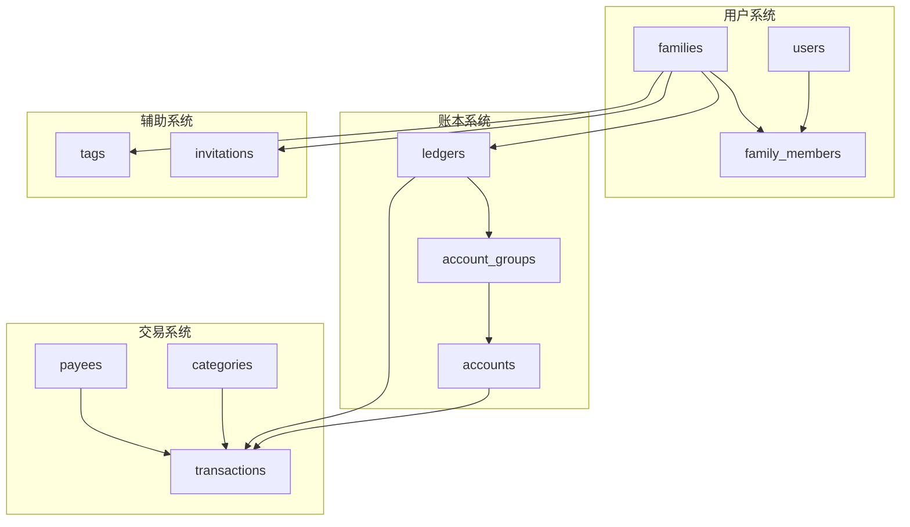

# 📚 Jive Money 数据库字典

> 版本: 1.0.0  
> 更新日期: 2025-09-06  
> 数据库: PostgreSQL 15+

## 🏗️ 数据库架构概览

Jive Money 采用**多Family架构**设计，支持一个用户账号管理多个独立的财务空间（Family）。每个Family内的数据完全隔离，用户可以在不同Family中拥有不同的角色和权限。



## 📊 核心表结构

### 1. 用户系统 (User System)

#### 1.1 users - 用户表
存储系统中所有用户的基本信息。

| 字段名 | 类型 | 约束 | 默认值 | 说明 |
|--------|------|------|--------|------|
| id | UUID | PK | gen_random_uuid() | 用户唯一标识 |
| email | VARCHAR(255) | NOT NULL, UNIQUE | - | 登录邮箱 |
| username | VARCHAR(100) | - | - | 用户名 |
| password_hash | VARCHAR(255) | NOT NULL | - | 密码哈希(Argon2) |
| full_name | VARCHAR(200) | - | - | 用户全名 |
| phone | VARCHAR(50) | - | - | 手机号码 |
| avatar_url | TEXT | - | - | 头像URL |
| email_verified | BOOLEAN | - | false | 邮箱是否已验证 |
| mfa_enabled | BOOLEAN | - | false | 是否启用双因素认证 |
| mfa_secret | VARCHAR(255) | - | - | 双因素认证密钥 |
| status | VARCHAR(20) | - | 'pending' | 账号状态(pending/active/suspended/deleted) |
| role | VARCHAR(20) | - | 'member' | 系统角色(admin/member) |
| current_family_id | UUID | FK(families) | - | 当前选中的Family |
| preferences | JSONB | - | '{}' | 用户偏好设置 |
| created_at | TIMESTAMPTZ | - | CURRENT_TIMESTAMP | 创建时间 |
| updated_at | TIMESTAMPTZ | - | CURRENT_TIMESTAMP | 更新时间 |
| last_login_at | TIMESTAMPTZ | - | - | 最后登录时间 |
| deleted_at | TIMESTAMPTZ | - | - | 软删除时间 |

**索引**：
- PRIMARY KEY: `id`
- UNIQUE: `email`
- INDEX: `current_family_id`

---

#### 1.2 families - 家庭/组织表
定义独立的财务管理空间。

| 字段名 | 类型 | 约束 | 默认值 | 说明 |
|--------|------|------|--------|------|
| id | UUID | PK | gen_random_uuid() | Family唯一标识 |
| name | VARCHAR(200) | NOT NULL | - | Family名称 |
| currency | VARCHAR(3) | - | 'CNY' | 默认货币(ISO 4217) |
| timezone | VARCHAR(50) | - | 'Asia/Shanghai' | 时区 |
| locale | VARCHAR(10) | - | 'zh-CN' | 语言地区 |
| fiscal_year_start | INTEGER | - | 1 | 财年起始月(1-12) |
| settings | JSONB | - | '{}' | Family设置 |
| created_at | TIMESTAMPTZ | - | CURRENT_TIMESTAMP | 创建时间 |
| updated_at | TIMESTAMPTZ | - | CURRENT_TIMESTAMP | 更新时间 |

**索引**：
- PRIMARY KEY: `id`

---

#### 1.3 family_members - 家庭成员表
定义用户与Family的关系，支持多对多关系。

| 字段名 | 类型 | 约束 | 默认值 | 说明 |
|--------|------|------|--------|------|
| id | UUID | PK | gen_random_uuid() | 关系唯一标识 |
| family_id | UUID | FK(families), NOT NULL | - | Family ID |
| user_id | UUID | FK(users), NOT NULL | - | 用户ID |
| role | VARCHAR(20) | - | 'member' | 角色(owner/admin/member/viewer) |
| permissions | JSONB | - | '{}' | 详细权限配置 |
| joined_at | TIMESTAMPTZ | - | CURRENT_TIMESTAMP | 加入时间 |

**索引**：
- PRIMARY KEY: `id`
- UNIQUE: `(family_id, user_id)`

**角色权限说明**：
- `owner`: 拥有者，完全控制权
- `admin`: 管理员，可管理成员和大部分设置
- `member`: 成员，可记账和查看
- `viewer`: 观察者，只读权限

---

#### 1.4 invitations - 邀请表
管理 Family 成员邀请（与 API 迁移保持一致）。

| 字段名 | 类型 | 约束 | 默认值 | 说明 |
|--------|------|------|--------|------|
| id | UUID | PK | gen_random_uuid() | 邀请唯一标识 |
| family_id | UUID | FK(families), NOT NULL | - | Family ID |
| inviter_id | UUID | FK(users), NOT NULL | - | 邀请人ID |
| invitee_email | VARCHAR(255) | NOT NULL | - | 被邀请人邮箱 |
| role | VARCHAR(20) | NOT NULL | 'member' | 预设角色(owner/admin/member/viewer) |
| invite_code | VARCHAR(50) | UNIQUE | - | 短邀请码（可选） |
| invite_token | UUID | UNIQUE | gen_random_uuid() | 邀请令牌（用于链接） |
| expires_at | TIMESTAMPTZ | NOT NULL | - | 过期时间（默认 7 天） |
| accepted_at | TIMESTAMPTZ | - | - | 接受时间 |
| accepted_by | UUID | FK(users) | - | 接受者用户ID（注册/登录后） |
| status | VARCHAR(20) | - | 'pending' | 状态(pending/accepted/expired/cancelled) |
| created_at | TIMESTAMPTZ | - | CURRENT_TIMESTAMP | 创建时间 |

**索引**：
- PRIMARY KEY: `id`
- UNIQUE: `invite_code`
- UNIQUE: `invite_token`
- INDEX: `family_id`
- INDEX: `status`
- INDEX: `expires_at`

---

### 2. 账本系统 (Ledger System)

#### 2.1 ledgers - 账本表
每个Family可以有多个账本。

| 字段名 | 类型 | 约束 | 默认值 | 说明 |
|--------|------|------|--------|------|
| id | UUID | PK | gen_random_uuid() | 账本唯一标识 |
| family_id | UUID | FK(families) | - | 所属Family |
| name | VARCHAR(255) | NOT NULL | - | 账本名称 |
| description | TEXT | - | - | 账本描述 |
| currency | VARCHAR(10) | - | 'CNY' | 账本货币 |
| created_at | TIMESTAMPTZ | NOT NULL | now() | 创建时间 |
| updated_at | TIMESTAMPTZ | NOT NULL | now() | 更新时间 |

**索引**：
- PRIMARY KEY: `id`
- INDEX: `family_id`

---

#### 2.2 account_groups - 账户组表
对账户进行分组管理。

| 字段名 | 类型 | 约束 | 默认值 | 说明 |
|--------|------|------|--------|------|
| id | UUID | PK | gen_random_uuid() | 账户组唯一标识 |
| ledger_id | UUID | FK(ledgers), NOT NULL | - | 所属账本 |
| name | VARCHAR(100) | NOT NULL | - | 组名称 |
| type | VARCHAR(50) | NOT NULL | - | 组类型(asset/liability/equity) |
| parent_id | UUID | FK(account_groups) | - | 父组ID |
| icon | VARCHAR(50) | - | - | 图标 |
| color | VARCHAR(7) | - | - | 颜色(HEX) |
| display_order | INTEGER | - | 0 | 显示顺序 |
| created_at | TIMESTAMPTZ | - | now() | 创建时间 |
| updated_at | TIMESTAMPTZ | - | now() | 更新时间 |

**索引**：
- PRIMARY KEY: `id`
- INDEX: `ledger_id`
- INDEX: `parent_id`

---

#### 2.3 accounts - 账户表
具体的资金账户。

| 字段名 | 类型 | 约束 | 默认值 | 说明 |
|--------|------|------|--------|------|
| id | UUID | PK | gen_random_uuid() | 账户唯一标识 |
| family_id | UUID | FK(families) | - | 所属Family |
| group_id | UUID | FK(account_groups), NOT NULL | - | 所属账户组 |
| name | VARCHAR(100) | NOT NULL | - | 账户名称 |
| account_number | VARCHAR(50) | - | - | 账号 |
| type | VARCHAR(50) | NOT NULL | - | 账户类型 |
| currency | VARCHAR(10) | - | 'CNY' | 账户货币 |
| initial_balance | DECIMAL(19,4) | - | 0 | 初始余额 |
| current_balance | DECIMAL(19,4) | - | 0 | 当前余额 |
| credit_limit | DECIMAL(19,4) | - | - | 信用额度 |
| bank_name | VARCHAR(100) | - | - | 银行名称 |
| bank_branch | VARCHAR(100) | - | - | 支行 |
| icon | VARCHAR(50) | - | - | 图标 |
| color | VARCHAR(7) | - | - | 颜色 |
| is_archived | BOOLEAN | - | false | 是否归档 |
| created_at | TIMESTAMPTZ | - | now() | 创建时间 |
| updated_at | TIMESTAMPTZ | - | now() | 更新时间 |

**索引**：
- PRIMARY KEY: `id`
- INDEX: `family_id`
- INDEX: `group_id`

**账户类型说明**：
- `cash`: 现金
- `checking`: 活期存款
- `savings`: 储蓄账户
- `credit_card`: 信用卡
- `investment`: 投资账户
- `loan`: 贷款账户

---

### 3. 交易系统 (Transaction System)

#### 3.1 transactions - 交易表
记录所有财务交易。

| 字段名 | 类型 | 约束 | 默认值 | 说明 |
|--------|------|------|--------|------|
| id | UUID | PK | gen_random_uuid() | 交易唯一标识 |
| family_id | UUID | FK(families) | - | 所属Family |
| account_id | UUID | FK(accounts), NOT NULL | - | 账户ID |
| ledger_id | UUID | FK(ledgers), NOT NULL | - | 账本ID |
| amount | DECIMAL(19,4) | NOT NULL | - | 金额 |
| transaction_type | VARCHAR(50) | NOT NULL | - | 交易类型(income/expense/transfer) |
| date | DATE | NOT NULL | - | 交易日期 |
| category_id | UUID | FK(categories) | - | 分类ID |
| payee_id | UUID | FK(payees) | - | 收款人ID |
| payee_name | VARCHAR(255) | - | - | 收款人名称(冗余) |
| description | TEXT | - | - | 描述 |
| notes | TEXT | - | - | 备注 |
| tags | JSONB | - | - | 标签列表 |
| location | VARCHAR(255) | - | - | 地点 |
| receipt_url | TEXT | - | - | 收据URL |
| status | VARCHAR(50) | NOT NULL | 'pending' | 状态(pending/cleared/reconciled) |
| is_recurring | BOOLEAN | - | false | 是否循环交易 |
| recurring_rule | TEXT | - | - | 循环规则 |
| created_at | TIMESTAMPTZ | NOT NULL | now() | 创建时间 |
| updated_at | TIMESTAMPTZ | NOT NULL | now() | 更新时间 |
| deleted_at | TIMESTAMPTZ | - | - | 软删除时间 |

**索引**：
- PRIMARY KEY: `id`
- INDEX: `family_id`
- INDEX: `account_id`
- INDEX: `ledger_id`
- INDEX: `category_id`
- INDEX: `payee_id`
- INDEX: `date`
- INDEX: `transaction_type`

---

#### 3.2 categories - 分类表
交易分类管理。

| 字段名 | 类型 | 约束 | 默认值 | 说明 |
|--------|------|------|--------|------|
| id | UUID | PK | gen_random_uuid() | 分类唯一标识 |
| family_id | UUID | FK(families) | - | 所属Family |
| name | VARCHAR(100) | NOT NULL | - | 分类名称 |
| type | VARCHAR(20) | NOT NULL | - | 分类类型(income/expense) |
| parent_id | UUID | FK(categories) | - | 父分类ID |
| icon | VARCHAR(50) | - | - | 图标 |
| color | VARCHAR(7) | - | - | 颜色 |
| budget_amount | DECIMAL(19,4) | - | - | 预算金额 |
| is_system | BOOLEAN | - | false | 是否系统分类 |
| is_archived | BOOLEAN | - | false | 是否归档 |
| created_at | TIMESTAMPTZ | - | now() | 创建时间 |
| updated_at | TIMESTAMPTZ | - | now() | 更新时间 |

**索引**：
- PRIMARY KEY: `id`
- INDEX: `family_id`
- INDEX: `parent_id`
- INDEX: `type`

---

#### 3.3 payees - 收款人表
管理交易对象。

| 字段名 | 类型 | 约束 | 默认值 | 说明 |
|--------|------|------|--------|------|
| id | UUID | PK | gen_random_uuid() | 收款人唯一标识 |
| family_id | UUID | FK(families) | - | 所属Family |
| name | VARCHAR(255) | NOT NULL | - | 收款人名称 |
| category_id | UUID | FK(categories) | - | 默认分类 |
| notes | TEXT | - | - | 备注 |
| is_archived | BOOLEAN | - | false | 是否归档 |
| created_at | TIMESTAMPTZ | - | now() | 创建时间 |
| updated_at | TIMESTAMPTZ | - | now() | 更新时间 |

**索引**：
- PRIMARY KEY: `id`
- INDEX: `family_id`
- INDEX: `name`

---

#### 3.4 tags - 标签表
灵活的标签系统。

| 字段名 | 类型 | 约束 | 默认值 | 说明 |
|--------|------|------|--------|------|
| id | UUID | PK | gen_random_uuid() | 标签唯一标识 |
| family_id | UUID | FK(families) | - | 所属Family |
| ledger_id | UUID | FK(ledgers) | - | 所属账本 |
| name | VARCHAR(50) | NOT NULL | - | 标签名称 |
| color | VARCHAR(7) | - | - | 颜色 |
| usage_count | INTEGER | - | 0 | 使用次数 |
| created_at | TIMESTAMPTZ | - | now() | 创建时间 |

**索引**：
- PRIMARY KEY: `id`
- INDEX: `family_id`
- INDEX: `ledger_id`
- UNIQUE: `(ledger_id, name)`

---

### 4. 其他表 (Other Tables)

#### 4.1 ledger_members - 账本成员表
账本级别的权限控制（可选）。

| 字段名 | 类型 | 约束 | 默认值 | 说明 |
|--------|------|------|--------|------|
| id | UUID | PK | gen_random_uuid() | 关系唯一标识 |
| ledger_id | UUID | FK(ledgers), NOT NULL | - | 账本ID |
| user_id | UUID | FK(users), NOT NULL | - | 用户ID |
| role | VARCHAR(20) | - | 'viewer' | 角色 |
| permissions | JSONB | - | '{}' | 权限配置 |
| created_at | TIMESTAMPTZ | - | now() | 创建时间 |

**索引**：
- PRIMARY KEY: `id`
- UNIQUE: `(ledger_id, user_id)`

---

## 🔐 权限模型

### Family级别权限

| 角色 | 查看 | 记账 | 编辑 | 删除 | 管理成员 | 管理设置 |
|------|------|------|------|------|---------|---------|
| Owner | ✅ | ✅ | ✅ | ✅ | ✅ | ✅ |
| Admin | ✅ | ✅ | ✅ | ✅ | ✅ | ⚠️ |
| Member | ✅ | ✅ | ⚠️ | ❌ | ❌ | ❌ |
| Viewer | ✅ | ❌ | ❌ | ❌ | ❌ | ❌ |

⚠️ 表示有限权限

### 数据隔离原则

1. **Family隔离**: 不同Family的数据完全隔离
2. **用户多角色**: 同一用户在不同Family可有不同角色
3. **级联删除**: 删除Family时级联删除所有相关数据
4. **软删除**: 交易等重要数据支持软删除

---

## 🚀 常用查询示例

### 获取用户的所有Family及角色
```sql
SELECT 
    f.*,
    fm.role,
    fm.joined_at,
    (f.id = u.current_family_id) as is_current
FROM families f
JOIN family_members fm ON f.id = fm.family_id
JOIN users u ON fm.user_id = u.id
WHERE fm.user_id = $1
ORDER BY fm.joined_at DESC;
```

### 获取Family的所有交易
```sql
SELECT 
    t.*,
    a.name as account_name,
    c.name as category_name,
    p.name as payee_name
FROM transactions t
LEFT JOIN accounts a ON t.account_id = a.id
LEFT JOIN categories c ON t.category_id = c.id
LEFT JOIN payees p ON t.payee_id = p.id
WHERE t.family_id = $1
  AND t.deleted_at IS NULL
ORDER BY t.date DESC, t.created_at DESC;
```

### 获取账户余额汇总
```sql
SELECT 
    ag.name as group_name,
    ag.type as group_type,
    a.name as account_name,
    a.current_balance,
    a.currency
FROM accounts a
JOIN account_groups ag ON a.group_id = ag.id
WHERE a.family_id = $1
  AND a.is_archived = false
ORDER BY ag.display_order, a.name;
```

---

## 📈 性能优化建议

1. **索引策略**
   - 所有外键字段都应建立索引
   - 常用查询条件（如date, status）建立索引
   - 复合索引用于多条件查询

2. **分区策略**
   - transactions表可按月份分区
   - 历史数据可归档到独立表

3. **缓存策略**
   - 用户权限信息缓存到Redis
   - Family设置缓存
   - 分类树结构缓存

4. **数据清理**
   - 定期清理已删除数据
   - 过期的邀请记录
   - 旧的审计日志

---

## 🔄 版本历史

| 版本 | 日期 | 说明 |
|------|------|------|
| 1.0.0 | 2025-09-06 | 初始版本，支持多Family架构 |

---

**维护者**: Jive开发团队  
**最后更新**: 2025-09-06
