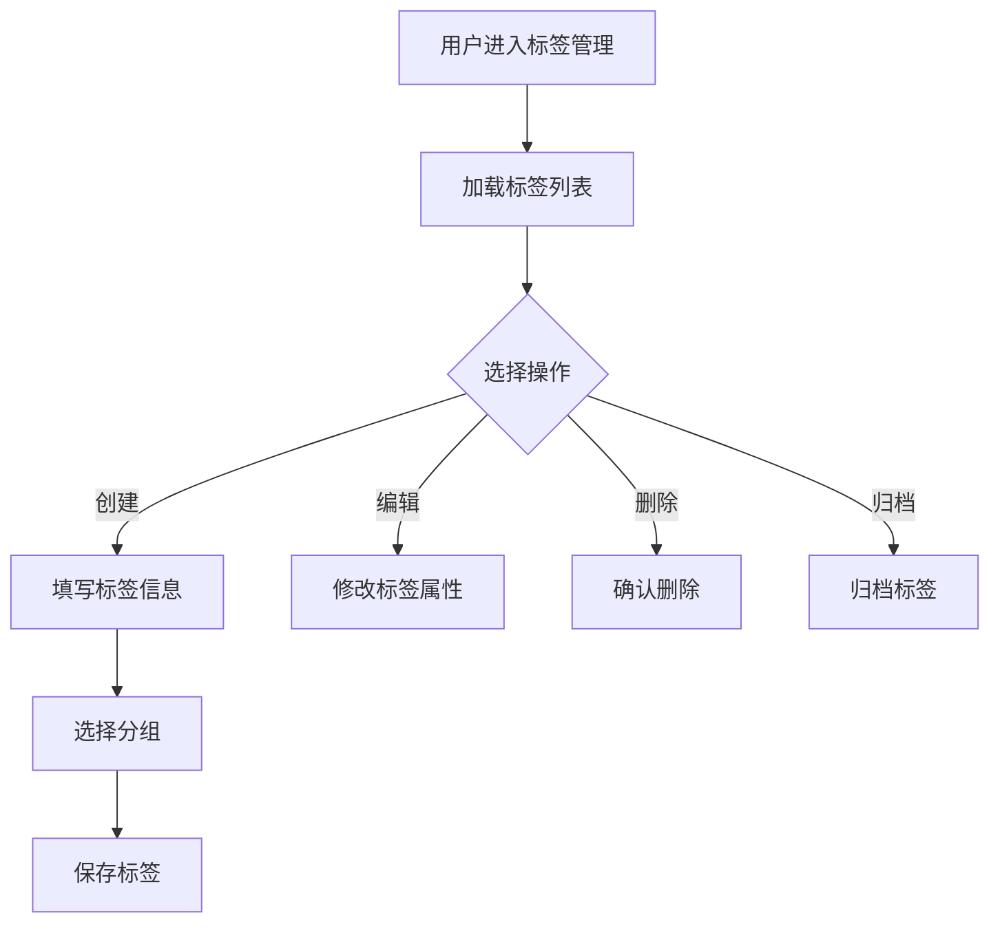
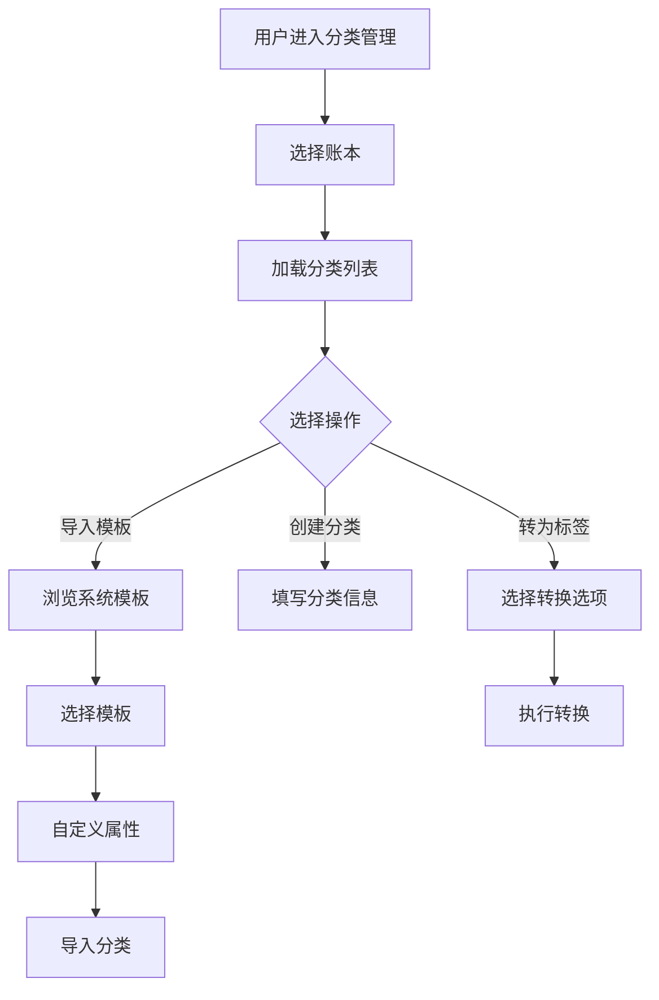
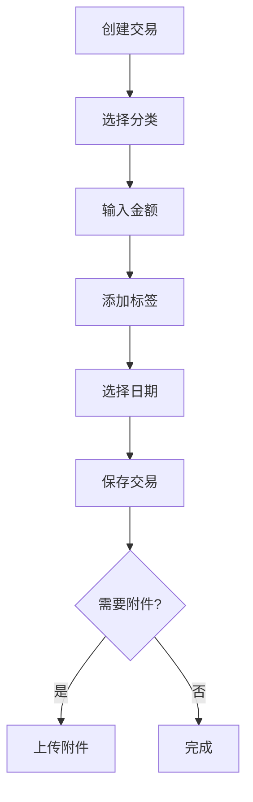

# 设计文档与实现对比分析报告

## 📅 报告日期：2025-01-06

## 📊 总体对比概览

### 已实现功能 vs 设计规划

| 功能模块 | 设计要求 | 实现状态 | 完成度 |
|---------|---------|---------|--------|
| **Family系统** | 多家庭管理 | ✅ 已实现 | 90% |
| **邀请系统** | 邀请成员加入 | ✅ 已实现 | 85% |
| **权限管理** | 角色权限控制 | ✅ 已实现 | 80% |
| **审计日志** | 操作记录追踪 | ✅ 已实现 | 75% |
| **标签管理** | 完整标签系统 | ❌ 未实现 | 0% |
| **分类管理** | 三层分类体系 | ❌ 未实现 | 0% |
| **网络同步** | 动态加载分类 | ❌ 未实现 | 0% |
| **交易管理** | 交易CRUD | ⚠️ 部分实现 | 30% |

## 🔍 详细对比分析

### 1. 标签管理系统（TAG_MANAGEMENT_SYSTEM.md）

#### 设计要求
- ✅ 标签CRUD操作
- ✅ 分组管理系统
- ✅ 智能搜索和筛选
- ✅ 数据持久化
- ✅ 实时预览
- ✅ 批量操作
- ✅ 归档管理
- ✅ 使用统计
- ✅ 响应式设计

#### 当前实现
- ❌ **完全未实现**
- 缺少Tag模型定义
- 缺少TagGroup分组系统
- 缺少标签管理页面
- 缺少智能分组选择器

#### 需要实现的核心组件
```dart
// 需要创建的文件
lib/models/tag.dart                    // 标签模型
lib/models/tag_group.dart              // 标签分组模型
lib/screens/tags/tag_management_screen.dart
lib/widgets/tag_selector.dart
lib/widgets/group_selector.dart
lib/services/tag_service.dart
lib/providers/tag_provider.dart
```

### 2. 分类管理系统（CATEGORY_FEATURE_DESIGN.md）

#### 设计要求（三层架构）
1. **系统分类模板**
   - 管理员维护
   - 全局共享
   - 版本控制
   
2. **用户分类**
   - 个人定制
   - 账本隔离
   - 层级管理（最多两层）
   
3. **标签系统**
   - 灵活标记
   - 多对多关系
   - 分类转标签功能

#### 当前实现
- ⚠️ **部分实现**
- ✅ 有基础Category模型
- ❌ 缺少系统模板层
- ❌ 缺少分类转标签功能
- ❌ 缺少批量操作
- ❌ 缺少拖拽排序
- ❌ 缺少使用统计

#### 数据库表缺失
```sql
-- 需要创建的表
system_category_templates  -- 系统模板
category_groups            -- 分类组
category_batch_operations  -- 批量操作记录
```

### 3. 网络分类加载（NETWORK_CATEGORY_DESIGN.md）

#### 设计要求
- 动态从服务器加载分类模板
- 多级缓存架构
- 离线支持
- 增量同步
- CDN图标加载

#### 当前实现
- ❌ **完全未实现**
- 缺少网络加载机制
- 缺少缓存管理
- 缺少离线支持
- 缺少CDN集成

#### 需要实现的服务
```dart
// 需要创建的服务
lib/services/network_category_service.dart
lib/services/cache_manager.dart
lib/services/offline_manager.dart
lib/utils/icon_loader.dart
```

### 4. 已实现但需完善的功能

#### Family系统
**已实现：**
- ✅ Family模型和CRUD
- ✅ 多家庭切换
- ✅ 成员管理
- ✅ 删除确认

**需完善：**
- ❌ 家庭统计信息
- ❌ 家庭设置持久化
- ❌ 家庭活动日志

#### 邀请系统
**已实现：**
- ✅ Invitation模型
- ✅ 邀请创建和接受
- ✅ 邀请管理页面
- ✅ 邀请码生成

**需完善：**
- ❌ 二维码生成
- ❌ 分享功能
- ❌ 深链接处理
- ❌ 邮件通知

#### 权限系统
**已实现：**
- ✅ PermissionService
- ✅ PermissionGuard组件
- ✅ 角色权限定义

**需完善：**
- ❌ 权限编辑界面
- ❌ 动态权限分配
- ❌ 权限审计

## 📋 需要完善的TODO项目

### 优先级1：核心功能补充（1-2周）

#### 1.1 标签管理系统
```yaml
任务清单:
  - 创建Tag和TagGroup模型
  - 实现标签CRUD API
  - 创建标签管理页面
  - 实现智能分组选择器
  - 添加标签使用统计
  - 实现标签归档功能
```

#### 1.2 分类管理系统
```yaml
任务清单:
  - 创建系统模板表结构
  - 实现模板导入功能
  - 创建分类管理页面
  - 实现分类转标签功能
  - 添加拖拽排序
  - 实现批量操作
```

### 优先级2：数据同步和网络（1周）

#### 2.1 网络分类加载
```yaml
任务清单:
  - 实现API客户端
  - 添加缓存管理
  - 实现离线支持
  - 添加CDN图标加载
  - 实现增量同步
```

#### 2.2 数据同步
```yaml
任务清单:
  - 实现本地存储服务
  - 添加同步队列
  - 实现冲突解决
  - 添加后台同步
```

### 优先级3：用户体验增强（1周）

#### 3.1 交互优化
```yaml
任务清单:
  - 添加拖拽支持
  - 实现批量选择
  - 添加搜索高亮
  - 实现快捷操作
  - 添加手势支持
```

#### 3.2 性能优化
```yaml
任务清单:
  - 实现虚拟列表
  - 添加图片缓存
  - 优化数据查询
  - 实现懒加载
  - 添加预加载
```

## 🔄 用户操作流程与API对接计划

### 1. 标签管理流程

#### 前端操作流程


#### API对接
```yaml
标签列表: GET /api/v1/tags
创建标签: POST /api/v1/tags
更新标签: PUT /api/v1/tags/{id}
删除标签: DELETE /api/v1/tags/{id}
归档标签: POST /api/v1/tags/{id}/archive
标签统计: GET /api/v1/tags/statistics
```

### 2. 分类管理流程

#### 前端操作流程


#### API对接
```yaml
模板列表: GET /api/v1/category-templates
导入模板: POST /api/v1/categories/import
分类列表: GET /api/v1/categories
创建分类: POST /api/v1/categories
转为标签: POST /api/v1/categories/{id}/convert-to-tag
批量操作: POST /api/v1/categories/batch
拖拽排序: PUT /api/v1/categories/{id}/position
```

### 3. 交易记录流程

#### 前端操作流程


#### API对接
```yaml
创建交易: POST /api/v1/transactions
更新交易: PUT /api/v1/transactions/{id}
删除交易: DELETE /api/v1/transactions/{id}
交易列表: GET /api/v1/transactions
批量分类: POST /api/v1/transactions/batch-categorize
添加标签: POST /api/v1/transactions/{id}/tags
上传附件: POST /api/v1/transactions/{id}/attachments
```

## 🏗️ 技术架构补充

### 需要添加的依赖
```yaml
dependencies:
  # 网络和缓存
  dio: ^5.3.2
  cached_network_image: ^3.3.0
  connectivity_plus: ^5.0.1
  
  # 数据持久化
  sqflite: ^2.3.0
  shared_preferences: ^2.2.1
  hive: ^2.2.18
  
  # UI增强
  flutter_slidable: ^3.0.0
  reorderables: ^0.6.0
  flutter_staggered_grid_view: ^0.7.0
  
  # 工具
  qr_flutter: ^4.1.0
  share_plus: ^7.2.1
  uni_links: ^0.5.1
```

### 状态管理架构
```dart
// Provider层级结构
RootProvider
├── AuthProvider
├── FamilyProvider
│   ├── CurrentFamilyProvider
│   └── FamilyListProvider
├── CategoryProvider
│   ├── SystemTemplateProvider
│   ├── UserCategoryProvider
│   └── CategorySyncProvider
├── TagProvider
│   ├── TagListProvider
│   └── TagGroupProvider
└── TransactionProvider
    ├── TransactionListProvider
    └── TransactionFilterProvider
```

## 💡 建议和优先级

### 立即实施（本周）
1. **创建基础模型**：Tag、TagGroup、SystemCategoryTemplate
2. **实现核心API**：标签CRUD、分类CRUD
3. **创建管理页面**：标签管理、分类管理

### 短期目标（2周内）
1. **完善交互功能**：拖拽、批量操作、搜索
2. **实现数据同步**：本地缓存、网络同步
3. **添加统计功能**：使用统计、数据分析

### 中期目标（1个月内）
1. **性能优化**：虚拟列表、懒加载、缓存优化
2. **离线支持**：完整离线功能、数据导入导出
3. **高级功能**：智能推荐、自动分类

## 📈 预期成果

完成所有功能后，Jive Money将具备：

1. **完整的财务管理体系**
   - 多家庭隔离
   - 灵活的分类和标签
   - 强大的权限控制

2. **优秀的用户体验**
   - 流畅的交互
   - 智能的推荐
   - 离线可用

3. **可扩展的架构**
   - 模块化设计
   - 清晰的API
   - 完善的测试

---

**报告状态**：✅ 完成
**下一步行动**：根据优先级开始实施标签管理系统