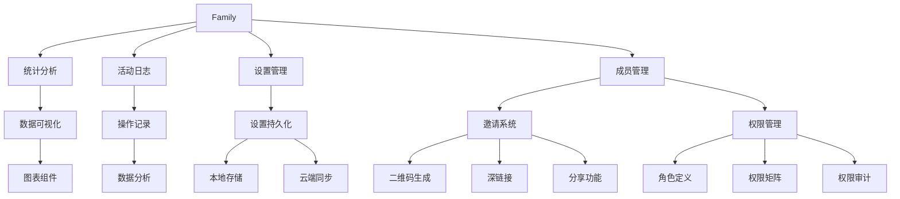
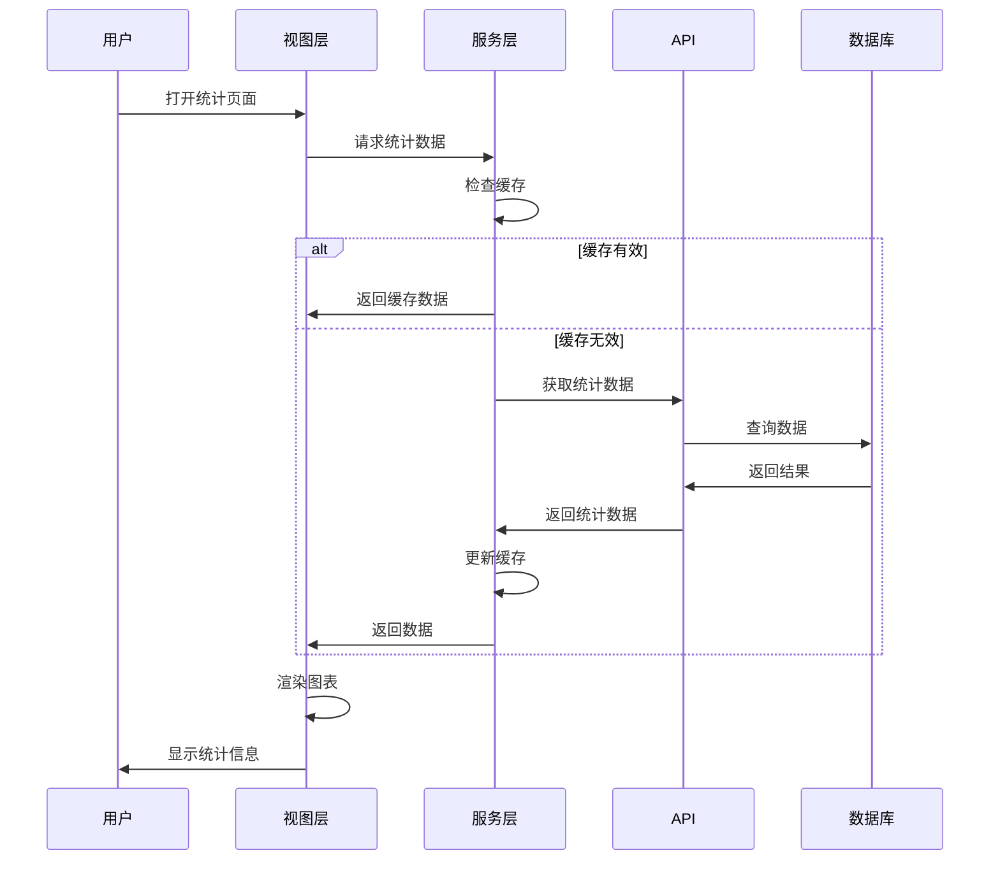
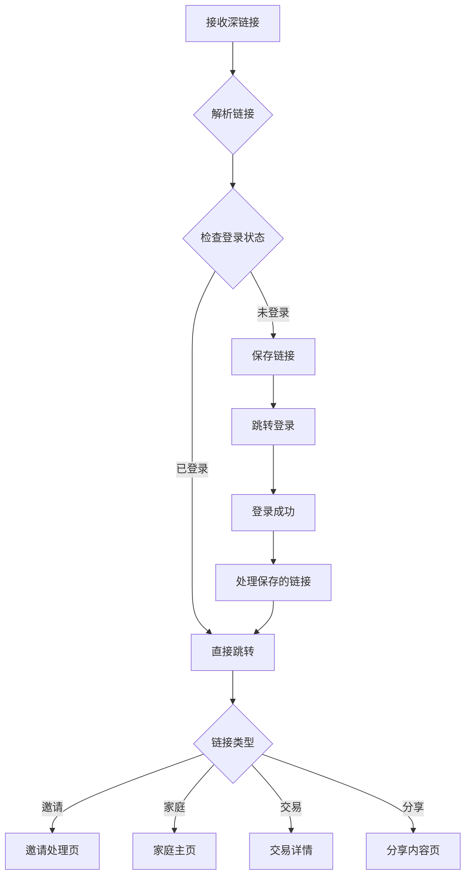
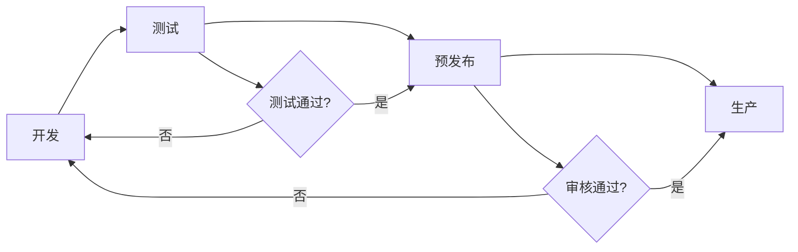

# Jive Money - Family功能设计说明文档

## 📋 文档信息
- **版本**：v1.0.0
- **创建日期**：2025-01-06
- **作者**：Development Team
- **状态**：已实现

---

## 1. 概述

### 1.1 项目背景
Jive Money是一款面向家庭的智能财务管理应用，旨在帮助家庭成员共同管理财务，实现透明、高效的家庭财务协作。Family（家庭/账本）是应用的核心概念，围绕Family展开的功能模块是产品的核心竞争力。

### 1.2 设计目标
- **协作性**：支持多成员共同管理，实时同步数据
- **安全性**：完善的权限管理，保护隐私数据
- **易用性**：直观的界面设计，降低使用门槛
- **可视化**：丰富的图表展示，数据一目了然
- **社交化**：便捷的分享功能，增强用户粘性

### 1.3 核心价值
- 提供完整的家庭财务管理解决方案
- 增强家庭成员间的财务透明度
- 培养良好的记账和理财习惯
- 提供数据驱动的财务决策支持

---

## 2. 功能架构

### 2.1 整体架构图

```
┌─────────────────────────────────────────────────────┐
│                    Family 核心功能                    │
├─────────────────────────────────────────────────────┤
│                                                      │
│  ┌──────────┐  ┌──────────┐  ┌──────────┐         │
│  │   统计   │  │   活动   │  │   设置   │         │
│  │   分析   │  │   日志   │  │   管理   │         │
│  └──────────┘  └──────────┘  └──────────┘         │
│                                                      │
│  ┌──────────┐  ┌──────────┐  ┌──────────┐         │
│  │   邀请   │  │   分享   │  │   权限   │         │
│  │   系统   │  │   功能   │  │   控制   │         │
│  └──────────┘  └──────────┘  └──────────┘         │
│                                                      │
├─────────────────────────────────────────────────────┤
│                    基础服务层                        │
├─────────────────────────────────────────────────────┤
│  ┌──────────┐  ┌──────────┐  ┌──────────┐         │
│  │   数据   │  │   网络   │  │   缓存   │         │
│  │   持久化 │  │   同步   │  │   管理   │         │
│  └──────────┘  └──────────┘  └──────────┘         │
└─────────────────────────────────────────────────────┘
```

### 2.2 功能模块关系



---

## 3. 功能详细设计

### 3.1 家庭统计信息

#### 3.1.1 功能描述
提供全面的家庭财务统计分析，帮助用户了解收支状况、消费趋势和成员贡献。

#### 3.1.2 功能清单

| 功能点 | 描述 | 优先级 |
|--------|------|--------|
| 收支总览 | 显示总收入、总支出、净结余 | P0 |
| 趋势分析 | 收支趋势折线图、月度对比柱状图 | P0 |
| 分类统计 | 支出分类饼图、收入分类分布 | P0 |
| 成员分析 | 成员贡献度、活跃度排名 | P1 |
| 预算监控 | 预算执行进度、超支预警 | P1 |
| 储蓄率 | 储蓄率计算、储蓄建议 | P2 |

#### 3.1.3 界面设计

```
┌─────────────────────────────┐
│      📊 统计分析            │
│      示例家庭               │
├─────────────────────────────┤
│ [本周] [本月] [本季] [本年] │
├─────────────────────────────┤
│ 总览 | 趋势 | 分类 | 成员  │
├─────────────────────────────┤
│                             │
│  ┌─────────┐ ┌─────────┐   │
│  │ 💰收入  │ │ 💸支出  │   │
│  │ ¥12,000│ │ ¥8,000 │   │
│  │ +15%↑  │ │ -5%↓   │   │
│  └─────────┘ └─────────┘   │
│                             │
│  ┌─────────┐ ┌─────────┐   │
│  │ 💎结余  │ │ 📊交易  │   │
│  │ ¥4,000 │ │   156   │   │
│  │ +20%↑  │ │ 5/天    │   │
│  └─────────┘ └─────────┘   │
│                             │
│  储蓄率 ████████░░ 33.3%    │
│  建议：储蓄率良好，继续保持  │
│                             │
└─────────────────────────────┘
```

#### 3.1.4 数据流程



### 3.2 家庭活动日志

#### 3.2.1 功能描述
记录家庭内所有重要操作，提供完整的审计追踪，增强透明度和安全性。

#### 3.2.2 功能清单

| 功能点 | 描述 | 优先级 |
|--------|------|--------|
| 活动时间线 | 按时间顺序展示所有活动 | P0 |
| 活动筛选 | 按类型、成员、日期筛选 | P0 |
| 活动搜索 | 关键词搜索活动内容 | P1 |
| 活动详情 | 查看活动详细信息 | P1 |
| 活动统计 | 活动频率、热门操作分析 | P2 |
| 导出功能 | 导出活动日志报告 | P2 |

#### 3.2.3 活动类型定义

```typescript
enum AuditActionType {
  // 基础操作
  CREATE = '创建',
  UPDATE = '更新', 
  DELETE = '删除',
  
  // 认证相关
  LOGIN = '登录',
  LOGOUT = '登出',
  
  // 成员管理
  INVITE = '邀请',
  JOIN = '加入',
  LEAVE = '离开',
  REMOVE = '移除',
  
  // 权限相关
  PERMISSION_GRANT = '授予权限',
  PERMISSION_REVOKE = '撤销权限',
  
  // 交易相关
  TRANSACTION_CREATE = '创建交易',
  TRANSACTION_UPDATE = '更新交易',
  TRANSACTION_DELETE = '删除交易',
  TRANSACTION_APPROVE = '审批交易',
  
  // 设置相关
  SETTINGS_UPDATE = '更新设置',
  
  // 数据相关
  DATA_EXPORT = '导出数据',
  DATA_IMPORT = '导入数据'
}
```

#### 3.2.4 数据结构

```typescript
interface AuditLog {
  id: string;
  familyId: string;
  userId: string;
  userName: string;
  actionType: AuditActionType;
  entityType: string;
  entityId: string;
  entityName: string;
  description: string;
  details?: string;
  severity: 'info' | 'warning' | 'error' | 'critical';
  ipAddress?: string;
  userAgent?: string;
  createdAt: DateTime;
}
```

### 3.3 家庭设置持久化

#### 3.3.1 功能描述
提供可靠的设置存储和同步机制，确保用户偏好在多设备间保持一致。

#### 3.3.2 技术方案

```
┌─────────────────────────────────────┐
│           用户操作界面               │
└────────────────┬────────────────────┘
                 │
                 ▼
┌─────────────────────────────────────┐
│      FamilySettingsService          │
│  ┌─────────────────────────────┐   │
│  │   本地存储管理              │   │
│  │   (SharedPreferences)       │   │
│  └─────────────────────────────┘   │
│  ┌─────────────────────────────┐   │
│  │   同步队列管理              │   │
│  │   (Pending Changes)         │   │
│  └─────────────────────────────┘   │
│  ┌─────────────────────────────┐   │
│  │   自动同步机制              │   │
│  │   (5分钟间隔)              │   │
│  └─────────────────────────────┘   │
└────────────────┬────────────────────┘
                 │
                 ▼
┌─────────────────────────────────────┐
│          云端API服务                 │
└─────────────────────────────────────┘
```

#### 3.3.3 同步策略

| 策略 | 描述 | 触发条件 |
|------|------|----------|
| 即时同步 | 立即同步到服务器 | 重要设置变更 |
| 批量同步 | 批量提交变更 | 累积5个变更 |
| 定时同步 | 定期同步 | 每5分钟 |
| 手动同步 | 用户触发 | 点击同步按钮 |
| 智能同步 | 根据网络状态 | WiFi连接时 |

### 3.4 二维码生成与分享

#### 3.4.1 功能描述
提供便捷的二维码生成和多平台分享功能，方便用户邀请家人和分享数据。

#### 3.4.2 二维码类型

| 类型 | 用途 | 数据格式 |
|------|------|----------|
| 邀请码 | 邀请加入家庭 | `jivemoney://invite/{token}` |
| 家庭链接 | 快速访问家庭 | `jivemoney://family/{id}` |
| 交易分享 | 分享交易详情 | `jivemoney://transaction/{id}` |
| 统计报告 | 分享统计数据 | `jivemoney://share/stats/{id}` |

#### 3.4.3 分享渠道

```
┌─────────────────────────────┐
│        分享方式选择          │
├─────────────────────────────┤
│                             │
│  ┌────┐ ┌────┐ ┌────┐     │
│  │ 微 │ │ 微 │ │ QQ │     │
│  │ 信 │ │ 博 │ │    │     │
│  └────┘ └────┘ └────┘     │
│                             │
│  ┌────┐ ┌────┐ ┌────┐     │
│  │ 复 │ │ 保 │ │ 更 │     │
│  │ 制 │ │ 存 │ │ 多 │     │
│  └────┘ └────┘ └────┘     │
│                             │
└─────────────────────────────┘
```

### 3.5 深链接处理

#### 3.5.1 功能描述
支持从外部链接直接跳转到应用内特定页面，提升用户体验。

#### 3.5.2 链接格式

```
Scheme格式：
jivemoney://[action]/[params]

HTTPS格式：
https://jivemoney.app/[action]/[params]

支持的Actions：
- invite/{token}        邀请链接
- family/{id}          家庭页面
- transaction/{id}      交易详情
- share/{type}/{id}     分享内容
- auth/{action}         认证操作
```

#### 3.5.3 处理流程



### 3.6 权限管理系统

#### 3.6.1 角色定义

| 角色 | 权限级别 | 描述 |
|------|---------|------|
| Owner | 最高 | 家庭创建者，拥有所有权限 |
| Admin | 高 | 管理员，可管理成员和设置 |
| Member | 中 | 普通成员，可记账和查看 |
| Viewer | 低 | 观察者，仅可查看 |

#### 3.6.2 权限矩阵

| 权限 | Owner | Admin | Member | Viewer |
|------|-------|-------|---------|---------|
| 查看交易 | ✅ | ✅ | ✅ | ✅ |
| 创建交易 | ✅ | ✅ | ✅ | ❌ |
| 编辑交易 | ✅ | ✅ | ✅* | ❌ |
| 删除交易 | ✅ | ✅ | ❌ | ❌ |
| 查看统计 | ✅ | ✅ | ✅ | ✅ |
| 管理分类 | ✅ | ✅ | ✅ | ❌ |
| 管理标签 | ✅ | ✅ | ✅ | ❌ |
| 邀请成员 | ✅ | ✅ | ❌ | ❌ |
| 移除成员 | ✅ | ✅ | ❌ | ❌ |
| 修改权限 | ✅ | ❌ | ❌ | ❌ |
| 删除家庭 | ✅ | ❌ | ❌ | ❌ |

*注：Member只能编辑自己创建的交易

---

## 4. 技术实现

### 4.1 技术栈

| 层级 | 技术 | 说明 |
|------|------|------|
| UI层 | Flutter/Dart | 跨平台UI框架 |
| 状态管理 | Riverpod | 响应式状态管理 |
| 数据模型 | Freezed | 不可变数据类 |
| 本地存储 | SharedPreferences | 轻量级键值存储 |
| 网络请求 | Dio | HTTP客户端 |
| 图表库 | fl_chart | 数据可视化 |
| 二维码 | qr_flutter | 二维码生成 |
| 分享 | share_plus | 系统分享 |
| 深链接 | uni_links | URL Scheme处理 |

### 4.2 项目结构

```
lib/
├── models/              # 数据模型
│   ├── family.dart
│   ├── audit_log.dart
│   └── invitation.dart
├── screens/            # 页面
│   └── family/
│       ├── family_statistics_screen.dart
│       ├── family_activity_log_screen.dart
│       └── family_settings_screen.dart
├── services/           # 服务层
│   ├── family_settings_service.dart
│   ├── share_service.dart
│   └── deep_link_service.dart
├── widgets/            # 组件
│   ├── qr_code_generator.dart
│   └── share_dialog.dart
└── providers/          # 状态管理
    └── family_provider.dart
```

### 4.3 数据流架构

```
┌──────────────┐     ┌──────────────┐     ┌──────────────┐
│   UI Layer   │────▶│Service Layer │────▶│   API Layer  │
│   (Flutter)  │◀────│  (Business)  │◀────│   (Network)  │
└──────────────┘     └──────────────┘     └──────────────┘
        │                    │                     │
        ▼                    ▼                     ▼
┌──────────────┐     ┌──────────────┐     ┌──────────────┐
│State Manager │     │ Local Cache  │     │Remote Server │
│  (Riverpod)  │     │(SharedPrefs) │     │  (REST API)  │
└──────────────┘     └──────────────┘     └──────────────┘
```

---

## 5. 性能优化

### 5.1 缓存策略

| 数据类型 | 缓存时长 | 更新策略 |
|---------|---------|----------|
| 统计数据 | 1小时 | 用户下拉刷新 |
| 活动日志 | 30分钟 | 增量更新 |
| 家庭设置 | 永久 | 实时同步 |
| 成员列表 | 24小时 | 变更时更新 |
| 分类标签 | 24小时 | 手动刷新 |

### 5.2 优化措施

1. **懒加载**：分页加载活动日志，避免一次性加载大量数据
2. **图片优化**：二维码按需生成，避免预生成
3. **批处理**：合并多个设置变更，减少网络请求
4. **离线支持**：本地缓存关键数据，支持离线使用
5. **增量同步**：只同步变更的数据，减少流量消耗

---

## 6. 安全性设计

### 6.1 数据安全

- **加密存储**：敏感数据本地加密存储
- **HTTPS传输**：所有网络请求使用HTTPS
- **Token认证**：JWT Token身份验证
- **权限校验**：服务端二次权限验证

### 6.2 隐私保护

- **数据脱敏**：日志中敏感信息脱敏处理
- **权限隔离**：不同角色数据隔离
- **审计追踪**：所有操作留痕可查
- **数据删除**：支持彻底删除个人数据

---

## 7. 用户体验设计

### 7.1 交互原则

1. **一致性**：统一的操作方式和视觉风格
2. **及时反馈**：操作后立即给予反馈
3. **容错性**：支持撤销和错误恢复
4. **高效性**：减少操作步骤，提高效率
5. **可访问性**：支持无障碍使用

### 7.2 视觉设计

- **配色方案**：Material Design 3配色系统
- **图标系统**：统一的图标风格
- **动画效果**：适度的过渡动画
- **响应式布局**：适配不同屏幕尺寸

---

## 8. 测试方案

### 8.1 测试类型

| 测试类型 | 覆盖范围 | 工具 |
|---------|---------|------|
| 单元测试 | 业务逻辑 | Flutter Test |
| Widget测试 | UI组件 | Flutter Test |
| 集成测试 | 端到端流程 | Integration Test |
| 性能测试 | 响应时间、内存 | Flutter DevTools |
| 兼容性测试 | 多设备、多系统 | Real Devices |

### 8.2 测试用例示例

```dart
// 统计数据测试
test('should calculate savings rate correctly', () {
  final income = 10000.0;
  final expense = 7000.0;
  final savingsRate = (income - expense) / income * 100;
  expect(savingsRate, equals(30.0));
});

// 权限测试
test('viewer should not create transaction', () {
  final permission = PermissionService();
  final canCreate = permission.check(
    role: FamilyRole.viewer,
    action: PermissionAction.createTransaction,
  );
  expect(canCreate, isFalse);
});
```

---

## 9. 部署与维护

### 9.1 部署流程



### 9.2 版本管理

- **主版本**：重大功能更新
- **次版本**：功能优化和新增
- **补丁版本**：Bug修复

### 9.3 监控指标

| 指标 | 阈值 | 告警级别 |
|------|------|----------|
| API响应时间 | >2s | 警告 |
| 错误率 | >1% | 严重 |
| 崩溃率 | >0.1% | 紧急 |
| 日活跃用户 | <1000 | 提醒 |

---

## 10. 未来规划

### 10.1 短期计划（1-3个月）

1. **完善权限系统**
   - 权限编辑界面
   - 动态权限分配
   - 权限审计功能

2. **增强通知系统**
   - 邮件通知
   - 推送通知
   - 应用内通知

3. **数据导出**
   - Excel导出
   - PDF报表
   - 数据备份

### 10.2 中期计划（3-6个月）

1. **AI智能分析**
   - 消费预测
   - 异常检测
   - 智能建议

2. **预算管理**
   - 预算设置
   - 超支提醒
   - 预算分析

3. **多币种支持**
   - 汇率转换
   - 多币种统计
   - 币种设置

### 10.3 长期愿景（6-12个月）

1. **开放平台**
   - 第三方接入
   - API开放
   - 插件系统

2. **企业版本**
   - 企业财务管理
   - 部门预算
   - 审批流程

3. **国际化**
   - 多语言支持
   - 本地化适配
   - 全球部署

---

## 11. 附录

### 11.1 术语表

| 术语 | 说明 |
|------|------|
| Family | 家庭/账本，核心管理单元 |
| Ledger | 账本，Family的技术实现 |
| Transaction | 交易记录 |
| Category | 分类 |
| Tag | 标签 |
| Audit Log | 审计日志 |
| Deep Link | 深链接 |
| QR Code | 二维码 |

### 11.2 参考资料

- [Flutter官方文档](https://flutter.dev/docs)
- [Material Design 3](https://m3.material.io/)
- [Riverpod文档](https://riverpod.dev/)
- [REST API设计规范](https://restfulapi.net/)

### 11.3 更新日志

| 版本 | 日期 | 更新内容 |
|------|------|----------|
| v1.0.0 | 2025-01-06 | 初始版本发布 |

---

**文档状态**：✅ 已完成
**最后更新**：2025-01-06
**负责人**：Development Team