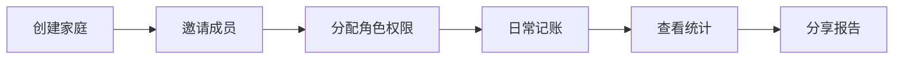

# Family功能用户操作指南

## 📱 功能入口导航图

```
应用主界面
├── 底部导航栏
│   └── 家庭 Tab
│       ├── 家庭列表
│       └── 家庭卡片 → 点击进入家庭详情
│           ├── 统计按钮 → 家庭统计界面
│           ├── 设置按钮 → 家庭设置界面
│           └── 更多菜单
│               ├── 活动日志
│               ├── 权限管理
│               └── 分享家庭
```

## 🎯 核心功能操作流程

### 1. 家庭统计功能

**入口路径**：
```
家庭列表 → 选择家庭 → 点击"统计"图标
```

**操作流程**：
1. 在家庭主页点击右上角的 📊 统计图标
2. 进入统计界面，默认显示"总览"标签
3. 可切换查看4个标签页：
   - **总览**：查看收支概况、预算执行、储蓄率
   - **趋势**：查看收支趋势图、月度对比
   - **分类**：查看各分类支出占比饼图
   - **成员**：查看成员贡献度和活跃度排名
4. 点击右上角可选择时间范围（本月/本季/本年）
5. 点击分享按钮可生成统计报告图片分享

**使用场景**：
- 月末查看家庭财务状况
- 分析支出结构优化预算
- 了解家庭成员消费习惯

---

### 2. 家庭活动日志

**入口路径**：
```
家庭设置 → 活动日志
或
家庭详情页 → 更多菜单 → 活动日志
```

**操作流程**：
1. 进入活动日志界面，显示时间线视图
2. 默认显示最近30天的活动
3. 使用筛选功能：
   - 点击筛选图标 🔽
   - 选择活动类型（交易/成员/设置变更）
   - 选择特定成员
   - 设置日期范围
4. 点击活动条目查看详情
5. 下拉刷新获取最新活动

**使用场景**：
- 追踪谁添加了什么交易
- 查看成员加入/退出记录
- 审核权限变更历史

---

### 3. 邀请成员（含二维码）

**入口路径**：
```
家庭设置 → 成员管理 → 邀请成员
```

**操作流程**：
1. 点击"邀请成员"按钮
2. 选择邀请方式：
   
   **方式一：邀请码**
   - 选择角色（管理员/成员/观察者）
   - 设置有效期（1天/7天/30天）
   - 生成邀请码
   - 复制邀请码发送给对方
   
   **方式二：二维码**
   - 生成邀请后点击"二维码"图标
   - 显示二维码弹窗
   - 对方扫码自动加入
   - 可保存二维码图片或分享
   
   **方式三：链接邀请**
   - 点击"分享"按钮
   - 选择分享平台（微信/QQ/复制链接）
   - 对方点击链接自动跳转应用

3. 被邀请者操作：
   - 收到邀请码：在应用内输入
   - 收到二维码：使用应用扫码功能
   - 收到链接：点击自动打开应用

**使用场景**：
- 面对面快速邀请（二维码）
- 远程邀请家人（邀请码/链接）
- 批量邀请（生成多个邀请码）

---

### 4. 权限管理

**入口路径**：
```
家庭设置 → 权限管理
或
成员列表 → 长按成员 → 管理权限
```

**操作流程**：

#### 4.1 权限编辑
1. 进入权限管理界面
2. 左侧显示角色列表：
   - 系统角色（拥有者/管理员/成员/观察者）
   - 自定义角色（如有）
3. 选择要编辑的角色
4. 右侧显示权限矩阵，按分类展示：
   - 交易管理
   - 预算管理
   - 成员管理
   - 分类管理
   - 报表统计
   - 系统设置
5. 勾选/取消权限项
6. 点击保存按钮应用更改

#### 4.2 创建自定义角色
1. 点击"创建角色"按钮
2. 输入角色名称（如：财务专员）
3. 选择基础角色模板
4. 自定义权限配置
5. 保存新角色

#### 4.3 临时权限授予
1. 选择成员 → 临时权限
2. 选择要授予的权限
3. 设置有效时长（1小时/1天/1周）
4. 输入授权理由
5. 确认授予

**使用场景**：
- 新成员加入时分配合适角色
- 临时授权他人处理特定事务
- 定期审查和调整权限设置

---

### 5. 权限审计

**入口路径**：
```
家庭设置 → 权限管理 → 审计日志
```

**操作流程**：
1. 进入审计界面，有4个标签页：
   
   **变更历史**：
   - 查看所有权限变更记录
   - 包含操作者、时间、变更内容
   - 点击展开查看详细信息
   
   **使用分析**：
   - 查看权限使用频率图表
   - 用户活跃度排名
   - 权限使用趋势
   
   **异常检测**：
   - 自动检测异常权限使用
   - 显示风险等级（高/中/低）
   - 提供处理建议
   
   **合规报告**：
   - 查看合规评分（0-100）
   - 合规项检查清单
   - 发现的问题和建议

2. 使用筛选功能：
   - 设置日期范围
   - 选择特定用户
   - 筛选事件类型

3. 导出审计报告（PDF/Excel）

**使用场景**：
- 定期安全审查
- 异常行为调查
- 合规性检查

---

### 6. 分享功能

**入口路径**：
多个入口，根据分享内容不同

**操作流程**：

#### 6.1 分享统计报告
1. 在统计界面点击分享图标
2. 选择分享内容：
   - 当前视图截图
   - 完整报告
   - 自定义时间段
3. 选择分享方式：
   - 生成图片分享
   - 生成PDF文档
   - 直接分享数据

#### 6.2 分享家庭邀请
1. 生成邀请码后点击分享
2. 选择分享平台：
   - 微信（好友/朋友圈）
   - QQ
   - 微博
   - 复制链接
3. 自动生成分享文案和链接

#### 6.3 分享交易记录
1. 在交易详情页点击分享
2. 选择分享格式：
   - 文字描述
   - 带图片卡片
   - 详细清单

**使用场景**：
- 月度账单分享给家人
- 邀请新成员加入
- 展示理财成果

---

### 7. 深链接使用

**支持的链接格式**：
```
jivemoney://invite/{邀请码}      - 加入家庭
jivemoney://family/{家庭ID}      - 打开家庭
jivemoney://transaction/{交易ID}  - 查看交易
jivemoney://share/{类型}/{ID}    - 分享内容
```

**操作流程**：
1. **接收链接**：
   - 点击分享的链接
   - 自动唤起应用
   - 跳转到对应页面
   
2. **处理邀请链接**：
   - 点击邀请链接
   - 自动打开加入家庭页面
   - 确认加入信息
   - 完成加入流程

**使用场景**：
- 快速定位到特定内容
- 简化邀请加入流程
- 跨平台内容分享

---

### 8. 邮件通知设置

**入口路径**：
```
个人设置 → 通知设置 → 邮件通知
```

**操作流程**：
1. 开启邮件通知总开关
2. 配置通知类型：
   - ✅ 家庭邀请
   - ✅ 交易提醒
   - ✅ 预算超支警告
   - ✅ 周报/月报
   - ✅ 成员变动
3. 设置通知频率：
   - 实时
   - 每日汇总
   - 每周汇总
4. 管理订阅状态

**邮件类型**：
- **邀请邮件**：收到家庭邀请时
- **周报邮件**：每周一早上9点
- **预算提醒**：使用超过80%时
- **重要变更**：权限或成员变动

**使用场景**：
- 及时了解家庭财务动态
- 预算超支预警
- 定期财务总结

---

## 🔄 典型使用流程

### 场景一：创建并管理家庭账本



1. **创建家庭**：设置名称、币种、时区
2. **邀请成员**：生成邀请码或二维码
3. **分配权限**：根据成员职责分配合适角色
4. **日常使用**：记录收支、查看报表
5. **定期审查**：查看活动日志、权限审计
6. **分享成果**：生成月度报告分享

### 场景二：新成员加入流程


1. **接收邀请**：通过二维码、邀请码或链接
2. **加入家庭**：确认家庭信息和角色
3. **初始设置**：配置个人偏好和通知
4. **熟悉功能**：查看统计、添加交易
5. **权限提升**：根据需要申请更多权限

### 场景三：月度财务回顾


1. **查看总览**：本月收支情况、预算执行率
2. **分析趋势**：对比上月变化
3. **分类分析**：找出主要支出类别
4. **成员贡献**：了解各成员记账情况
5. **生成报告**：导出PDF或图片
6. **家庭讨论**：分享报告，制定下月计划

---

## 💡 使用技巧

### 快捷操作
- **长按** 家庭卡片快速进入设置
- **下拉** 刷新获取最新数据
- **左滑** 交易条目快速编辑/删除
- **双击** 统计图表查看详细数据

### 最佳实践
1. **权限设置**：
   - 给予最小必要权限
   - 定期审查权限设置
   - 使用临时权限处理特殊需求

2. **邀请管理**：
   - 设置合理的邀请有效期
   - 邀请后及时分配正确角色
   - 定期清理无效邀请

3. **数据安全**：
   - 定期查看审计日志
   - 关注异常检测提醒
   - 及时处理安全问题

4. **通知设置**：
   - 避免通知过载
   - 重要事项开启实时通知
   - 次要信息使用汇总通知

---

## 🆘 常见问题

### Q1: 如何修改成员权限？
**A**: 家庭设置 → 成员管理 → 点击成员 → 修改角色 或 家庭设置 → 权限管理 → 选择角色 → 编辑权限

### Q2: 邀请码过期了怎么办？
**A**: 重新生成新的邀请码，旧邀请码会自动失效

### Q3: 如何查看谁删除了交易？
**A**: 家庭设置 → 活动日志 → 筛选"交易删除"类型

### Q4: 能否撤销已授予的权限？
**A**: 可以，进入权限管理界面，选择对应角色或成员，取消相应权限并保存

### Q5: 如何导出家庭财务数据？
**A**: 统计界面 → 更多菜单 → 导出报告 → 选择格式（PDF/Excel）

### Q6: 深链接无法打开怎么办？
**A**: 确保应用已安装最新版本，检查默认应用设置，允许从浏览器打开

### Q7: 邮件通知收不到？
**A**: 检查垃圾邮件文件夹，确认邮箱地址正确，检查通知设置是否开启

### Q8: 如何处理权限审计中的异常？
**A**: 查看异常详情 → 按照建议处理 → 必要时撤销可疑权限 → 通知相关成员

---

## 📞 需要帮助？

- **应用内帮助**：设置 → 帮助中心
- **在线文档**：https://jivemoney.com/help
- **客服邮箱**：support@jivemoney.com
- **用户社区**：https://community.jivemoney.com

---

*最后更新：2025-01-07*