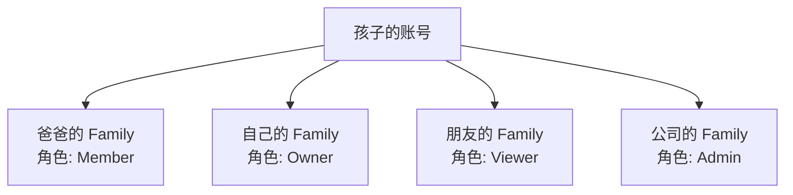

# Jive 多 Family 场景设计方案

## 🎯 核心设计：一个用户可以属于多个 Family

### 设计原则
1. **一个账号，多个身份**：用户只需一个账号，可以在不同 Family 中扮演不同角色
2. **独立的权限体系**：在每个 Family 中的角色和权限完全独立
3. **灵活切换**：用户可以在不同 Family 之间自由切换

## 📊 典型场景分析

### 场景：孩子在多个 Family 中的角色



## 🔄 实现方案

### 1. 创建新 Family（已有账号的用户）

```rust
/// 已登录用户创建新 Family
pub async fn create_additional_family(
    &self,
    user_id: String,
    request: CreateFamilyRequest,
) -> Result<(Family, FamilyMembership)> {
    // 1. 用户已经登录，有账号
    let user = self.get_user(user_id).await?;
    
    // 2. 创建新的 Family
    let family = Family::new(
        request.name,
        request.currency,
        request.timezone,
    );
    
    // 3. 用户成为新 Family 的 Owner
    let membership = FamilyMembership {
        family_id: family.id.clone(),
        user_id: user.id.clone(),
        role: FamilyRole::Owner,  // ⭐ 在新 Family 中是 Owner
        permissions: FamilyRole::Owner.default_permissions(),
        ..
    };
    
    // 4. 保存到数据库
    self.save_family(&family).await?;
    self.save_membership(&membership).await?;
    
    Ok((family, membership))
}
```

### 2. 用户的 Family 列表和角色

```rust
/// 用户的 Family 成员信息
#[derive(Debug, Clone, Serialize, Deserialize)]
pub struct UserFamilyInfo {
    pub family: Family,
    pub role: FamilyRole,
    pub joined_at: DateTime<Utc>,
    pub is_current: bool,  // 当前选中的 Family
}

/// 获取用户的所有 Family 及角色
pub async fn get_user_families_with_roles(
    &self,
    user_id: String,
) -> Result<Vec<UserFamilyInfo>> {
    let memberships = self.get_user_memberships(user_id).await?;
    
    let mut result = Vec::new();
    for membership in memberships {
        let family = self.get_family(&membership.family_id).await?;
        result.push(UserFamilyInfo {
            family,
            role: membership.role,
            joined_at: membership.joined_at,
            is_current: membership.family_id == current_family_id,
        });
    }
    
    Ok(result)
}

// 示例返回：
[
    {
        family: { name: "爸爸的家庭", id: "family_001" },
        role: "Member",
        joined_at: "2024-01-01",
        is_current: false
    },
    {
        family: { name: "我的个人账本", id: "family_002" },
        role: "Owner",  // ⭐ 自己创建的，是 Owner
        joined_at: "2024-06-01",
        is_current: true
    },
    {
        family: { name: "室友共享账本", id: "family_003" },
        role: "Admin",
        joined_at: "2024-09-01",
        is_current: false
    }
]
```

### 3. Family 切换机制

```rust
/// 切换当前 Family
pub async fn switch_family(
    &self,
    user_id: String,
    target_family_id: String,
) -> Result<ServiceContext> {
    // 1. 验证用户是该 Family 的成员
    let membership = self.get_membership(user_id, target_family_id).await?;
    
    // 2. 更新用户的当前 Family
    self.update_current_family(user_id, target_family_id).await?;
    
    // 3. 返回新的上下文（包含新 Family 的权限）
    Ok(ServiceContext {
        user_id,
        family_id: target_family_id,
        permissions: membership.permissions,
        ..
    })
}
```

## 💻 UI 交互设计

### Family 切换器组件

```dart
// Flutter UI 示例
class FamilySwitcher extends StatelessWidget {
  @override
  Widget build(BuildContext context) {
    return PopupMenuButton<String>(
      child: Row(
        children: [
          Icon(Icons.group),
          Text(currentFamily.name),
          Text(currentRole.toString(), style: TextStyle(fontSize: 12)),
          Icon(Icons.arrow_drop_down),
        ],
      ),
      itemBuilder: (context) => [
        // 显示所有 Family
        PopupMenuItem(
          child: ListTile(
            title: Text("爸爸的家庭"),
            subtitle: Text("角色: Member"),
            trailing: Icon(Icons.check_circle),
          ),
        ),
        PopupMenuItem(
          child: ListTile(
            title: Text("我的个人账本"),
            subtitle: Text("角色: Owner"),  // ⭐ 显示角色
          ),
        ),
        PopupMenuDivider(),
        // 创建新 Family 选项
        PopupMenuItem(
          value: "create_new",
          child: ListTile(
            leading: Icon(Icons.add),
            title: Text("创建新账本"),
            subtitle: Text("成为 Owner"),
          ),
        ),
      ],
    );
  }
}
```

### 创建新 Family 对话框

```dart
class CreateFamilyDialog extends StatelessWidget {
  @override
  Widget build(BuildContext context) {
    return AlertDialog(
      title: Text("创建新账本"),
      content: Column(
        children: [
          Text("您将成为新账本的 Owner"),
          TextField(
            decoration: InputDecoration(
              labelText: "账本名称",
              hintText: "例如：我的个人理财",
            ),
          ),
          DropdownButton<String>(
            hint: Text("选择货币"),
            items: ["CNY", "USD", "EUR"].map((currency) {
              return DropdownMenuItem(
                value: currency,
                child: Text(currency),
              );
            }).toList(),
          ),
        ],
      ),
      actions: [
        TextButton(
          child: Text("取消"),
          onPressed: () => Navigator.pop(context),
        ),
        ElevatedButton(
          child: Text("创建"),
          onPressed: () async {
            // 创建新 Family
            await createAdditionalFamily(...);
            Navigator.pop(context);
            // 自动切换到新 Family
            await switchToNewFamily();
          },
        ),
      ],
    );
  }
}
```

## 🎯 实际使用流程

### 场景示例：孩子的多重身份

```
1. 初始状态
   - 孩子通过爸爸的邀请注册
   - 在"爸爸的家庭"中是 Member
   - 可以记录和查看家庭开支

2. 孩子想管理个人财务
   - 点击"创建新账本"
   - 输入"我的个人理财"
   - 系统创建新 Family
   - 孩子成为该 Family 的 Owner

3. 孩子现在有两个身份
   - Family 1: "爸爸的家庭" - 角色: Member
   - Family 2: "我的个人理财" - 角色: Owner

4. 日常使用
   - 记录家庭聚餐 → 切换到"爸爸的家庭"
   - 记录个人开支 → 切换到"我的个人理财"
   - 可以邀请女朋友加入"我的个人理财"

5. 未来扩展
   - 加入"室友共享账本" - 角色: Admin
   - 加入"公司团建账本" - 角色: Member
   - 所有这些都用同一个账号
```

## 📊 数据模型支持

### 数据库设计

```sql
-- 用户可以有多个 Family 成员关系
CREATE TABLE family_memberships (
    id UUID PRIMARY KEY,
    family_id UUID REFERENCES families(id),
    user_id UUID REFERENCES users(id),
    role VARCHAR(20) NOT NULL,
    joined_at TIMESTAMP NOT NULL,
    -- 每个 (user_id, family_id) 组合唯一
    UNIQUE(family_id, user_id)
);

-- 用户表记录当前 Family
CREATE TABLE users (
    id UUID PRIMARY KEY,
    email VARCHAR(255) UNIQUE NOT NULL,
    current_family_id UUID REFERENCES families(id),
    -- 其他字段...
);

-- 查询用户的所有 Family
SELECT 
    f.*,
    fm.role,
    fm.joined_at,
    (f.id = u.current_family_id) as is_current
FROM families f
JOIN family_memberships fm ON f.id = fm.family_id
JOIN users u ON fm.user_id = u.id
WHERE fm.user_id = $1
ORDER BY fm.joined_at DESC;
```

## 🔒 权限隔离

### 重要原则

1. **数据完全隔离**：不同 Family 的数据完全独立
2. **权限不会串扰**：在 Family A 是 Owner 不影响在 Family B 的权限
3. **切换即生效**：切换 Family 后立即应用新的权限集

```rust
// 权限检查始终基于当前 Family
pub async fn delete_transaction(
    &self,
    context: ServiceContext,  // 包含 current_family_id
    transaction_id: String,
) -> Result<()> {
    // 检查在当前 Family 中的权限
    context.require_permission(Permission::DeleteTransactions)?;
    
    // 确保交易属于当前 Family
    let transaction = self.get_transaction(transaction_id).await?;
    if transaction.family_id != context.family_id {
        return Err(JiveError::Forbidden("Cannot access other family's data"));
    }
    
    // 执行删除
    self.delete(transaction_id).await
}
```

## 💡 优势总结

### 对用户的好处

1. **一个账号走天下**：不需要多个账号
2. **灵活的角色管理**：在不同场景有不同权限
3. **清晰的数据边界**：个人/家庭/工作账本分离
4. **便捷的切换**：快速切换不同身份

### 对系统的好处

1. **简化用户管理**：一个用户一个账号
2. **权限模型统一**：同一套权限系统
3. **数据隔离清晰**：Family 级别隔离
4. **扩展性强**：轻松支持更多场景

## 🎯 最佳实践

1. **默认 Family**：用户登录后显示最近使用的 Family
2. **Family 标识**：UI 上始终显示当前 Family 和角色
3. **快速切换**：提供便捷的 Family 切换入口
4. **创建引导**：引导用户创建适合的 Family 结构

---

**文档版本**: 1.0.0  
**更新日期**: 2025-08-25  
**作者**: Jive 开发团队