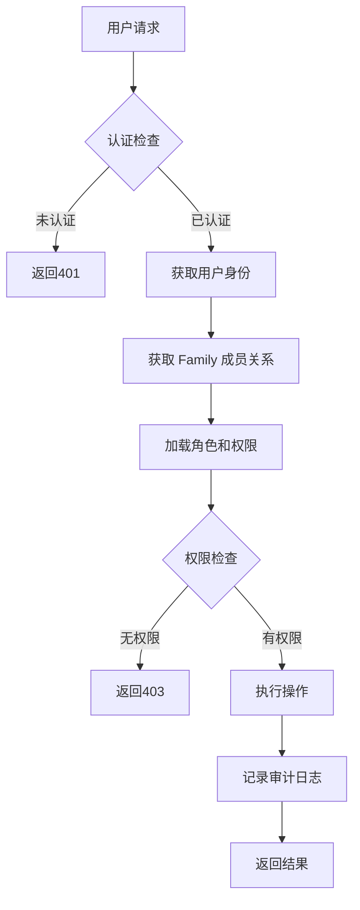

# Jive 角色权限系统设计规范 (RBAC)

## 📋 目录
1. [系统概述](#系统概述)
2. [设计理念](#设计理念)
3. [角色体系](#角色体系)
4. [权限矩阵](#权限矩阵)
5. [使用场景](#使用场景)
6. [实现细节](#实现细节)
7. [安全机制](#安全机制)
8. [最佳实践](#最佳实践)

## 🎯 系统概述

### 核心概念

Jive 采用基于角色的访问控制（RBAC）系统，参考 Maybe Finance 的 Family 模型设计，实现多用户协作的财务管理平台。

#### 三大核心实体

1. **Family（家庭/团队）**
   - 数据隔离的基本单位
   - 所有财务数据的所有者
   - 类似于 SaaS 系统中的"租户"概念

2. **User（用户）**
   - 系统的实际使用者
   - 可以属于多个 Family
   - 通过 FamilyMembership 关联角色

3. **FamilyMembership（成员关系）**
   - 连接 User 和 Family
   - 定义用户在特定 Family 中的角色
   - 携带权限信息

### 设计原则

1. **最小权限原则**：用户只获得完成工作所需的最小权限集
2. **职责分离**：关键操作需要不同角色配合完成
3. **向下兼容**：支持从单用户模式平滑升级到多用户模式
4. **审计追踪**：所有权限相关操作都有日志记录
5. **灵活扩展**：支持自定义权限组合

## 🏗️ 设计理念

### 为什么选择 RBAC？

相比其他权限模型，RBAC 提供了：

- **简单直观**：用户容易理解"角色"概念
- **易于管理**：通过角色批量管理权限
- **灵活性高**：支持角色继承和权限组合
- **安全可控**：清晰的权限边界

### 与 Maybe 的对比

| 特性 | Maybe 实现 | Jive 实现 | 改进点 |
|------|-----------|----------|--------|
| 角色数量 | 3个（member, admin, super_admin） | 4个（Viewer, Member, Admin, Owner） | 增加只读角色 |
| 权限粒度 | 粗粒度 | 细粒度（30+权限） | 更精确的控制 |
| 权限自定义 | 不支持 | 支持自定义权限组合 | 更灵活 |
| 审计日志 | 基础 | 完整审计链 | 更好的追溯性 |
| 数据隔离 | Family 级别 | Family + Ledger 双层 | 更强的隔离性 |

## 👥 角色体系

### 角色层级

```
Owner (拥有者)
  ├── Admin (管理员)
  │     ├── Member (成员)
  │     │     └── Viewer (查看者)
```

### 角色详解

#### 1. Owner（拥有者）
**定位**：Family 的创建者和最高权限持有者

**核心权限**：
- ✅ 所有数据的完全控制权
- ✅ 转让所有权
- ✅ 删除 Family
- ✅ 管理订阅和计费
- ✅ 模拟其他用户（用于支持）

**限制**：
- 每个 Family 只能有一个 Owner
- Owner 角色不能被删除，只能转让
- 不能将自己的角色降级

**适用人群**：
- 家庭的户主
- 企业的财务负责人
- 团队的创建者

#### 2. Admin（管理员）
**定位**：协助 Owner 管理 Family 的副手

**核心权限**：
- ✅ 邀请和移除成员（除 Owner 外）
- ✅ 管理其他成员的角色（除 Owner 外）
- ✅ 配置 Family 设置
- ✅ 管理分类、标签、规则等
- ✅ 查看审计日志
- ❌ 不能管理订阅
- ❌ 不能删除 Family

**适用人群**：
- 家庭的主要成员（配偶）
- 企业的财务主管
- 团队的核心成员

#### 3. Member（成员）
**定位**：日常使用系统的普通用户

**核心权限**：
- ✅ 创建和编辑交易
- ✅ 管理自己的账户
- ✅ 查看报表
- ✅ 导入导出数据
- ❌ 不能管理其他成员
- ❌ 不能修改系统设置

**适用人群**：
- 家庭的一般成员（子女）
- 企业的普通员工
- 团队的普通成员

#### 4. Viewer（查看者）
**定位**：只需要查看数据的用户

**核心权限**：
- ✅ 查看所有数据
- ✅ 生成报表
- ❌ 不能创建或修改数据
- ❌ 不能导出数据

**适用人群**：
- 需要查看账目的亲属
- 外部审计人员
- 临时访客

## 📊 权限矩阵

### 完整权限列表

| 权限分类 | 权限名称 | Owner | Admin | Member | Viewer | 说明 |
|---------|---------|-------|-------|--------|--------|------|
| **账户管理** |||||
| | ViewAccounts | ✅ | ✅ | ✅ | ✅ | 查看账户列表和详情 |
| | CreateAccounts | ✅ | ✅ | ✅ | ❌ | 创建新账户 |
| | EditAccounts | ✅ | ✅ | ✅ | ❌ | 编辑账户信息 |
| | DeleteAccounts | ✅ | ✅ | ❌ | ❌ | 删除账户 |
| | ConnectBankAccounts | ✅ | ✅ | ❌ | ❌ | 连接银行账户 |
| **交易管理** |||||
| | ViewTransactions | ✅ | ✅ | ✅ | ✅ | 查看交易记录 |
| | CreateTransactions | ✅ | ✅ | ✅ | ❌ | 创建交易 |
| | EditTransactions | ✅ | ✅ | ✅ | ❌ | 编辑交易 |
| | DeleteTransactions | ✅ | ✅ | ❌ | ❌ | 删除交易 |
| | BulkEditTransactions | ✅ | ✅ | ❌ | ❌ | 批量编辑交易 |
| | ImportTransactions | ✅ | ✅ | ✅ | ❌ | 导入交易 |
| | ExportTransactions | ✅ | ✅ | ✅ | ❌ | 导出交易 |
| **分类管理** |||||
| | ViewCategories | ✅ | ✅ | ✅ | ✅ | 查看分类 |
| | ManageCategories | ✅ | ✅ | ❌ | ❌ | 创建/编辑/删除分类 |
| **商户/收款人** |||||
| | ViewPayees | ✅ | ✅ | ✅ | ✅ | 查看收款人 |
| | ManagePayees | ✅ | ✅ | ❌ | ❌ | 管理收款人 |
| **标签管理** |||||
| | ViewTags | ✅ | ✅ | ✅ | ✅ | 查看标签 |
| | ManageTags | ✅ | ✅ | ❌ | ❌ | 管理标签 |
| **预算管理** |||||
| | ViewBudgets | ✅ | ✅ | ✅ | ✅ | 查看预算 |
| | CreateBudgets | ✅ | ✅ | ❌ | ❌ | 创建预算 |
| | EditBudgets | ✅ | ✅ | ❌ | ❌ | 编辑预算 |
| | DeleteBudgets | ✅ | ✅ | ❌ | ❌ | 删除预算 |
| **报表分析** |||||
| | ViewReports | ✅ | ✅ | ✅ | ✅ | 查看报表 |
| | ExportReports | ✅ | ✅ | ✅ | ❌ | 导出报表 |
| **规则管理** |||||
| | ViewRules | ✅ | ✅ | ✅ | ✅ | 查看自动化规则 |
| | ManageRules | ✅ | ✅ | ❌ | ❌ | 管理自动化规则 |
| **成员管理** |||||
| | InviteMembers | ✅ | ✅ | ❌ | ❌ | 邀请新成员 |
| | RemoveMembers | ✅ | ✅ | ❌ | ❌ | 移除成员 |
| | ManageRoles | ✅ | ❌ | ❌ | ❌ | 修改成员角色 |
| **系统管理** |||||
| | ManageFamilySettings | ✅ | ✅ | ❌ | ❌ | 管理 Family 设置 |
| | ManageLedgers | ✅ | ✅ | ❌ | ❌ | 管理账本 |
| | ManageIntegrations | ✅ | ✅ | ❌ | ❌ | 管理第三方集成 |
| | ViewAuditLog | ✅ | ✅ | ❌ | ❌ | 查看审计日志 |
| | ManageSubscription | ✅ | ❌ | ❌ | ❌ | 管理订阅计费 |
| | ImpersonateMembers | ✅ | ❌ | ❌ | ❌ | 模拟其他成员 |

### 权限组合示例

#### 场景1：家庭财务管理
```rust
// 爸爸：Owner - 完全控制
let dad = FamilyRole::Owner;

// 妈妈：Admin - 共同管理
let mom = FamilyRole::Admin;

// 大学生子女：Member - 记录自己的开支
let college_kid = FamilyRole::Member;

// 高中生子女：Viewer - 只能查看
let high_school_kid = FamilyRole::Viewer;
```

#### 场景2：小企业财务
```rust
// 老板：Owner
let boss = FamilyRole::Owner;

// 财务经理：Admin
let finance_manager = FamilyRole::Admin;

// 会计：Member + 自定义权限
let accountant = FamilyMembership {
    role: FamilyRole::Member,
    permissions: vec![
        Permission::CreateTransactions,
        Permission::EditTransactions,
        Permission::ImportTransactions,
        Permission::ManageCategories,  // 额外权限
    ],
    ..
};

// 外部审计：Viewer
let auditor = FamilyRole::Viewer;
```

## 🎭 使用场景

### 1. 创建 Family 时
```rust
// 用户注册后自动创建个人 Family
let family = Family::new("Personal", "USD", "America/New_York");
let membership = FamilyMembership {
    role: FamilyRole::Owner,  // 创建者自动成为 Owner
    permissions: FamilyRole::Owner.default_permissions(),
    ..
};
```

### 2. 邀请成员时
```rust
// Owner 或 Admin 发起邀请
let invitation = FamilyInvitation {
    role: FamilyRole::Member,  // 默认给予 Member 角色
    custom_permissions: None,   // 可选：自定义权限
    ..
};
```

### 3. 权限检查时
```rust
// 在服务层自动检查
impl TransactionService {
    pub async fn delete_transaction(&self, context: ServiceContext) -> Result<()> {
        // 自动检查权限
        context.require_permission(Permission::DeleteTransactions)?;
        // 执行删除...
    }
}
```

### 4. 角色升级时
```rust
// Admin 将 Member 升级为 Admin（需要 Owner 批准）
service.update_member_role(UpdateMemberRoleRequest {
    member_id: "member_123",
    new_role: FamilyRole::Admin,
    custom_permissions: None,
});
```

## 🔧 实现细节

### 1. 数据库设计

```sql
-- Family 表
CREATE TABLE families (
    id UUID PRIMARY KEY,
    name VARCHAR(100) NOT NULL,
    currency VARCHAR(3) NOT NULL,
    timezone VARCHAR(50) NOT NULL,
    settings JSONB,
    created_at TIMESTAMP NOT NULL,
    updated_at TIMESTAMP NOT NULL,
    deleted_at TIMESTAMP
);

-- 成员关系表
CREATE TABLE family_memberships (
    id UUID PRIMARY KEY,
    family_id UUID REFERENCES families(id) ON DELETE CASCADE,
    user_id UUID REFERENCES users(id) ON DELETE CASCADE,
    role VARCHAR(20) NOT NULL,
    permissions TEXT[],  -- 权限数组
    joined_at TIMESTAMP NOT NULL,
    invited_by UUID REFERENCES users(id),
    is_active BOOLEAN DEFAULT true,
    last_accessed_at TIMESTAMP,
    UNIQUE(family_id, user_id)
);

-- 邀请表
CREATE TABLE family_invitations (
    id UUID PRIMARY KEY,
    family_id UUID REFERENCES families(id) ON DELETE CASCADE,
    inviter_id UUID REFERENCES users(id),
    invitee_email VARCHAR(255) NOT NULL,
    role VARCHAR(20) NOT NULL,
    custom_permissions TEXT[],
    token VARCHAR(255) UNIQUE NOT NULL,
    status VARCHAR(20) NOT NULL,
    expires_at TIMESTAMP NOT NULL,
    created_at TIMESTAMP NOT NULL,
    accepted_at TIMESTAMP
);

-- 审计日志表
CREATE TABLE family_audit_logs (
    id UUID PRIMARY KEY,
    family_id UUID REFERENCES families(id) ON DELETE CASCADE,
    user_id UUID REFERENCES users(id),
    action VARCHAR(50) NOT NULL,
    resource_type VARCHAR(50) NOT NULL,
    resource_id UUID,
    changes JSONB,
    ip_address INET,
    user_agent TEXT,
    created_at TIMESTAMP NOT NULL
);

-- 所有业务表都需要 family_id
ALTER TABLE accounts ADD COLUMN family_id UUID REFERENCES families(id);
ALTER TABLE transactions ADD COLUMN family_id UUID REFERENCES families(id);
ALTER TABLE categories ADD COLUMN family_id UUID REFERENCES families(id);
-- ... 其他表类似
```

### 2. 权限检查流程



### 3. 权限缓存策略

```rust
// 使用 LRU 缓存减少数据库查询
pub struct PermissionCache {
    cache: LruCache<(String, String), Vec<Permission>>,  // (user_id, family_id) -> permissions
    ttl: Duration,
}

impl PermissionCache {
    pub fn get_permissions(&self, user_id: &str, family_id: &str) -> Option<Vec<Permission>> {
        self.cache.get(&(user_id.to_string(), family_id.to_string()))
    }
    
    pub fn invalidate(&mut self, user_id: &str, family_id: &str) {
        self.cache.pop(&(user_id.to_string(), family_id.to_string()));
    }
}
```

## 🔒 安全机制

### 1. 防止权限提升
- Owner 角色只能通过显式转让获得
- 用户不能修改自己的角色
- 关键操作需要二次确认

### 2. 防止数据泄露
- 所有查询自动加入 family_id 过滤
- 跨 Family 访问被完全阻止
- 敏感操作记录 IP 和 User Agent

### 3. 防止暴力攻击
- 邀请 token 使用安全随机数
- 邀请链接有有效期（默认7天）
- 失败尝试有频率限制

### 4. 审计追踪
```rust
// 所有权限相关操作都记录日志
pub enum AuditAction {
    // 成员管理
    MemberInvited,      // 邀请成员
    MemberJoined,       // 成员加入
    MemberRemoved,      // 移除成员
    MemberRoleChanged,  // 角色变更
    
    // 权限操作
    PermissionGranted,  // 授予权限
    PermissionRevoked,  // 撤销权限
    
    // 安全事件
    UnauthorizedAccess, // 未授权访问
    PermissionDenied,   // 权限拒绝
}
```

## 📚 最佳实践

### 1. 角色分配原则

✅ **推荐做法**：
- 遵循最小权限原则
- 定期审查成员角色
- 及时移除不活跃成员
- 使用自定义权限满足特殊需求

❌ **避免做法**：
- 给所有人 Admin 权限
- 长期保留临时成员
- 忽视审计日志
- 共享账号登录

### 2. Family 组织建议

#### 个人使用
```
Personal Family
  └── 自己 (Owner)
```

#### 家庭使用
```
Smith Family
  ├── 爸爸 (Owner)
  ├── 妈妈 (Admin)
  ├── 大儿子 (Member)
  └── 小女儿 (Viewer)
```

#### 小团队使用
```
Startup Team
  ├── CEO (Owner)
  ├── CFO (Admin)
  ├── 会计 (Member + 额外权限)
  ├── 员工A (Member)
  └── 实习生 (Viewer)
```

### 3. 权限迁移路径

#### 从单用户升级到多用户
```rust
// 1. 创建 Family
let family = Family::new(user.name + "'s Family", currency, timezone);

// 2. 将现有用户设为 Owner
let membership = FamilyMembership {
    role: FamilyRole::Owner,
    ..
};

// 3. 迁移数据关联
UPDATE accounts SET family_id = ? WHERE user_id = ?;
UPDATE transactions SET family_id = ? WHERE user_id = ?;
```

#### 角色调整
```rust
// 提升权限（需要更高权限者批准）
Member -> Admin: 需要 Owner 批准
Viewer -> Member: 需要 Admin 批准

// 降低权限（自动生效）
Admin -> Member: 立即生效
Member -> Viewer: 立即生效
```

### 4. 异常处理

#### 处理 Owner 离开
```rust
// 必须先转让 Owner 权限
if member.role == FamilyRole::Owner {
    // 1. 选择新 Owner（通常是 Admin）
    // 2. 转让所有权
    // 3. 原 Owner 降级为 Admin 或离开
}
```

#### 处理权限冲突
```rust
// 使用显式权限覆盖默认权限
let membership = FamilyMembership {
    role: FamilyRole::Member,
    permissions: vec![
        // Member 默认权限
        ...FamilyRole::Member.default_permissions(),
        // 额外授予的权限
        Permission::ManageCategories,
        Permission::ManageBudgets,
    ],
};
```

## 🎯 总结

Jive 的 RBAC 系统提供了：

1. **清晰的角色层级**：4个预定义角色满足大部分场景
2. **灵活的权限组合**：支持自定义权限满足特殊需求
3. **完整的安全机制**：多层防护确保数据安全
4. **良好的扩展性**：易于添加新角色和权限
5. **平滑的迁移路径**：从单用户到多用户无缝升级

这个设计既保持了系统的简单性，又提供了足够的灵活性，能够满足从个人到小型企业的各种使用场景。

---

**文档版本**: 1.0.0  
**最后更新**: 2025-08-25  
**维护团队**: Jive 开发团队