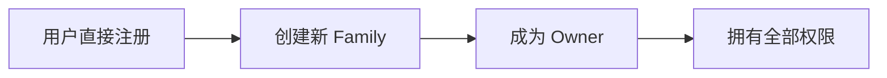
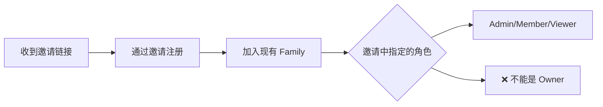

# Jive 用户注册与角色分配逻辑说明

## 📋 核心原则

### 1. Owner 角色的唯一性
- 每个 Family 只能有**一个** Owner
- Owner 不能通过邀请产生，只能通过**创建**或**转让**获得
- Owner 拥有 Family 的最高权限

### 2. 注册场景与角色分配

## 🎯 场景一：直接注册（无邀请）



**流程说明**：
1. 用户通过注册页面直接注册
2. 系统自动为用户创建一个新的 Family
3. 用户成为该 Family 的 **Owner**
4. 拥有所有权限，可以邀请其他成员

**代码示例**：
```rust
// 直接注册
let user = register_user(RegisterRequest {
    email: "john@example.com",
    password: "secure_password",
    name: "John Smith",
    invitation_token: None,  // 无邀请
});

// 结果：
// - 创建 "John Smith's Family"
// - John 的角色：Owner
// - 权限：全部权限
```

## 🎯 场景二：通过邀请注册



**流程说明**：
1. 用户收到 Family 成员的邀请链接
2. 通过邀请链接注册账号
3. 自动加入邀请者的 Family
4. 获得邀请中指定的角色（**不能是 Owner**）

**代码示例**：
```rust
// 通过邀请注册
let user = register_user(RegisterRequest {
    email: "jane@example.com",
    password: "secure_password",
    name: "Jane Doe",
    invitation_token: Some("invitation_token_xyz"),  // 有邀请
});

// 结果：
// - 加入 "John Smith's Family"
// - Jane 的角色：Member 或 Admin（取决于邀请）
// - 权限：根据角色确定
```

## 📊 角色分配矩阵

| 注册方式 | 创建 Family | 加入 Family | 可能的角色 | 说明 |
|---------|------------|------------|-----------|------|
| **直接注册** | ✅ 创建新的 | ❌ | **Owner** | 成为新 Family 的拥有者 |
| **邀请注册（被邀请为 Admin）** | ❌ | ✅ 加入现有 | **Admin** | 协助管理 Family |
| **邀请注册（被邀请为 Member）** | ❌ | ✅ 加入现有 | **Member** | 普通成员权限 |
| **邀请注册（被邀请为 Viewer）** | ❌ | ✅ 加入现有 | **Viewer** | 只读权限 |
| **邀请注册（尝试邀请为 Owner）** | ❌ | ❌ | **错误** | 系统拒绝，Owner 不能通过邀请产生 |

## 🔒 安全限制

### 1. 邀请权限限制

```rust
// ❌ 错误：尝试邀请别人成为 Owner
let invitation = create_invitation(InviteMemberRequest {
    email: "newuser@example.com",
    role: FamilyRole::Owner,  // 这会被拒绝！
});
// 结果：Error - "Cannot invite someone as Owner"

// ✅ 正确：邀请成为 Admin（需要 Owner 权限）
let invitation = create_invitation(InviteMemberRequest {
    email: "newuser@example.com",
    role: FamilyRole::Admin,  // Owner 可以邀请 Admin
});
```

### 2. 角色升级限制

| 当前角色 | 目标角色 | 谁能操作 | 是否允许 |
|---------|---------|---------|---------|
| Viewer | Member | Admin/Owner | ✅ |
| Viewer | Admin | Owner | ✅ |
| Member | Admin | Owner | ✅ |
| Admin | Owner | - | ❌ 必须通过转让 |
| Member | Owner | - | ❌ 必须通过转让 |
| Viewer | Owner | - | ❌ 必须通过转让 |

### 3. Owner 转让流程

Owner 角色只能通过**显式转让**获得：

```rust
// Owner 转让流程（特殊操作）
async fn transfer_ownership(
    current_owner_id: String,
    new_owner_id: String,
) -> Result<()> {
    // 1. 验证当前用户是 Owner
    assert!(current_user.role == FamilyRole::Owner);
    
    // 2. 新 Owner 必须已经是成员
    assert!(new_owner.is_member_of_family());
    
    // 3. 执行转让
    new_owner.role = FamilyRole::Owner;
    current_owner.role = FamilyRole::Admin;  // 降级为 Admin
    
    // 4. 记录审计日志
    log_audit("Ownership transferred");
}
```

## 🎭 实际使用场景

### 场景1：创建家庭账本
```
1. 爸爸注册 → 自动成为 Owner
2. 爸爸邀请妈妈（Admin） → 妈妈通过邀请注册，成为 Admin
3. 爸爸邀请孩子（Member） → 孩子通过邀请注册，成为 Member
```

### 场景2：创建团队账本
```
1. CEO 注册 → 自动成为 Owner
2. CEO 邀请 CFO（Admin） → CFO 通过邀请注册，成为 Admin
3. CFO 邀请会计（Member） → 会计通过邀请注册，成为 Member
4. CEO 退休，转让 Owner 给 CFO → CFO 成为新 Owner，CEO 降为 Admin
```

### 场景3：错误示例
```
❌ Admin 尝试邀请新人为 Owner → 系统拒绝
❌ Member 尝试邀请新人为 Admin → 系统拒绝（权限不足）
❌ 尝试同时有两个 Owner → 系统拒绝（Owner 唯一）
```

## 💡 最佳实践

### 1. 邀请策略
- **Owner** 应谨慎邀请 Admin，因为 Admin 拥有管理权限
- 默认邀请为 **Member** 角色，需要时再升级
- 对于只需要查看的用户，使用 **Viewer** 角色

### 2. 角色管理
- 定期审查成员角色，移除不活跃成员
- 使用最小权限原则，不要给予过高权限
- Owner 转让前要充分考虑，因为这是不可逆的

### 3. 安全建议
- Owner 账号要使用强密码和双因素认证
- 邀请链接有 7 天有效期，过期需重新邀请
- 所有角色变更都会记录在审计日志中

## 📝 总结

1. **直接注册** = **Owner**（创建新 Family）
2. **邀请注册** = **Admin/Member/Viewer**（加入现有 Family）
3. **Owner 不能通过邀请产生**，只能通过创建或转让
4. 每个 Family 只能有一个 Owner
5. 角色升级有严格限制，防止权限滥用

这种设计确保了：
- 清晰的权限边界
- 防止权限提升攻击
- Family 的所有权明确
- 灵活的团队协作

---

**文档版本**: 1.0.0  
**更新日期**: 2025-08-25  
**作者**: Jive 开发团队