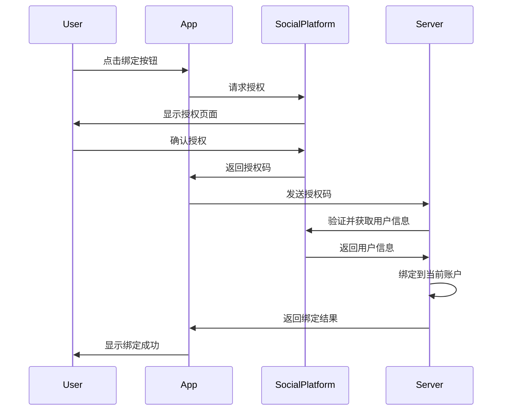
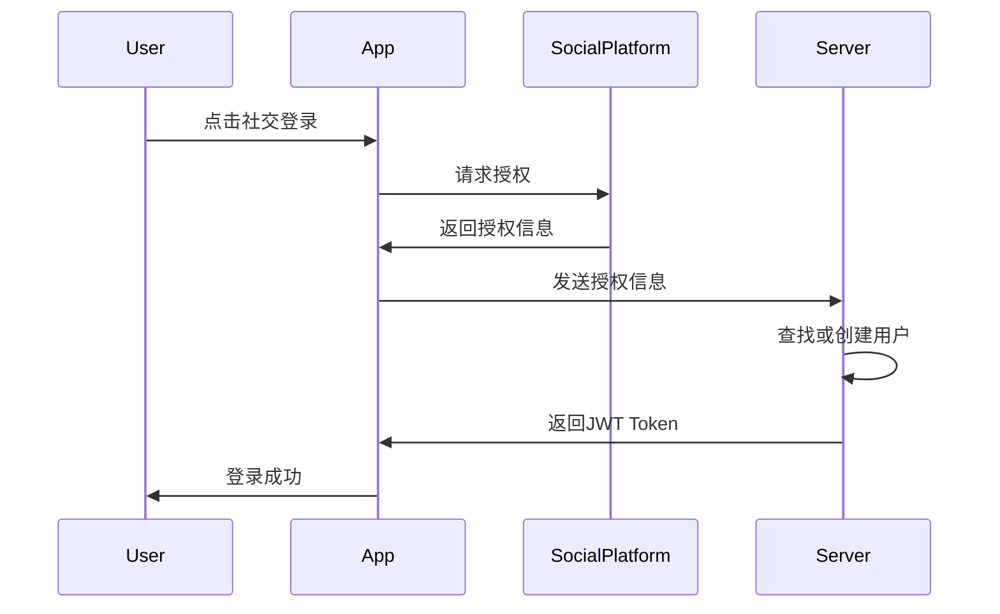
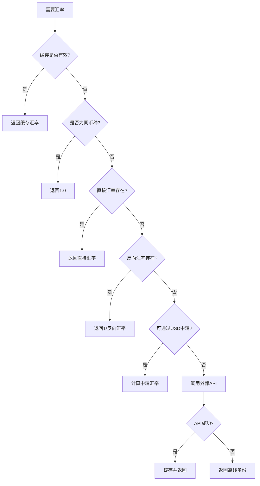
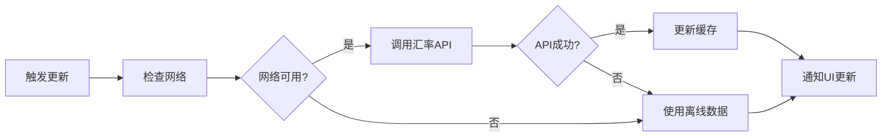

# 用户Profile及多币种功能设计说明

## 📋 目录
- [概述](#概述)
- [用户Profile系统](#用户profile系统)
- [多币种系统](#多币种系统)
- [技术架构](#技术架构)
- [API设计](#api设计)
- [安全考虑](#安全考虑)

## 概述

本文档描述了Jive Money应用中用户Profile管理和多币种功能的设计与实现方案。系统支持完整的用户资料管理、第三方账户绑定、多币种记账、实时汇率转换等功能。

## 用户Profile系统

### 1. 功能架构

```
用户Profile
├── 基本信息
│   ├── 用户名
│   ├── 邮箱
│   ├── 手机号
│   └── 头像
├── 偏好设置
│   ├── 国家/地区
│   ├── 语言
│   ├── 时区
│   ├── 日期格式
│   └── 货币
├── 第三方账户
│   ├── 微信
│   ├── QQ
│   └── 抖音
└── 账户安全
    ├── 密码修改
    ├── 两步验证
    └── 账户注销
```

### 2. 用户头像系统

#### 2.1 头像来源优先级
1. **用户上传头像** - 最高优先级
2. **第三方账户头像** - 绑定社交账户时获取
3. **系统生成头像** - 注册时自动生成

#### 2.2 自动头像生成策略

```typescript
interface AvatarStyle {
  Initials,    // 首字母样式
  Animal,      // 动物头像
  Abstract,    // 抽象图案
  Gradient,    // 渐变色彩
  Pattern      // 几何图案
}
```

生成规则：
- 使用用户名/邮箱作为种子，确保同一用户头像一致
- 预设22种动物、12种颜色主题、11种抽象图案
- 支持中文名字（取前两个字符）和英文名字（取首字母）

### 3. 第三方账户绑定

#### 3.1 支持的平台

| 平台 | 功能 | 获取信息 | 状态 |
|------|------|----------|------|
| 微信 | 登录/绑定/注册 | 昵称、头像、OpenID、UnionID | 待集成SDK |
| QQ | 登录/绑定/注册 | 昵称、头像、OpenID | 待集成SDK |
| 抖音 | 登录/绑定/注册 | 昵称、头像、OpenID | 待集成SDK |

#### 3.2 绑定流程



#### 3.3 快速登录流程



### 4. 偏好设置

#### 4.1 地区相关设置联动

当用户选择国家/地区时，系统自动调整：

| 国家/地区 | 默认货币 | 默认语言 | 默认时区 | 日期格式 |
|-----------|---------|----------|---------|----------|
| 中国 | CNY | zh-CN | Asia/Shanghai | YYYY-MM-DD |
| 美国 | USD | en-US | America/New_York | MM/DD/YYYY |
| 英国 | GBP | en-GB | Europe/London | DD/MM/YYYY |
| 日本 | JPY | ja-JP | Asia/Tokyo | YYYY-MM-DD |
| 欧盟 | EUR | en-EU | Europe/Brussels | DD.MM.YYYY |

#### 4.2 支持的配置选项

- **语言**: 简体中文、繁体中文、英语、日语、韩语等
- **时区**: 全球主要城市时区
- **日期格式**: YYYY-MM-DD、MM/DD/YYYY、DD/MM/YYYY、DD.MM.YYYY
- **货币**: 137种法定货币 + 21种加密货币

## 多币种系统

### 1. 系统架构

```
多币种系统
├── 货币管理
│   ├── 基础货币设置
│   ├── 多币种开关
│   ├── 支持货币选择
│   └── 加密货币开关
├── 汇率管理
│   ├── 实时汇率获取
│   ├── 汇率缓存（15分钟）
│   ├── 离线汇率备份
│   └── 自动更新机制
├── 货币转换
│   ├── 实时转换计算
│   ├── 历史汇率查询
│   └── 批量转换
└── 显示设置
    ├── 货币符号/代码切换
    ├── 小数位数控制
    └── 千分位格式化
```

### 2. 数据库设计

#### 2.1 货币表 (currencies)
```sql
CREATE TABLE currencies (
    code VARCHAR(10) PRIMARY KEY,      -- ISO 4217代码
    name VARCHAR(100) NOT NULL,        -- 货币名称
    symbol VARCHAR(10) NOT NULL,       -- 货币符号
    decimal_places INTEGER DEFAULT 2,   -- 小数位数
    is_active BOOLEAN DEFAULT true,    -- 是否启用
    created_at TIMESTAMP,
    updated_at TIMESTAMP
);
```

#### 2.2 汇率表 (exchange_rates)
```sql
CREATE TABLE exchange_rates (
    id UUID PRIMARY KEY,
    from_currency VARCHAR(10) REFERENCES currencies(code),
    to_currency VARCHAR(10) REFERENCES currencies(code),
    rate DECIMAL(20, 10) NOT NULL,
    source VARCHAR(50),                -- 数据源：manual/api/bank
    effective_date DATE NOT NULL,
    created_at TIMESTAMP,
    UNIQUE(from_currency, to_currency, effective_date)
);
```

#### 2.3 用户货币偏好 (user_currency_preferences)
```sql
CREATE TABLE user_currency_preferences (
    id UUID PRIMARY KEY,
    user_id UUID REFERENCES users(id),
    currency_code VARCHAR(10) REFERENCES currencies(code),
    is_primary BOOLEAN DEFAULT false,
    display_order INTEGER DEFAULT 0,
    created_at TIMESTAMP,
    UNIQUE(user_id, currency_code)
);
```

#### 2.4 家庭货币设置 (family_currency_settings)
```sql
CREATE TABLE family_currency_settings (
    id UUID PRIMARY KEY,
    family_id UUID REFERENCES families(id),
    base_currency VARCHAR(10) REFERENCES currencies(code),
    allow_multi_currency BOOLEAN DEFAULT true,
    auto_convert BOOLEAN DEFAULT false,
    created_at TIMESTAMP,
    updated_at TIMESTAMP,
    UNIQUE(family_id)
);
```

### 3. 汇率管理

#### 3.1 汇率获取策略



#### 3.2 支持的货币类型

**主要法定货币（15种）**：
- CNY (人民币)、USD (美元)、EUR (欧元)、GBP (英镑)、JPY (日元)
- HKD (港币)、TWD (台币)、SGD (新加坡元)、AUD (澳元)、CAD (加元)
- CHF (瑞士法郎)、KRW (韩元)、INR (印度卢比)、THB (泰铢)、MYR (马来西亚令吉)

**完整支持137种法定货币**，包括所有主要国家和地区货币。

**加密货币（21种）**：
- BTC (比特币)、ETH (以太坊)、USDT (泰达币)、BNB (币安币)
- SOL (Solana)、XRP (瑞波币)、USDC (USD币)、ADA (卡尔达诺)
- 等主流加密货币

#### 3.3 加密货币地区限制

系统会根据用户所在地区自动禁用加密货币功能：

```javascript
const cryptoRestrictedCountries = [
  'CN', 'IN', 'BD', 'EG', 'ID', 'IQ', 'MA', 'NP', 'TN', 'VN',
  // ... 等36个限制国家/地区
];
```

### 4. 货币转换功能

#### 4.1 转换公式

```
转换金额 = 原始金额 × 汇率
舍入结果 = ROUND(转换金额, 目标货币小数位数)
```

#### 4.2 特殊处理

- **日元、韩元**：0位小数
- **大部分货币**：2位小数
- **加密货币**：6-8位小数
- **金额显示**：根据货币习惯格式化

### 5. 自动更新机制

#### 5.1 更新触发时机

1. **应用启动时**：检查设置，若启用则更新
2. **手动刷新**：用户在汇率管理页面点击刷新
3. **缓存过期**：超过15分钟自动更新
4. **基础货币变更**：切换基础货币时立即更新

#### 5.2 更新流程



## 技术架构

### 1. 前端架构（Flutter）

```
lib/
├── models/
│   ├── currency.dart          # 货币模型
│   └── currency_api.dart      # API相关模型
├── services/
│   ├── currency_service.dart  # 货币服务
│   ├── social_auth_service.dart # 社交登录服务
│   └── exchange_rate_service.dart # 汇率服务
├── providers/
│   └── currency_provider.dart # 状态管理
└── screens/
    ├── settings/
    │   ├── profile_settings_screen.dart
    │   └── currency_settings_screen.dart
    └── widgets/
        └── currency_converter.dart
```

### 2. 后端架构（Rust）

```
jive-api/src/
├── handlers/
│   ├── currency_handler.rs    # 货币API处理
│   └── enhanced_profile.rs    # Profile API处理
├── services/
│   ├── currency_service.rs    # 货币业务逻辑
│   └── avatar_service.rs      # 头像生成服务
└── models/
    └── currency.rs            # 数据模型
```

### 3. 状态管理

使用Riverpod进行状态管理：

```dart
// 货币偏好状态
final currencyProvider = StateNotifierProvider<CurrencyNotifier, CurrencyPreferences>

// 可用货币列表
final availableCurrenciesProvider = Provider<List<Currency>>

// 选中货币列表
final selectedCurrenciesProvider = Provider<List<Currency>>

// 基础货币
final baseCurrencyProvider = Provider<Currency>

// 加密货币支持状态
final isCryptoSupportedProvider = Provider<bool>
```

## API设计

### 1. Profile相关API

| 端点 | 方法 | 描述 | 认证 |
|------|------|------|------|
| `/api/v1/auth/profile-enhanced` | GET | 获取完整Profile | ✅ |
| `/api/v1/auth/preferences` | PUT | 更新偏好设置 | ✅ |
| `/api/v1/auth/avatar` | POST | 上传头像 | ✅ |
| `/api/v1/auth/social/{platform}/bind` | POST | 绑定社交账户 | ✅ |
| `/api/v1/auth/social/{platform}/unbind` | DELETE | 解绑社交账户 | ✅ |
| `/api/v1/auth/social/{platform}/login` | POST | 社交登录 | ❌ |
| `/api/v1/auth/social/{platform}/register` | POST | 社交注册 | ❌ |

### 2. 货币相关API

| 端点 | 方法 | 描述 | 认证 |
|------|------|------|------|
| `/api/v1/currencies` | GET | 获取支持的货币列表 | ❌ |
| `/api/v1/currencies/preferences` | GET | 获取用户货币偏好 | ✅ |
| `/api/v1/currencies/preferences` | POST | 设置用户货币偏好 | ✅ |
| `/api/v1/currencies/rate` | GET | 获取汇率 | ❌ |
| `/api/v1/currencies/rates` | POST | 批量获取汇率 | ❌ |
| `/api/v1/currencies/convert` | POST | 货币转换 | ❌ |
| `/api/v1/currencies/history` | GET | 汇率历史 | ❌ |
| `/api/v1/currencies/refresh` | POST | 刷新汇率 | ✅ |
| `/api/v1/family/currency-settings` | GET | 获取家庭货币设置 | ✅ |
| `/api/v1/family/currency-settings` | PUT | 更新家庭货币设置 | ✅ |

### 3. 请求/响应示例

#### 3.1 获取用户Profile
```json
GET /api/v1/auth/profile-enhanced

Response:
{
  "success": true,
  "data": {
    "id": "uuid",
    "name": "张三",
    "email": "user@example.com",
    "avatar_url": "https://...",
    "avatar_style": "animal",
    "country": "CN",
    "preferred_currency": "CNY",
    "preferred_language": "zh-CN",
    "preferred_timezone": "Asia/Shanghai",
    "preferred_date_format": "YYYY-MM-DD",
    "wechat_id": "wx_openid",
    "qq_id": null,
    "tiktok_id": null
  }
}
```

#### 3.2 货币转换
```json
POST /api/v1/currencies/convert
{
  "amount": 100,
  "from_currency": "CNY",
  "to_currency": "USD",
  "date": "2024-12-31"  // 可选，不传则使用最新汇率
}

Response:
{
  "success": true,
  "data": {
    "original_amount": 100,
    "converted_amount": 13.80,
    "from_currency": "CNY",
    "to_currency": "USD",
    "exchange_rate": 0.138
  }
}
```

## 安全考虑

### 1. 数据安全

- **敏感信息加密**：密码使用Argon2加密
- **Token管理**：JWT Token，有效期24小时
- **社交账户Token**：服务端管理，不暴露给客户端
- **HTTPS传输**：所有API调用强制使用HTTPS

### 2. 隐私保护

- **头像存储**：支持本地存储和云存储
- **社交信息**：仅存储必要的OpenID/UnionID
- **货币偏好**：用户级别隔离，家庭成员可见性控制
- **操作日志**：记录敏感操作审计日志

### 3. 权限控制

| 操作 | 所需权限 |
|------|----------|
| 查看自己Profile | 已登录 |
| 修改自己Profile | 已登录 |
| 查看家庭货币设置 | 家庭成员 |
| 修改家庭货币设置 | 家庭管理员 |
| 刷新汇率 | 管理员 |
| 删除账户 | 账户所有者 + 验证码 |

### 4. 防护措施

- **请求限流**：API限流防止滥用
- **验证码**：敏感操作需要邮箱验证码
- **两步验证**：可选的2FA保护
- **异常检测**：异常登录地点提醒

## 性能优化

### 1. 缓存策略

- **汇率缓存**：15分钟有效期，减少API调用
- **货币列表**：应用启动时加载，内存缓存
- **用户偏好**：本地存储，减少网络请求
- **头像缓存**：CDN加速 + 本地缓存

### 2. 数据库优化

- **索引优化**：
  - exchange_rates(from_currency, to_currency, effective_date)
  - user_currency_preferences(user_id)
  - family_currency_settings(family_id)
- **查询优化**：使用批量查询减少数据库连接

### 3. 网络优化

- **批量请求**：支持批量获取汇率
- **增量更新**：只更新变化的汇率
- **离线支持**：本地备份常用汇率
- **压缩传输**：启用Gzip压缩

## 未来扩展

### 1. 功能扩展
- [ ] 支持更多社交平台（微博、Facebook、Google等）
- [ ] 自定义汇率警报
- [ ] 货币趋势分析图表
- [ ] 多账本不同基础货币
- [ ] 虚拟货币/积分系统

### 2. 技术升级
- [ ] WebSocket实时汇率推送
- [ ] 机器学习预测汇率趋势
- [ ] 区块链集成真实加密货币交易
- [ ] GraphQL API支持

### 3. 用户体验
- [ ] 深色模式下的头像适配
- [ ] 动态头像支持
- [ ] 货币快速切换手势
- [ ] 汇率计算器Widget
- [ ] Siri/Google Assistant集成

## 总结

本设计方案提供了完整的用户Profile管理和多币种支持功能，满足了个人和家庭财务管理的核心需求。系统设计考虑了扩展性、安全性和用户体验，可以支撑未来的功能迭代和用户增长。

---

*文档版本：1.0.0*  
*更新日期：2024-12-31*  
*作者：Jive Money Development Team*