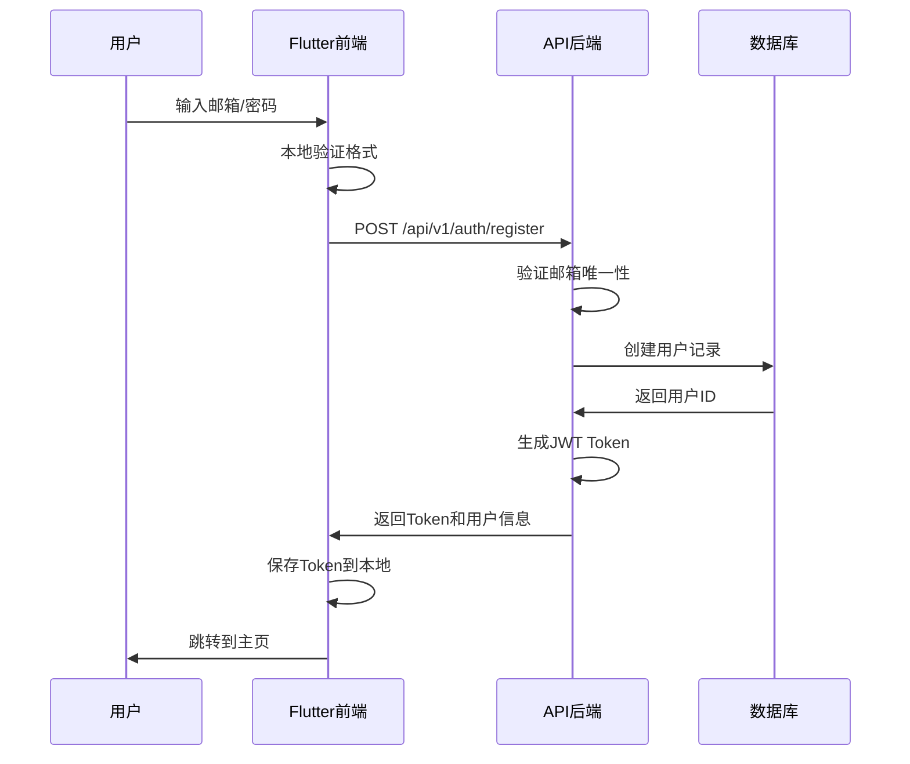
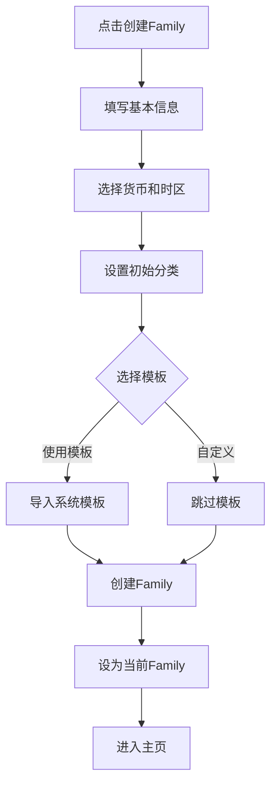
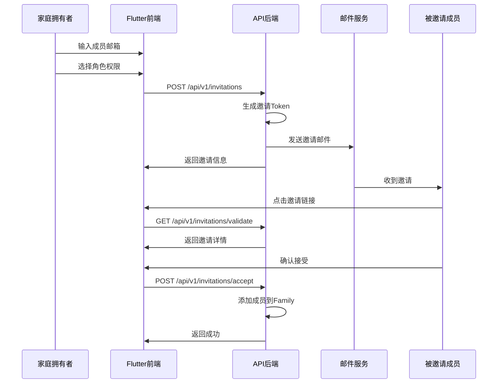
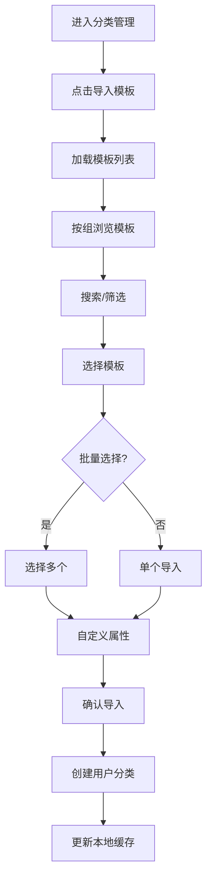
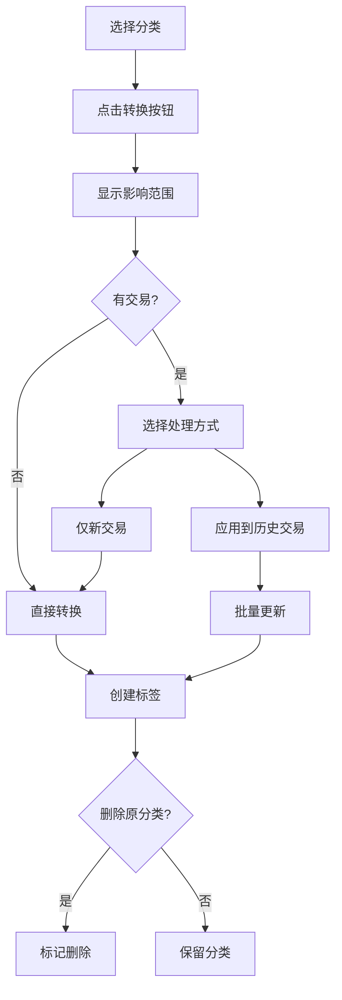
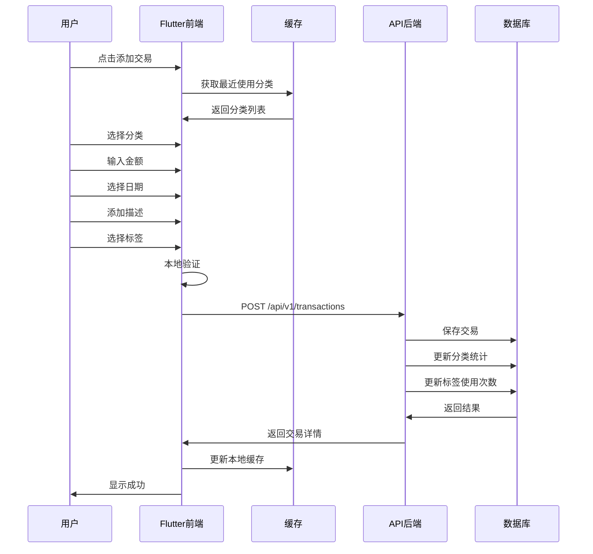
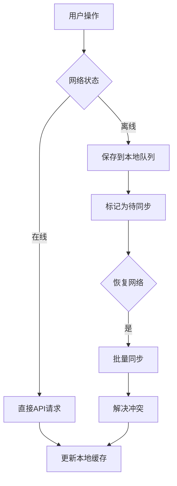

# 用户操作流程与前后端API对接详细计划

## 📅 计划制定日期：2025-01-06

## 🎯 总体目标
建立完整的用户操作流程，确保前端界面与后端API无缝对接，提供流畅的用户体验。

## 📱 核心用户流程

### 1. 用户注册与登录流程

#### 1.1 注册流程


#### API接口定义
```yaml
注册接口:
  endpoint: POST /api/v1/auth/register
  request:
    email: string (required)
    password: string (required, min:8)
    displayName: string (optional)
    inviteCode: string (optional)
  response:
    token: string
    user:
      id: uuid
      email: string
      displayName: string
    defaultFamily:
      id: uuid
      name: string
```

#### 1.2 登录流程
```yaml
登录接口:
  endpoint: POST /api/v1/auth/login
  request:
    email: string
    password: string
    rememberMe: boolean
  response:
    token: string
    refreshToken: string
    user: UserObject
    families: Family[]
```

### 2. Family（家庭/账本）管理流程

#### 2.1 创建Family流程


#### API接口定义
```yaml
创建Family:
  endpoint: POST /api/v1/families
  request:
    name: string
    description: string
    currency: string (CNY/USD/EUR等)
    timezone: string
    settings:
      startOfWeek: number (1-7)
      locale: string
    importTemplates: boolean
    templateIds: string[] (可选)
  response:
    family: Family
    categories: Category[]
    
切换Family:
  endpoint: POST /api/v1/families/{id}/switch
  response:
    currentFamily: Family
    categories: Category[]
    recentTransactions: Transaction[]
```

#### 2.2 邀请成员流程


### 3. 分类管理流程

#### 3.1 系统模板导入流程


#### API接口定义
```yaml
获取模板列表:
  endpoint: GET /api/v1/category-templates
  params:
    group: string (income/expense/transfer)
    featured: boolean
    search: string
    lang: string (zh/en)
  response:
    templates: SystemCategoryTemplate[]
    groups: CategoryGroup[]
    
导入模板:
  endpoint: POST /api/v1/categories/import
  request:
    familyId: uuid
    templateIds: uuid[]
    options:
      skipExisting: boolean
      customizations:
        - templateId: uuid
          name: string
          color: string
  response:
    imported: number
    skipped: number
    categories: Category[]
```

#### 3.2 分类转标签流程


### 4. 标签管理流程

#### 4.1 标签CRUD流程
```yaml
创建标签:
  endpoint: POST /api/v1/tags
  request:
    name: string
    color: string
    icon: string
    groupId: uuid (可选)
  response:
    tag: Tag
    
标签分组:
  endpoint: POST /api/v1/tag-groups
  request:
    name: string
    color: string
    icon: string
  response:
    group: TagGroup
    
批量操作:
  endpoint: POST /api/v1/tags/batch
  request:
    action: merge|delete|archive
    tagIds: uuid[]
    targetId: uuid (merge时需要)
```

### 5. 交易管理流程

#### 5.1 创建交易完整流程


#### API接口定义
```yaml
创建交易:
  endpoint: POST /api/v1/transactions
  request:
    familyId: uuid
    categoryId: uuid
    amount: decimal
    type: income|expense|transfer
    date: date
    description: string
    tags: uuid[]
    attachments: file[] (可选)
    location: object (可选)
    recurring: object (可选)
  response:
    transaction: Transaction
    categoryStats: CategoryStatistics
    
批量操作:
  endpoint: POST /api/v1/transactions/batch
  request:
    action: recategorize|delete|addTags
    transactionIds: uuid[]
    targetCategoryId: uuid (recategorize时)
    tagIds: uuid[] (addTags时)
  response:
    affected: number
    batchId: uuid
```

#### 5.2 交易搜索和筛选
```yaml
搜索交易:
  endpoint: GET /api/v1/transactions/search
  params:
    familyId: uuid
    keyword: string
    categoryIds: uuid[]
    tagIds: uuid[]
    dateFrom: date
    dateTo: date
    amountMin: decimal
    amountMax: decimal
    type: income|expense|transfer
    sort: date|amount
    order: asc|desc
    page: number
    limit: number
  response:
    transactions: Transaction[]
    total: number
    summary:
      totalIncome: decimal
      totalExpense: decimal
      balance: decimal
```

### 6. 报表和统计流程

#### 6.1 数据统计API
```yaml
月度统计:
  endpoint: GET /api/v1/statistics/monthly
  params:
    familyId: uuid
    year: number
    month: number
  response:
    income: decimal
    expense: decimal
    balance: decimal
    categoryBreakdown: object[]
    tagCloud: object[]
    dailyTrend: object[]
    
年度统计:
  endpoint: GET /api/v1/statistics/yearly
  params:
    familyId: uuid
    year: number
  response:
    monthlyData: object[]
    categoryRanking: object[]
    yearOverYear: object
```

## 🔄 数据同步机制

### 离线优先架构


### 同步策略
```dart
class SyncManager {
  // 同步优先级
  static const PRIORITY_HIGH = 1;    // 交易、分类
  static const PRIORITY_MEDIUM = 2;  // 标签、设置
  static const PRIORITY_LOW = 3;     // 统计、报表
  
  // 同步间隔
  static const SYNC_INTERVAL_ACTIVE = Duration(minutes: 5);
  static const SYNC_INTERVAL_BACKGROUND = Duration(minutes: 30);
  
  // 冲突解决策略
  enum ConflictResolution {
    serverWins,   // 服务器优先
    clientWins,   // 客户端优先
    merge,        // 合并
    manual        // 手动解决
  }
}
```

## 🔐 安全和权限

### API认证流程
```yaml
认证头:
  Authorization: Bearer {jwt_token}
  X-Family-Id: {current_family_id}
  X-Device-Id: {device_id}
  
Token刷新:
  endpoint: POST /api/v1/auth/refresh
  request:
    refreshToken: string
  response:
    token: string
    refreshToken: string
```

### 权限检查矩阵
| 操作 | Owner | Admin | Member | Viewer |
|-----|-------|-------|---------|---------|
| 查看交易 | ✅ | ✅ | ✅ | ✅ |
| 创建交易 | ✅ | ✅ | ✅ | ❌ |
| 编辑交易 | ✅ | ✅ | ✅ | ❌ |
| 删除交易 | ✅ | ✅ | ❌ | ❌ |
| 管理分类 | ✅ | ✅ | ✅ | ❌ |
| 管理成员 | ✅ | ✅ | ❌ | ❌ |
| 删除Family | ✅ | ❌ | ❌ | ❌ |

## 📊 性能优化策略

### 分页加载
```yaml
默认分页参数:
  page: 1
  limit: 20
  maxLimit: 100
  
无限滚动:
  预加载: 下一页在剩余5条时触发
  缓存页数: 最多缓存10页
```

### 缓存策略
```dart
class CachePolicy {
  // 缓存时长
  static const CACHE_DURATION = {
    'categories': Duration(hours: 24),
    'tags': Duration(hours: 24),
    'transactions': Duration(minutes: 30),
    'statistics': Duration(hours: 1),
    'templates': Duration(days: 7),
  };
  
  // 缓存大小限制
  static const MAX_CACHE_SIZE = 50 * 1024 * 1024; // 50MB
}
```

## 🚀 实施计划

### 第一阶段：基础API（第1周）
- [ ] 实现认证和授权
- [ ] 实现Family CRUD
- [ ] 实现分类管理API
- [ ] 实现标签管理API

### 第二阶段：核心功能（第2周）
- [ ] 实现交易管理API
- [ ] 实现搜索和筛选
- [ ] 实现批量操作
- [ ] 实现数据统计

### 第三阶段：高级功能（第3周）
- [ ] 实现模板导入
- [ ] 实现分类转标签
- [ ] 实现数据同步
- [ ] 实现离线支持

### 第四阶段：优化和测试（第4周）
- [ ] 性能优化
- [ ] 安全加固
- [ ] 集成测试
- [ ] 用户测试

## 📝 API文档规范

### 请求规范
```yaml
标准请求头:
  Content-Type: application/json
  Accept: application/json
  Accept-Language: zh-CN
  X-Request-Id: uuid
  X-Client-Version: 1.0.0
```

### 响应规范
```yaml
成功响应:
  status: 200/201
  body:
    success: true
    data: object
    message: string
    
错误响应:
  status: 4xx/5xx
  body:
    success: false
    error:
      code: string
      message: string
      details: object
```

### 错误码定义
```yaml
认证错误:
  AUTH001: Token无效
  AUTH002: Token过期
  AUTH003: 权限不足
  
业务错误:
  BIZ001: 资源不存在
  BIZ002: 重复操作
  BIZ003: 数据验证失败
  
系统错误:
  SYS001: 服务不可用
  SYS002: 数据库错误
  SYS003: 网络超时
```

## 🎯 成功指标

### 技术指标
- API响应时间 < 200ms (P95)
- 客户端加载时间 < 3s
- 离线可用率 > 90%
- 数据同步成功率 > 99%

### 用户体验指标
- 操作步骤 < 3步完成核心功能
- 错误率 < 1%
- 用户满意度 > 4.5/5

---

**计划状态**：✅ 已制定
**执行优先级**：高
**预计完成时间**：4周