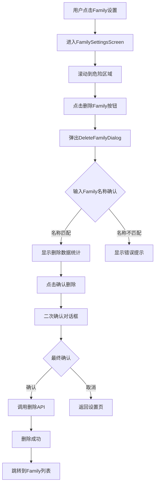
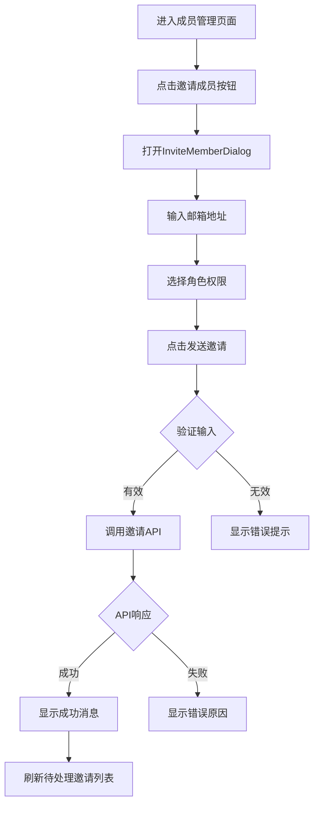
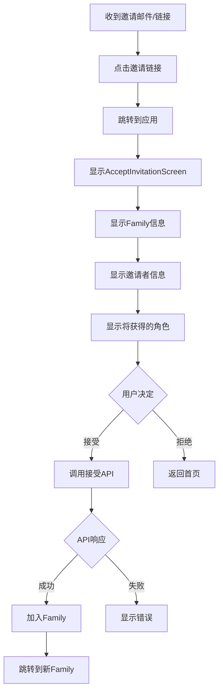
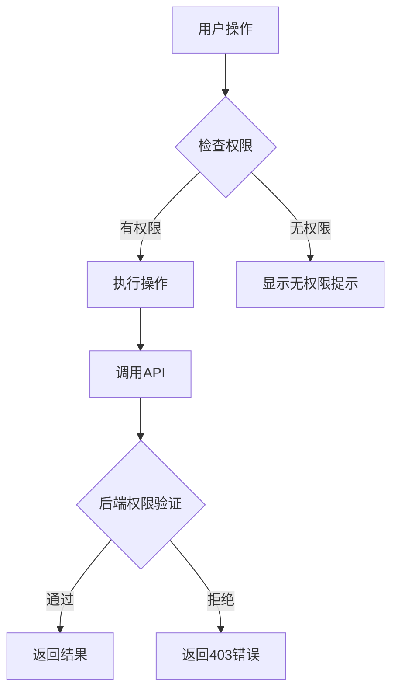

# 🔄 用户操作流程详细实现计划

## 📋 概述

本文档详细描述Jive Money应用中每个用户操作的完整流程，包括：
- 用户界面交互步骤
- 前端API调用
- 后端处理逻辑
- 数据流向
- 错误处理

## 🎯 核心功能模块

### 1. Family生命周期管理
### 2. 成员邀请与管理
### 3. 权限管理系统
### 4. 审计日志系统

---

## 📱 功能1：删除Family完整流程

### 用户操作步骤



### 前端实现代码

#### 1. 创建删除确认对话框

```dart
// lib/widgets/dialogs/delete_family_dialog.dart
import 'package:flutter/material.dart';
import 'package:flutter_riverpod/flutter_riverpod.dart';
import '../../models/family.dart';
import '../../services/api/family_service.dart';
import '../../providers/family_provider.dart';

class DeleteFamilyDialog extends ConsumerStatefulWidget {
  final Family family;
  final FamilyStatistics statistics;

  const DeleteFamilyDialog({
    Key? key,
    required this.family,
    required this.statistics,
  }) : super(key: key);

  @override
  ConsumerState<DeleteFamilyDialog> createState() => _DeleteFamilyDialogState();
}

class _DeleteFamilyDialogState extends ConsumerState<DeleteFamilyDialog> {
  final _nameController = TextEditingController();
  bool _isNameValid = false;
  bool _isDeleting = false;
  String? _error;

  @override
  void initState() {
    super.initState();
    _nameController.addListener(_validateName);
  }

  void _validateName() {
    setState(() {
      _isNameValid = _nameController.text == widget.family.name;
      _error = null;
    });
  }

  Future<void> _deleteFamily() async {
    if (!_isNameValid) return;

    // 二次确认
    final secondConfirm = await showDialog<bool>(
      context: context,
      builder: (context) => AlertDialog(
        title: const Text('⚠️ 最终确认'),
        content: Text(
          '您确定要删除 "${widget.family.name}" 吗？\n'
          '此操作不可恢复！\n\n'
          '将删除：\n'
          '• ${widget.statistics.memberCount} 个成员\n'
          '• ${widget.statistics.accountCount} 个账户\n'
          '• ${widget.statistics.transactionCount} 条交易记录',
        ),
        actions: [
          TextButton(
            onPressed: () => Navigator.pop(context, false),
            child: const Text('取消'),
          ),
          FilledButton(
            onPressed: () => Navigator.pop(context, true),
            style: FilledButton.styleFrom(
              backgroundColor: Colors.red,
            ),
            child: const Text('确认删除'),
          ),
        ],
      ),
    );

    if (secondConfirm != true) return;

    setState(() {
      _isDeleting = true;
      _error = null;
    });

    try {
      final familyService = FamilyService();
      await familyService.deleteFamily(widget.family.id);

      // 刷新Family列表
      await ref.refresh(userFamiliesProvider.future);

      if (mounted) {
        // 如果删除的是当前Family，切换到其他Family或显示空状态
        final currentFamily = ref.read(currentFamilyProvider);
        if (currentFamily?.id == widget.family.id) {
          final families = await ref.read(userFamiliesProvider.future);
          if (families.isNotEmpty) {
            // 切换到第一个可用的Family
            await familyService.switchFamily(families.first.family.id);
            await ref.refresh(currentFamilyProvider.future);
          }
        }

        Navigator.of(context).pop(true);
        ScaffoldMessenger.of(context).showSnackBar(
          SnackBar(
            content: Text('已删除 "${widget.family.name}"'),
            backgroundColor: Colors.green,
          ),
        );

        // 导航到Family列表或Dashboard
        Navigator.of(context).pushNamedAndRemoveUntil(
          '/dashboard',
          (route) => false,
        );
      }
    } catch (e) {
      setState(() {
        _isDeleting = false;
        _error = e.toString();
      });
    }
  }

  @override
  Widget build(BuildContext context) {
    final theme = Theme.of(context);
    
    return AlertDialog(
      title: Row(
        children: [
          Icon(
            Icons.warning_amber_rounded,
            color: theme.colorScheme.error,
          ),
          const SizedBox(width: 8),
          const Text('删除Family'),
        ],
      ),
      content: SingleChildScrollView(
        child: Column(
          mainAxisSize: MainAxisSize.min,
          crossAxisAlignment: CrossAxisAlignment.start,
          children: [
            Text(
              '此操作将永久删除 "${widget.family.name}" 及其所有数据。',
              style: theme.textTheme.bodyMedium,
            ),
            const SizedBox(height: 16),
            
            // 数据统计
            Container(
              padding: const EdgeInsets.all(12),
              decoration: BoxDecoration(
                color: theme.colorScheme.errorContainer.withOpacity(0.3),
                borderRadius: BorderRadius.circular(8),
              ),
              child: Column(
                crossAxisAlignment: CrossAxisAlignment.start,
                children: [
                  Text(
                    '将被删除的数据：',
                    style: theme.textTheme.titleSmall,
                  ),
                  const SizedBox(height: 8),
                  _buildStatRow(Icons.people, '成员', widget.statistics.memberCount),
                  _buildStatRow(Icons.account_balance_wallet, '账户', widget.statistics.accountCount),
                  _buildStatRow(Icons.receipt_long, '交易', widget.statistics.transactionCount),
                  _buildStatRow(Icons.category, '分类', widget.statistics.ledgerCount),
                ],
              ),
            ),
            const SizedBox(height: 16),
            
            // 输入确认
            Text(
              '请输入Family名称以确认删除：',
              style: theme.textTheme.bodyMedium,
            ),
            const SizedBox(height: 8),
            TextField(
              controller: _nameController,
              decoration: InputDecoration(
                hintText: widget.family.name,
                border: const OutlineInputBorder(),
                errorText: _error,
                suffixIcon: _isNameValid
                    ? const Icon(Icons.check_circle, color: Colors.green)
                    : null,
              ),
              enabled: !_isDeleting,
            ),
          ],
        ),
      ),
      actions: [
        TextButton(
          onPressed: _isDeleting ? null : () => Navigator.pop(context),
          child: const Text('取消'),
        ),
        FilledButton(
          onPressed: _isNameValid && !_isDeleting ? _deleteFamily : null,
          style: FilledButton.styleFrom(
            backgroundColor: theme.colorScheme.error,
          ),
          child: _isDeleting
              ? const SizedBox(
                  width: 20,
                  height: 20,
                  child: CircularProgressIndicator(
                    strokeWidth: 2,
                    valueColor: AlwaysStoppedAnimation<Color>(Colors.white),
                  ),
                )
              : const Text('删除Family'),
        ),
      ],
    );
  }

  Widget _buildStatRow(IconData icon, String label, int count) {
    return Padding(
      padding: const EdgeInsets.symmetric(vertical: 2),
      child: Row(
        children: [
          Icon(icon, size: 16, color: Colors.red),
          const SizedBox(width: 8),
          Text('$label: '),
          Text(
            count.toString(),
            style: const TextStyle(fontWeight: FontWeight.bold),
          ),
        ],
      ),
    );
  }

  @override
  void dispose() {
    _nameController.dispose();
    super.dispose();
  }
}
```

#### 2. 在FamilySettingsScreen中集成删除功能

```dart
// lib/screens/family/family_settings_screen.dart
// 在危险区域部分添加删除按钮

Widget _buildDangerZone() {
  return Card(
    color: theme.colorScheme.errorContainer.withOpacity(0.1),
    child: Padding(
      padding: const EdgeInsets.all(16),
      children: [
        Row(
          children: [
            Icon(
              Icons.warning_amber_rounded,
              color: theme.colorScheme.error,
            ),
            const SizedBox(width: 8),
            Text(
              '危险操作',
              style: theme.textTheme.titleMedium?.copyWith(
                color: theme.colorScheme.error,
                fontWeight: FontWeight.bold,
              ),
            ),
          ],
        ),
        const SizedBox(height: 16),
        
        // 删除Family按钮
        if (_currentMember?.role == LedgerRole.owner)
          ListTile(
            leading: const Icon(Icons.delete_forever, color: Colors.red),
            title: const Text('删除此Family'),
            subtitle: const Text('永久删除Family及其所有数据'),
            trailing: const Icon(Icons.arrow_forward_ios, size: 16),
            onTap: _showDeleteDialog,
          ),
        
        // 离开Family按钮
        if (_currentMember?.role != LedgerRole.owner)
          ListTile(
            leading: const Icon(Icons.exit_to_app, color: Colors.orange),
            title: const Text('离开此Family'),
            subtitle: const Text('退出并失去访问权限'),
            trailing: const Icon(Icons.arrow_forward_ios, size: 16),
            onTap: _showLeaveDialog,
          ),
      ],
    ),
  );
}

Future<void> _showDeleteDialog() async {
  if (_statistics == null) return;
  
  final result = await showDialog<bool>(
    context: context,
    barrierDismissible: false,
    builder: (context) => DeleteFamilyDialog(
      family: widget.ledger,
      statistics: _statistics!,
    ),
  );
  
  if (result == true && mounted) {
    // Family已删除，对话框会处理导航
  }
}
```

### 后端API调用流程

```dart
// API调用顺序
1. GET /families/{id}/statistics - 获取删除前的统计信息
2. DELETE /families/{id} - 执行删除操作
3. GET /families - 刷新Family列表
4. POST /families/switch - 切换到其他Family（如果需要）
```

### 错误处理

```dart
// 错误处理策略
try {
  await familyService.deleteFamily(familyId);
} catch (e) {
  if (e is ApiException) {
    switch (e.statusCode) {
      case 403:
        _showError('您没有权限删除此Family');
        break;
      case 409:
        _showError('无法删除：Family中还有其他活跃成员');
        break;
      case 500:
        _showError('服务器错误，请稍后重试');
        break;
      default:
        _showError(e.message);
    }
  }
}
```

---

## 📱 功能2：完整邀请系统流程

### 用户操作步骤 - 发送邀请



### 用户操作步骤 - 接受邀请



### 前端实现代码

#### 1. 创建邀请模型

```dart
// lib/models/invitation.dart
import 'package:freezed_annotation/freezed_annotation.dart';
import 'family.dart';

part 'invitation.freezed.dart';
part 'invitation.g.dart';

@freezed
class Invitation with _$Invitation {
  const factory Invitation({
    required String id,
    required String familyId,
    required String email,
    required String token,
    required FamilyRole role,
    required String invitedBy,
    required DateTime createdAt,
    required DateTime expiresAt,
    DateTime? acceptedAt,
    String? acceptedBy,
    @Default(InvitationStatus.pending) InvitationStatus status,
  }) = _Invitation;

  factory Invitation.fromJson(Map<String, dynamic> json) =>
      _$InvitationFromJson(json);
}

enum InvitationStatus {
  pending('pending'),
  accepted('accepted'),
  expired('expired'),
  cancelled('cancelled');

  final String value;
  const InvitationStatus(this.value);
}

@freezed
class InvitationWithDetails with _$InvitationWithDetails {
  const factory InvitationWithDetails({
    required Invitation invitation,
    required Family family,
    required User inviter,
  }) = _InvitationWithDetails;

  factory InvitationWithDetails.fromJson(Map<String, dynamic> json) =>
      _$InvitationWithDetailsFromJson(json);
}
```

#### 2. 扩展FamilyService添加邀请方法

```dart
// lib/services/api/family_service.dart
// 添加以下方法

/// 创建邀请
Future<Invitation> createInvitation({
  required String familyId,
  required String email,
  required FamilyRole role,
}) async {
  try {
    final response = await _client.post(
      '/invitations',
      data: {
        'family_id': familyId,
        'email': email,
        'role': role.value,
      },
    );
    
    return Invitation.fromJson(response.data['data'] ?? response.data);
  } catch (e) {
    throw _handleError(e);
  }
}

/// 获取待处理的邀请
Future<List<InvitationWithDetails>> getPendingInvitations() async {
  try {
    final response = await _client.get('/invitations');
    
    final List<dynamic> data = response.data['data'] ?? response.data;
    return data.map((json) => InvitationWithDetails.fromJson(json)).toList();
  } catch (e) {
    throw _handleError(e);
  }
}

/// 获取Family的所有邀请
Future<List<Invitation>> getFamilyInvitations(String familyId) async {
  try {
    final response = await _client.get('/families/$familyId/invitations');
    
    final List<dynamic> data = response.data['data'] ?? response.data;
    return data.map((json) => Invitation.fromJson(json)).toList();
  } catch (e) {
    throw _handleError(e);
  }
}

/// 接受邀请
Future<UserFamilyInfo> acceptInvitation(String invitationId) async {
  try {
    final response = await _client.post(
      '/invitations/$invitationId/accept',
    );
    
    return UserFamilyInfo.fromJson(response.data['data'] ?? response.data);
  } catch (e) {
    throw _handleError(e);
  }
}

/// 拒绝邀请
Future<void> declineInvitation(String invitationId) async {
  try {
    await _client.post('/invitations/$invitationId/decline');
  } catch (e) {
    throw _handleError(e);
  }
}

/// 取消邀请（邀请者操作）
Future<void> cancelInvitation(String invitationId) async {
  try {
    await _client.delete('/invitations/$invitationId');
  } catch (e) {
    throw _handleError(e);
  }
}

/// 验证邀请码
Future<InvitationWithDetails> validateInvitationCode(String code) async {
  try {
    final response = await _client.get('/invitations/validate/$code');
    
    return InvitationWithDetails.fromJson(response.data['data'] ?? response.data);
  } catch (e) {
    throw _handleError(e);
  }
}

/// 重新生成Family邀请码
Future<String> regenerateFamilyInviteCode(String familyId) async {
  try {
    final response = await _client.post('/families/$familyId/invite-code');
    
    return response.data['data']['invite_code'] ?? response.data['invite_code'];
  } catch (e) {
    throw _handleError(e);
  }
}
```

#### 3. 创建待处理邀请页面

```dart
// lib/screens/invitations/pending_invitations_screen.dart
import 'package:flutter/material.dart';
import 'package:flutter_riverpod/flutter_riverpod.dart';
import '../../models/invitation.dart';
import '../../services/api/family_service.dart';
import '../../providers/invitation_provider.dart';

class PendingInvitationsScreen extends ConsumerStatefulWidget {
  const PendingInvitationsScreen({Key? key}) : super(key: key);

  @override
  ConsumerState<PendingInvitationsScreen> createState() => 
      _PendingInvitationsScreenState();
}

class _PendingInvitationsScreenState 
    extends ConsumerState<PendingInvitationsScreen> {
  final _familyService = FamilyService();
  bool _isLoading = true;
  List<InvitationWithDetails> _invitations = [];
  String? _error;

  @override
  void initState() {
    super.initState();
    _loadInvitations();
  }

  Future<void> _loadInvitations() async {
    setState(() {
      _isLoading = true;
      _error = null;
    });

    try {
      final invitations = await _familyService.getPendingInvitations();
      setState(() {
        _invitations = invitations;
        _isLoading = false;
      });
    } catch (e) {
      setState(() {
        _error = e.toString();
        _isLoading = false;
      });
    }
  }

  Future<void> _acceptInvitation(InvitationWithDetails invitation) async {
    try {
      await _familyService.acceptInvitation(invitation.invitation.id);
      
      // 刷新Family列表
      await ref.refresh(userFamiliesProvider.future);
      
      if (mounted) {
        ScaffoldMessenger.of(context).showSnackBar(
          SnackBar(
            content: Text('已加入 ${invitation.family.name}'),
            backgroundColor: Colors.green,
          ),
        );
        
        // 切换到新Family
        await _familyService.switchFamily(invitation.invitation.familyId);
        await ref.refresh(currentFamilyProvider.future);
        
        Navigator.of(context).pushReplacementNamed('/dashboard');
      }
    } catch (e) {
      ScaffoldMessenger.of(context).showSnackBar(
        SnackBar(
          content: Text('接受邀请失败: ${e.toString()}'),
          backgroundColor: Colors.red,
        ),
      );
    }
  }

  Future<void> _declineInvitation(InvitationWithDetails invitation) async {
    try {
      await _familyService.declineInvitation(invitation.invitation.id);
      await _loadInvitations();
      
      if (mounted) {
        ScaffoldMessenger.of(context).showSnackBar(
          const SnackBar(
            content: Text('已拒绝邀请'),
          ),
        );
      }
    } catch (e) {
      ScaffoldMessenger.of(context).showSnackBar(
        SnackBar(
          content: Text('操作失败: ${e.toString()}'),
          backgroundColor: Colors.red,
        ),
      );
    }
  }

  @override
  Widget build(BuildContext context) {
    final theme = Theme.of(context);

    if (_isLoading) {
      return const Scaffold(
        body: Center(
          child: CircularProgressIndicator(),
        ),
      );
    }

    if (_error != null) {
      return Scaffold(
        body: Center(
          child: Column(
            mainAxisAlignment: MainAxisAlignment.center,
            children: [
              const Icon(Icons.error_outline, size: 64, color: Colors.red),
              const SizedBox(height: 16),
              Text(_error!),
              const SizedBox(height: 16),
              FilledButton(
                onPressed: _loadInvitations,
                child: const Text('重试'),
              ),
            ],
          ),
        ),
      );
    }

    return Scaffold(
      appBar: AppBar(
        title: const Text('待处理的邀请'),
      ),
      body: _invitations.isEmpty
          ? const Center(
              child: Column(
                mainAxisAlignment: MainAxisAlignment.center,
                children: [
                  Icon(Icons.mail_outline, size: 64, color: Colors.grey),
                  SizedBox(height: 16),
                  Text('暂无待处理的邀请'),
                ],
              ),
            )
          : RefreshIndicator(
              onRefresh: _loadInvitations,
              child: ListView.builder(
                padding: const EdgeInsets.all(16),
                itemCount: _invitations.length,
                itemBuilder: (context, index) {
                  final invitation = _invitations[index];
                  return _buildInvitationCard(invitation);
                },
              ),
            ),
    );
  }

  Widget _buildInvitationCard(InvitationWithDetails invitation) {
    final theme = Theme.of(context);
    
    return Card(
      margin: const EdgeInsets.only(bottom: 12),
      child: Padding(
        padding: const EdgeInsets.all(16),
        child: Column(
          crossAxisAlignment: CrossAxisAlignment.start,
          children: [
            Row(
              children: [
                CircleAvatar(
                  backgroundImage: invitation.family.avatarUrl != null
                      ? NetworkImage(invitation.family.avatarUrl!)
                      : null,
                  child: invitation.family.avatarUrl == null
                      ? Text(invitation.family.name[0].toUpperCase())
                      : null,
                ),
                const SizedBox(width: 12),
                Expanded(
                  child: Column(
                    crossAxisAlignment: CrossAxisAlignment.start,
                    children: [
                      Text(
                        invitation.family.name,
                        style: theme.textTheme.titleMedium,
                      ),
                      Text(
                        '邀请者: ${invitation.inviter.fullName}',
                        style: theme.textTheme.bodySmall,
                      ),
                    ],
                  ),
                ),
              ],
            ),
            const SizedBox(height: 12),
            Container(
              padding: const EdgeInsets.symmetric(horizontal: 8, vertical: 4),
              decoration: BoxDecoration(
                color: theme.colorScheme.primaryContainer,
                borderRadius: BorderRadius.circular(4),
              ),
              child: Text(
                '角色: ${_getRoleDisplayName(invitation.invitation.role)}',
                style: TextStyle(
                  color: theme.colorScheme.onPrimaryContainer,
                  fontSize: 12,
                ),
              ),
            ),
            const SizedBox(height: 8),
            Text(
              '过期时间: ${_formatDate(invitation.invitation.expiresAt)}',
              style: theme.textTheme.bodySmall,
            ),
            const SizedBox(height: 16),
            Row(
              mainAxisAlignment: MainAxisAlignment.end,
              children: [
                TextButton(
                  onPressed: () => _declineInvitation(invitation),
                  child: const Text('拒绝'),
                ),
                const SizedBox(width: 8),
                FilledButton(
                  onPressed: () => _acceptInvitation(invitation),
                  child: const Text('接受'),
                ),
              ],
            ),
          ],
        ),
      ),
    );
  }

  String _getRoleDisplayName(FamilyRole role) {
    switch (role) {
      case FamilyRole.owner:
        return '所有者';
      case FamilyRole.admin:
        return '管理员';
      case FamilyRole.editor:
        return '编辑者';
      case FamilyRole.viewer:
        return '查看者';
    }
  }

  String _formatDate(DateTime date) {
    final now = DateTime.now();
    final difference = date.difference(now);
    
    if (difference.inDays > 0) {
      return '${difference.inDays}天后';
    } else if (difference.inHours > 0) {
      return '${difference.inHours}小时后';
    } else if (difference.inMinutes > 0) {
      return '${difference.inMinutes}分钟后';
    } else {
      return '已过期';
    }
  }
}
```

### API调用时序

```dart
// 发送邀请流程
1. POST /invitations - 创建邀请
2. GET /families/{id}/invitations - 刷新邀请列表

// 接受邀请流程
1. GET /invitations - 获取待处理邀请
2. POST /invitations/{id}/accept - 接受邀请
3. GET /families - 刷新Family列表
4. POST /families/switch - 切换到新Family
```

---

## 📱 功能3：基础权限检查系统

### 权限检查流程



### 前端实现代码

#### 1. 创建权限服务

```dart
// lib/services/permission_service.dart
import '../models/ledger.dart';
import '../models/family.dart';

enum Permission {
  // Family管理
  viewFamilyInfo,
  updateFamilyInfo,
  deleteFamily,
  
  // 成员管理
  viewMembers,
  inviteMembers,
  removeMembers,
  updateMemberRoles,
  
  // 账户管理
  viewAccounts,
  createAccounts,
  editAccounts,
  deleteAccounts,
  
  // 交易管理
  viewTransactions,
  createTransactions,
  editTransactions,
  deleteTransactions,
  bulkEditTransactions,
  
  // 预算管理
  viewBudgets,
  createBudgets,
  editBudgets,
  deleteBudgets,
  
  // 报表查看
  viewReports,
  exportReports,
  
  // 设置管理
  manageSettings,
  viewAuditLog,
}

class PermissionService {
  static final PermissionService _instance = PermissionService._internal();
  factory PermissionService() => _instance;
  PermissionService._internal();

  /// 角色权限映射
  static const Map<LedgerRole, Set<Permission>> _rolePermissions = {
    LedgerRole.owner: {
      // Owner拥有所有权限
      ...Permission.values,
    },
    LedgerRole.admin: {
      // Admin除了删除Family外的所有权限
      Permission.viewFamilyInfo,
      Permission.updateFamilyInfo,
      Permission.viewMembers,
      Permission.inviteMembers,
      Permission.removeMembers,
      Permission.updateMemberRoles,
      Permission.viewAccounts,
      Permission.createAccounts,
      Permission.editAccounts,
      Permission.deleteAccounts,
      Permission.viewTransactions,
      Permission.createTransactions,
      Permission.editTransactions,
      Permission.deleteTransactions,
      Permission.bulkEditTransactions,
      Permission.viewBudgets,
      Permission.createBudgets,
      Permission.editBudgets,
      Permission.deleteBudgets,
      Permission.viewReports,
      Permission.exportReports,
      Permission.manageSettings,
      Permission.viewAuditLog,
    },
    LedgerRole.editor: {
      // Editor可以编辑数据但不能管理成员
      Permission.viewFamilyInfo,
      Permission.viewMembers,
      Permission.viewAccounts,
      Permission.createAccounts,
      Permission.editAccounts,
      Permission.viewTransactions,
      Permission.createTransactions,
      Permission.editTransactions,
      Permission.viewBudgets,
      Permission.createBudgets,
      Permission.editBudgets,
      Permission.viewReports,
    },
    LedgerRole.viewer: {
      // Viewer只能查看
      Permission.viewFamilyInfo,
      Permission.viewMembers,
      Permission.viewAccounts,
      Permission.viewTransactions,
      Permission.viewBudgets,
      Permission.viewReports,
    },
  };

  /// 检查用户是否有指定权限
  bool hasPermission(LedgerMember member, Permission permission) {
    // 首先检查角色权限
    final rolePermissions = _rolePermissions[member.role] ?? {};
    if (rolePermissions.contains(permission)) {
      return true;
    }
    
    // 然后检查自定义权限
    if (member.permissions != null) {
      final permissionKey = permission.toString().split('.').last;
      return member.permissions![permissionKey] == true;
    }
    
    return false;
  }

  /// 检查用户是否有任一权限
  bool hasAnyPermission(LedgerMember member, List<Permission> permissions) {
    return permissions.any((p) => hasPermission(member, p));
  }

  /// 检查用户是否有所有权限
  bool hasAllPermissions(LedgerMember member, List<Permission> permissions) {
    return permissions.every((p) => hasPermission(member, p));
  }

  /// 获取角色的最小权限级别
  bool hasMinimumRole(LedgerMember member, LedgerRole minimumRole) {
    const roleHierarchy = {
      LedgerRole.owner: 4,
      LedgerRole.admin: 3,
      LedgerRole.editor: 2,
      LedgerRole.viewer: 1,
    };
    
    final memberLevel = roleHierarchy[member.role] ?? 0;
    final requiredLevel = roleHierarchy[minimumRole] ?? 0;
    
    return memberLevel >= requiredLevel;
  }

  /// 快捷方法
  bool canEditFamily(LedgerMember member) =>
      hasPermission(member, Permission.updateFamilyInfo);
  
  bool canDeleteFamily(LedgerMember member) =>
      hasPermission(member, Permission.deleteFamily);
  
  bool canInviteMembers(LedgerMember member) =>
      hasPermission(member, Permission.inviteMembers);
  
  bool canRemoveMembers(LedgerMember member) =>
      hasPermission(member, Permission.removeMembers);
  
  bool canManageRoles(LedgerMember member) =>
      hasPermission(member, Permission.updateMemberRoles);
  
  bool canCreateTransactions(LedgerMember member) =>
      hasPermission(member, Permission.createTransactions);
  
  bool canEditTransactions(LedgerMember member) =>
      hasPermission(member, Permission.editTransactions);
  
  bool canDeleteTransactions(LedgerMember member) =>
      hasPermission(member, Permission.deleteTransactions);
  
  bool canManageSettings(LedgerMember member) =>
      hasPermission(member, Permission.manageSettings);
}
```

#### 2. 创建权限保护Widget

```dart
// lib/widgets/permission_guard.dart
import 'package:flutter/material.dart';
import 'package:flutter_riverpod/flutter_riverpod.dart';
import '../services/permission_service.dart';
import '../providers/family_provider.dart';

class PermissionGuard extends ConsumerWidget {
  final Permission requiredPermission;
  final Widget child;
  final Widget? fallback;
  final bool showMessage;

  const PermissionGuard({
    Key? key,
    required this.requiredPermission,
    required this.child,
    this.fallback,
    this.showMessage = false,
  }) : super(key: key);

  @override
  Widget build(BuildContext context, WidgetRef ref) {
    final currentMember = ref.watch(currentMemberProvider);
    
    if (currentMember == null) {
      return fallback ?? const SizedBox.shrink();
    }
    
    final permissionService = PermissionService();
    final hasPermission = permissionService.hasPermission(
      currentMember,
      requiredPermission,
    );
    
    if (hasPermission) {
      return child;
    }
    
    if (fallback != null) {
      return fallback!;
    }
    
    if (showMessage) {
      return Container(
        padding: const EdgeInsets.all(16),
        child: Column(
          mainAxisAlignment: MainAxisAlignment.center,
          children: [
            const Icon(
              Icons.lock_outline,
              size: 48,
              color: Colors.grey,
            ),
            const SizedBox(height: 16),
            Text(
              '您没有权限执行此操作',
              style: Theme.of(context).textTheme.titleMedium,
            ),
            const SizedBox(height: 8),
            Text(
              '需要权限: ${_getPermissionName(requiredPermission)}',
              style: Theme.of(context).textTheme.bodySmall,
            ),
          ],
        ),
      );
    }
    
    return const SizedBox.shrink();
  }
  
  String _getPermissionName(Permission permission) {
    // 转换权限枚举为可读名称
    final name = permission.toString().split('.').last;
    return name.replaceAllMapped(
      RegExp(r'([A-Z])'),
      (match) => ' ${match.group(0)}',
    ).trim();
  }
}

/// 角色保护Widget
class RoleGuard extends ConsumerWidget {
  final LedgerRole minimumRole;
  final Widget child;
  final Widget? fallback;

  const RoleGuard({
    Key? key,
    required this.minimumRole,
    required this.child,
    this.fallback,
  }) : super(key: key);

  @override
  Widget build(BuildContext context, WidgetRef ref) {
    final currentMember = ref.watch(currentMemberProvider);
    
    if (currentMember == null) {
      return fallback ?? const SizedBox.shrink();
    }
    
    final permissionService = PermissionService();
    final hasRole = permissionService.hasMinimumRole(
      currentMember,
      minimumRole,
    );
    
    if (hasRole) {
      return child;
    }
    
    return fallback ?? const SizedBox.shrink();
  }
}
```

#### 3. 在UI中使用权限保护

```dart
// 示例：在FamilyMembersScreen中使用权限保护

// 邀请成员按钮 - 需要inviteMembers权限
PermissionGuard(
  requiredPermission: Permission.inviteMembers,
  child: FloatingActionButton.extended(
    onPressed: _showInviteMemberDialog,
    icon: const Icon(Icons.person_add),
    label: const Text('邀请成员'),
  ),
  fallback: const SizedBox.shrink(),
)

// 删除成员按钮 - 需要removeMembers权限
PermissionGuard(
  requiredPermission: Permission.removeMembers,
  child: IconButton(
    icon: const Icon(Icons.remove_circle_outline),
    onPressed: () => _removeMember(member),
  ),
)

// 编辑角色 - 需要updateMemberRoles权限
RoleGuard(
  minimumRole: LedgerRole.admin,
  child: PopupMenuButton<LedgerRole>(
    onSelected: (role) => _updateMemberRole(member, role),
    itemBuilder: (context) => [
      // 角色选项
    ],
  ),
)

// 设置页面 - 需要manageSettings权限
PermissionGuard(
  requiredPermission: Permission.manageSettings,
  showMessage: true,
  child: FamilySettingsContent(),
)
```

### 权限检查工具方法

```dart
// lib/utils/permission_helper.dart
import 'package:flutter/material.dart';
import '../services/permission_service.dart';
import '../models/ledger.dart';

mixin PermissionCheckMixin {
  final _permissionService = PermissionService();
  
  /// 检查并执行操作
  Future<void> checkAndExecute({
    required BuildContext context,
    required LedgerMember member,
    required Permission permission,
    required Future<void> Function() action,
    String? customMessage,
  }) async {
    if (!_permissionService.hasPermission(member, permission)) {
      ScaffoldMessenger.of(context).showSnackBar(
        SnackBar(
          content: Text(customMessage ?? '您没有权限执行此操作'),
          backgroundColor: Colors.red,
        ),
      );
      return;
    }
    
    try {
      await action();
    } catch (e) {
      if (e.toString().contains('403')) {
        ScaffoldMessenger.of(context).showSnackBar(
          const SnackBar(
            content: Text('权限已变更，请刷新页面'),
            backgroundColor: Colors.orange,
          ),
        );
      } else {
        rethrow;
      }
    }
  }
  
  /// 批量检查权限
  Map<Permission, bool> checkPermissions(
    LedgerMember member,
    List<Permission> permissions,
  ) {
    return {
      for (final permission in permissions)
        permission: _permissionService.hasPermission(member, permission),
    };
  }
}
```

---

## 📊 API调用总览

### 完整API端点映射

| 功能模块 | API端点 | 方法 | 前端调用方法 | 权限要求 |
|---------|---------|------|-------------|---------|
| **删除Family** |
| 获取统计 | /families/{id}/statistics | GET | getFamilyStatistics() | viewer |
| 删除Family | /families/{id} | DELETE | deleteFamily() | owner |
| **邀请系统** |
| 创建邀请 | /invitations | POST | createInvitation() | admin |
| 获取待处理 | /invitations | GET | getPendingInvitations() | - |
| 接受邀请 | /invitations/{id}/accept | POST | acceptInvitation() | - |
| 拒绝邀请 | /invitations/{id}/decline | POST | declineInvitation() | - |
| 取消邀请 | /invitations/{id} | DELETE | cancelInvitation() | admin |
| 验证邀请码 | /invitations/validate/{code} | GET | validateInvitationCode() | - |
| **权限管理** |
| 更新权限 | /members/{id}/permissions | PUT | updateMemberPermissions() | admin |
| 获取权限 | /members/{id}/permissions | GET | getMemberPermissions() | viewer |

---

## 🎯 实施计划

### 第1天：删除Family功能
- [ ] 创建DeleteFamilyDialog组件
- [ ] 集成到FamilySettingsScreen
- [ ] 测试删除流程
- [ ] 处理边界情况

### 第2-3天：完整邀请系统
- [ ] 创建Invitation模型
- [ ] 扩展FamilyService
- [ ] 创建PendingInvitationsScreen
- [ ] 创建AcceptInvitationScreen
- [ ] 实现邀请码功能
- [ ] 测试邀请流程

### 第4天：权限检查系统
- [ ] 创建PermissionService
- [ ] 创建PermissionGuard组件
- [ ] 在所有敏感操作处添加权限检查
- [ ] 测试权限控制

### 第5天：集成测试
- [ ] 端到端测试
- [ ] 修复发现的问题
- [ ] 优化用户体验
- [ ] 文档更新

---

## 📝 总结

本计划详细描述了Jive Money应用中3个核心功能的完整实现方案：

1. **删除Family功能** - 包含二次确认、数据统计展示、级联处理
2. **完整邀请系统** - 支持邮件邀请、邀请码、接受/拒绝流程
3. **基础权限检查** - 前端权限保护、角色层级、细粒度控制

每个功能都包含：
- 用户操作流程图
- 完整的前端代码实现
- API调用时序
- 错误处理策略
- UI集成方案

预计总工期：5个工作日
完成后功能覆盖率将从50%提升到75%

---

**创建日期**: 2025-01-06  
**负责人**: Development Team  
**状态**: 📝 待实施