# 汇率获取系统设计文档

## 目录
1. [系统概述](#系统概述)
2. [架构设计](#架构设计)
3. [数据源策略](#数据源策略)
4. [核心模块](#核心模块)
5. [数据流程](#数据流程)
6. [缓存策略](#缓存策略)
7. [容错机制](#容错机制)
8. [API接口](#api接口)
9. [性能优化](#性能优化)
10. [监控与维护](#监控与维护)

## 系统概述

Jive Money 汇率获取系统是一个高可用、多数据源、智能缓存的实时汇率服务，支持137种法定货币和24种主流加密货币的实时价格获取。

### 主要特性
- ✅ **多数据源冗余**: 自动切换备用API
- ✅ **智能缓存**: 减少API调用，提升响应速度
- ✅ **自动更新**: 定时任务保持数据新鲜
- ✅ **离线支持**: 本地默认汇率备份
- ✅ **手动覆盖**: 支持自定义汇率
- ✅ **地区合规**: 根据地区限制加密货币

## 架构设计

```
┌─────────────────────────────────────────────────────────────┐
│                     外部数据源层                             │
│  ┌──────────────┐  ┌──────────────┐  ┌──────────────┐     │
│  │ Frankfurter  │  │ExchangeRate  │  │  CoinGecko   │     │
│  │     API      │  │     API      │  │     API      │     │
│  └──────────────┘  └──────────────┘  └──────────────┘     │
└────────────┬────────────────┬────────────────┬─────────────┘
             │                │                │
┌────────────▼────────────────▼────────────────▼─────────────┐
│                    汇率服务层 (Rust)                         │
│  ┌──────────────────────────────────────────────────────┐  │
│  │         ExchangeRateApiService                       │  │
│  │  ├─ fetch_fiat_rates()     获取法定货币汇率         │  │
│  │  ├─ fetch_crypto_prices()  获取加密货币价格         │  │
│  │  └─ 智能故障转移 & 缓存管理                         │  │
│  └──────────────────────────────────────────────────────┘  │
└─────────────────────────┬───────────────────────────────────┘
                          │
┌─────────────────────────▼───────────────────────────────────┐
│                     缓存层 (内存)                            │
│  ┌──────────────┐  ┌──────────────┐  ┌──────────────┐     │
│  │ 法定货币缓存  │  │ 加密货币缓存 │  │  汇率历史    │     │
│  │   15分钟      │  │    5分钟     │  │   1小时      │     │
│  └──────────────┘  └──────────────┘  └──────────────┘     │
└─────────────────────────┬───────────────────────────────────┘
                          │
┌─────────────────────────▼───────────────────────────────────┐
│                   数据持久层 (PostgreSQL)                    │
│  ┌──────────────┐  ┌──────────────┐  ┌──────────────┐     │
│  │exchange_rates│  │crypto_prices │  │exchange_rate │     │
│  │     汇率表    │  │  加密价格表   │  │   _cache     │     │
│  └──────────────┘  └──────────────┘  └──────────────┘     │
└─────────────────────────┬───────────────────────────────────┘
                          │
┌─────────────────────────▼───────────────────────────────────┐
│                    定时任务层                                │
│  ┌──────────────┐  ┌──────────────┐  ┌──────────────┐     │
│  │ 汇率更新任务  │  │加密价格任务   │  │ 缓存清理任务  │     │
│  │   每15分钟    │  │   每5分钟     │  │   每1小时     │     │
│  └──────────────┘  └──────────────┘  └──────────────┘     │
└──────────────────────────────────────────────────────────────┘
```

## 数据源策略

### 法定货币汇率源

#### 1. Frankfurter API (主选)
```rust
URL: https://api.frankfurter.app/latest?from={base_currency}
```
- **数据来源**: 欧洲央行(ECB)
- **更新频率**: 工作日每日16:00 CET
- **支持货币**: 30+ 主要货币
- **限制**: 无需API密钥，无请求限制
- **可靠性**: ⭐⭐⭐⭐⭐

#### 2. ExchangeRate-API (备选)
```rust
URL: https://api.exchangerate-api.com/v4/latest/{base_currency}
```
- **数据来源**: 多家银行聚合
- **更新频率**: 每小时
- **支持货币**: 160+ 货币
- **限制**: 免费套餐1500请求/月
- **可靠性**: ⭐⭐⭐⭐

### 加密货币价格源

#### 1. CoinGecko API (主选)
```rust
URL: https://api.coingecko.com/api/v3/simple/price
```
- **数据来源**: 600+ 交易所聚合
- **更新频率**: 实时(1-2分钟延迟)
- **支持币种**: 13,000+ 加密货币
- **限制**: 免费套餐50请求/分钟
- **数据内容**: 价格、市值、24h变化、交易量
- **可靠性**: ⭐⭐⭐⭐⭐

#### 2. CoinCap API (备选)
```rust
URL: https://api.coincap.io/v2/assets/{id}
```
- **数据来源**: 主流交易所
- **更新频率**: 实时
- **支持币种**: 2000+ 主流币
- **限制**: 无需API密钥
- **数据内容**: USD价格、市值、24h变化
- **可靠性**: ⭐⭐⭐⭐

## 核心模块

### 1. ExchangeRateApiService (`exchange_rate_api.rs`)

主要职责：
- 管理外部API调用
- 实现故障转移逻辑
- 维护内存缓存
- 数据格式转换

```rust
pub struct ExchangeRateApiService {
    client: reqwest::Client,        // HTTP客户端
    cache: HashMap<String, CachedRates>, // 内存缓存
}

impl ExchangeRateApiService {
    // 获取法定货币汇率（带故障转移）
    pub async fn fetch_fiat_rates(&mut self, base: &str) 
        -> Result<HashMap<String, Decimal>>
    
    // 获取加密货币价格（带故障转移）
    pub async fn fetch_crypto_prices(&mut self, cryptos: Vec<&str>, fiat: &str) 
        -> Result<HashMap<String, Decimal>>
}
```

### 2. CurrencyService (`currency_service.rs`)

主要职责：
- 数据库交互
- 汇率计算
- 历史记录管理

```rust
pub struct CurrencyService {
    pool: PgPool,
}

impl CurrencyService {
    // 更新汇率到数据库
    pub async fn fetch_latest_rates(&self, base: &str) -> Result<()>
    
    // 更新加密货币价格
    pub async fn fetch_crypto_prices(&self, cryptos: Vec<&str>, fiat: &str) -> Result<()>
    
    // 货币转换
    pub async fn convert_amount(&self, amount: Decimal, from: &str, to: &str) -> Result<Decimal>
}
```

### 3. ScheduledTaskManager (`scheduled_tasks.rs`)

主要职责：
- 定时任务调度
- 任务执行监控
- 错误恢复

```rust
pub struct ScheduledTaskManager {
    pool: Arc<PgPool>,
}

impl ScheduledTaskManager {
    // 汇率更新任务 (15分钟)
    async fn run_exchange_rate_update_task(&self)
    
    // 加密价格更新任务 (5分钟)
    async fn run_crypto_price_update_task(&self)
    
    // 缓存清理任务 (1小时)
    async fn run_cache_cleanup_task(&self)
}
```

## 数据流程

### 汇率获取流程

```mermaid
sequenceDiagram
    participant U as 用户请求
    participant A as API Handler
    participant C as 缓存层
    participant S as ExchangeRateService
    participant E as 外部API
    participant D as 数据库

    U->>A: 请求汇率
    A->>C: 检查缓存
    alt 缓存命中且未过期
        C-->>A: 返回缓存数据
    else 缓存未命中或已过期
        A->>S: 请求新数据
        S->>E: 调用Frankfurter API
        alt API成功
            E-->>S: 返回汇率
        else API失败
            S->>E: 调用ExchangeRate-API
            alt 备用API成功
                E-->>S: 返回汇率
            else 所有API失败
                S->>D: 获取最近历史数据
                D-->>S: 返回历史汇率
            end
        end
        S->>C: 更新缓存
        S->>D: 保存到数据库
        S-->>A: 返回汇率
    end
    A-->>U: 返回结果
```



### 定时更新流程


## 缓存策略

### 三级缓存架构

1. **内存缓存** (L1)
   - 存储位置：应用内存
   - 有效期：5-15分钟
   - 访问速度：< 1ms
   - 容量：约100MB

2. **Redis缓存** (L2) - 可选
   - 存储位置：Redis服务器
   - 有效期：1小时
   - 访问速度：< 10ms
   - 容量：可配置

3. **数据库缓存** (L3)
   - 存储位置：PostgreSQL
   - 有效期：7天
   - 访问速度：< 50ms
   - 容量：无限制

### 缓存更新策略

```rust
// 缓存键生成
cache_key = format!("{}_{}", currency_type, base_currency);

// 缓存有效期
const FIAT_CACHE_DURATION: Duration = Duration::minutes(15);
const CRYPTO_CACHE_DURATION: Duration = Duration::minutes(5);

// 缓存失效条件
1. 超过有效期
2. 手动刷新请求
3. 重大汇率变动(>5%)
```

## 容错机制

### 1. API故障转移
```rust
// 优先级顺序
1. Frankfurter API (主选)
2. ExchangeRate-API (备选1)
3. 本地默认汇率 (备选2)
4. 历史数据 (最后手段)
```

### 2. 限流保护
```rust
// API调用间隔
const API_CALL_DELAY: Duration = Duration::seconds(1);

// 每分钟最大请求数
const MAX_REQUESTS_PER_MINUTE: u32 = 30;
```

### 3. 数据验证
```rust
// 汇率合理性检查
fn validate_rate(rate: Decimal) -> bool {
    rate > Decimal::ZERO && rate < Decimal::from(1_000_000)
}

// 变化幅度检查
fn check_rate_change(old: Decimal, new: Decimal) -> bool {
    let change = ((new - old) / old).abs();
    change < Decimal::from_str("0.5").unwrap() // 50%阈值
}
```

### 4. 降级策略
```
正常模式 → 降级模式1 → 降级模式2 → 离线模式
   ↓           ↓            ↓           ↓
实时API    使用缓存    历史数据    默认汇率
```

## API接口

### 1. 获取汇率
```http
POST /api/v1/currencies/rates
Content-Type: application/json

{
    "base_currency": "USD",
    "target_currencies": ["EUR", "CNY", "JPY"]
}

Response:
{
    "data": {
        "EUR": 0.85,
        "CNY": 7.25,
        "JPY": 150.0
    },
    "source": "frankfurter",
    "updated_at": "2025-09-08T12:00:00Z"
}
```

### 2. 获取加密货币价格
```http
GET /api/v1/currency/crypto/prices

Response:
{
    "data": [
        {
            "crypto_code": "BTC",
            "price": 45000.00,
            "change_24h": 2.5,
            "market_cap": 880000000000
        }
    ]
}
```

### 3. 货币转换
```http
POST /api/v1/currency/convert
Content-Type: application/json

{
    "from_currency": "USD",
    "to_currency": "EUR",
    "amount": 100.00
}

Response:
{
    "converted_amount": 85.00,
    "rate": 0.85,
    "source": "api"
}
```

## 性能优化

### 1. 批量请求
```rust
// 一次获取多个货币对的汇率
let currencies = vec!["EUR", "GBP", "JPY", "CNY"];
let rates = service.fetch_batch_rates("USD", currencies).await?;
```

### 2. 预加载策略
```rust
// 启动时预加载热门货币对
const HOT_PAIRS: &[(&str, &str)] = &[
    ("USD", "EUR"),
    ("USD", "CNY"),
    ("EUR", "GBP"),
];
```

### 3. 并发控制
```rust
// 使用信号量限制并发API调用
let semaphore = Arc::new(Semaphore::new(5));
```

### 4. 连接池复用
```rust
// HTTP客户端连接池
let client = reqwest::Client::builder()
    .pool_max_idle_per_host(10)
    .timeout(Duration::from_secs(10))
    .build()?;
```

## 监控与维护

### 监控指标

1. **API健康度**
   - 成功率: > 99%
   - 响应时间: < 500ms
   - 错误率: < 1%

2. **缓存效率**
   - 命中率: > 80%
   - 过期率: < 20%
   - 内存使用: < 100MB

3. **数据质量**
   - 更新延迟: < 15分钟
   - 数据完整性: 100%
   - 异常波动: < 5%

### 告警规则

```yaml
alerts:
  - name: API故障
    condition: error_rate > 10%
    duration: 5m
    severity: critical
    
  - name: 缓存失效
    condition: cache_hit_rate < 50%
    duration: 10m
    severity: warning
    
  - name: 汇率异常
    condition: rate_change > 50%
    duration: 1m
    severity: critical
```

### 维护任务

| 任务 | 频率 | 说明 |
|-----|------|------|
| 清理过期缓存 | 每小时 | 删除过期的缓存条目 |
| 压缩历史数据 | 每天 | 归档30天前的数据 |
| 更新API密钥 | 每月 | 轮换API访问密钥 |
| 性能分析 | 每周 | 分析慢查询和瓶颈 |
| 数据备份 | 每天 | 备份汇率历史数据 |

## 未来优化

### 第二阶段
- [ ] 实现WebSocket推送实时汇率
- [ ] 添加更多数据源(Fixer.io, CurrencyAPI)
- [ ] 支持历史汇率查询
- [ ] 实现汇率预测模型

### 第三阶段
- [ ] 分布式缓存(Redis Cluster)
- [ ] GraphQL API支持
- [ ] 自定义汇率提供商
- [ ] 机器学习异常检测

## 故障恢复

### 常见问题处理

1. **所有API失败**
   ```rust
   解决方案: 使用本地默认汇率 + 显示离线提示
   ```

2. **汇率突变**
   ```rust
   解决方案: 拒绝更新 + 人工审核 + 使用上次正常值
   ```

3. **数据库连接失败**
   ```rust
   解决方案: 仅使用内存缓存 + 降级为只读模式
   ```

4. **内存溢出**
   ```rust
   解决方案: LRU淘汰策略 + 限制缓存大小
   ```

## 相关文档

- [多币种功能设计](./multi-currency-feature-design.md)
- [API接口文档](./multi-currency-api-database.md)
- [数据库设计文档](./multi-currency-database.md)