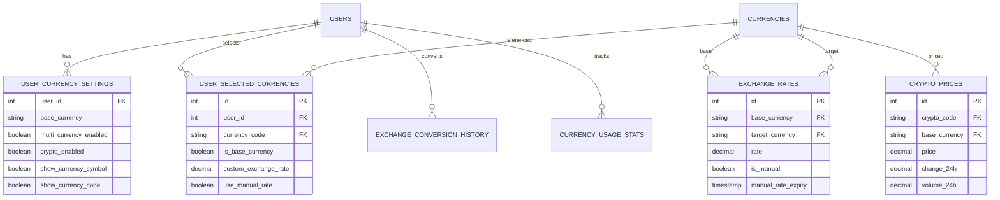

# 多币种功能 API 与数据库文档

## 目录
1. [API 接口说明](#api-接口说明)
2. [数据库表结构](#数据库表结构)
3. [数据关系图](#数据关系图)
4. [使用示例](#使用示例)

## API 接口说明

### 基础路径
```
BASE_URL: http://localhost:8012/api/v1
```

### 认证
所有API需要JWT Token认证
```
Authorization: Bearer <token>
```

---

### 1. 获取所有可用货币
**GET** `/currency/all`

#### 响应示例
```json
{
  "success": true,
  "data": [
    {
      "code": "USD",
      "name": "US Dollar",
      "name_zh": "美元",
      "symbol": "$",
      "decimal_places": 2,
      "is_crypto": false,
      "is_active": true,
      "flag": "🇺🇸",
      "country_code": "US",
      "is_popular": true,
      "display_order": 1,
      "min_amount": "0.01",
      "max_amount": "999999999"
    },
    {
      "code": "BTC",
      "name": "Bitcoin",
      "name_zh": "比特币",
      "symbol": "₿",
      "decimal_places": 8,
      "is_crypto": true,
      "is_active": true,
      "flag": null,
      "country_code": null,
      "is_popular": true,
      "display_order": 100
    }
  ]
}
```

---

### 2. 获取用户货币设置
**GET** `/currency/settings`

#### 响应示例
```json
{
  "success": true,
  "data": {
    "user_id": 1,
    "base_currency": "CNY",
    "multi_currency_enabled": true,
    "crypto_enabled": true,
    "show_currency_symbol": true,
    "show_currency_code": true,
    "auto_update_rates": true,
    "rate_update_frequency": 15,
    "crypto_update_frequency": 5,
    "selected_currencies": ["CNY", "USD", "EUR", "BTC"],
    "last_updated": "2025-09-08T10:30:00Z"
  }
}
```

---

### 3. 更新用户货币设置
**PUT** `/currency/settings`

#### 请求体
```json
{
  "base_currency": "USD",
  "multi_currency_enabled": true,
  "crypto_enabled": true,
  "show_currency_symbol": true,
  "show_currency_code": false,
  "selected_currencies": ["USD", "EUR", "GBP", "BTC", "ETH"]
}
```

#### 响应
```json
{
  "success": true,
  "data": {
    "message": "Settings updated successfully"
  }
}
```

---

### 4. 获取汇率
**GET** `/currency/rates`

#### 查询参数
- `base`: 基础货币代码（可选，默认用户基础货币）

#### 响应示例
```json
{
  "success": true,
  "data": [
    {
      "id": 1,
      "base_currency": "USD",
      "target_currency": "EUR",
      "rate": "0.85",
      "is_manual": false,
      "manual_rate_expiry": null,
      "source": "api",
      "confidence_level": "100.00",
      "last_updated": "2025-09-08T10:00:00Z"
    },
    {
      "id": 2,
      "base_currency": "USD",
      "target_currency": "CNY",
      "rate": "7.25",
      "is_manual": true,
      "manual_rate_expiry": "2025-09-09T00:00:00Z",
      "source": "manual",
      "confidence_level": "100.00",
      "last_updated": "2025-09-08T09:30:00Z"
    }
  ]
}
```

---

### 5. 设置手动汇率
**POST** `/currency/rates/manual`

#### 请求体
```json
{
  "target_currency": "EUR",
  "rate": "0.86",
  "expiry_days": 1
}
```

#### 响应
```json
{
  "success": true,
  "data": {
    "message": "Manual exchange rate set successfully",
    "expiry": "2025-09-09T00:00:00Z"
  }
}
```

---

### 6. 获取加密货币价格
**GET** `/currency/crypto/prices`

#### 响应示例
```json
{
  "success": true,
  "data": [
    {
      "crypto_code": "BTC",
      "base_currency": "USD",
      "price": "45000.00",
      "price_24h_ago": "44000.00",
      "change_24h": "2.27",
      "change_7d": "5.12",
      "change_30d": "-3.45",
      "volume_24h": "28500000000",
      "market_cap": "880000000000",
      "is_manual": false,
      "last_updated": "2025-09-08T10:00:00Z"
    }
  ]
}
```

---

### 7. 货币转换
**POST** `/currency/convert`

#### 请求体
```json
{
  "from_currency": "USD",
  "to_currency": "EUR",
  "amount": "100.00"
}
```

#### 响应
```json
{
  "success": true,
  "data": {
    "from_currency": "USD",
    "to_currency": "EUR",
    "amount": "100.00",
    "converted_amount": "85.00",
    "exchange_rate": "0.85",
    "rate_source": "system",
    "timestamp": "2025-09-08T10:30:00Z"
  }
}
```

---

### 8. 获取转换历史
**GET** `/currency/history`

#### 查询参数
- `limit`: 返回记录数（默认50）

#### 响应示例
```json
{
  "success": true,
  "data": [
    {
      "from_currency": "USD",
      "to_currency": "EUR",
      "amount": "100.00",
      "converted_amount": "85.00",
      "exchange_rate": "0.85",
      "conversion_date": "2025-09-08T10:30:00Z"
    }
  ]
}
```

---

### 9. 获取热门货币对
**GET** `/currency/popular-pairs`

#### 响应示例
```json
{
  "success": true,
  "data": [
    {
      "from_currency": "USD",
      "to_currency": "EUR",
      "usage_count": 156
    },
    {
      "from_currency": "CNY",
      "to_currency": "USD",
      "usage_count": 142
    }
  ]
}
```

---

## 数据库表结构

### 1. currencies（货币表）
```sql
CREATE TABLE currencies (
    code VARCHAR(10) PRIMARY KEY,
    name VARCHAR(100) NOT NULL,
    name_zh VARCHAR(100) NOT NULL,
    symbol VARCHAR(10) NOT NULL,
    decimal_places INTEGER DEFAULT 2,
    is_crypto BOOLEAN DEFAULT FALSE,
    is_active BOOLEAN DEFAULT TRUE,
    flag VARCHAR(10),
    country_code VARCHAR(2),
    is_popular BOOLEAN DEFAULT FALSE,
    display_order INTEGER DEFAULT 999,
    min_amount DECIMAL(20, 8) DEFAULT 0.01,
    max_amount DECIMAL(20, 8) DEFAULT 999999999,
    created_at TIMESTAMPTZ DEFAULT CURRENT_TIMESTAMP,
    updated_at TIMESTAMPTZ DEFAULT CURRENT_TIMESTAMP
);
```

### 2. user_currency_settings（用户货币设置表）
```sql
CREATE TABLE user_currency_settings (
    user_id INTEGER PRIMARY KEY REFERENCES users(id),
    base_currency VARCHAR(10) NOT NULL DEFAULT 'USD',
    multi_currency_enabled BOOLEAN DEFAULT FALSE,
    crypto_enabled BOOLEAN DEFAULT FALSE,
    show_currency_symbol BOOLEAN DEFAULT TRUE,
    show_currency_code BOOLEAN DEFAULT TRUE,
    auto_update_rates BOOLEAN DEFAULT TRUE,
    rate_update_frequency INTEGER DEFAULT 15,
    crypto_update_frequency INTEGER DEFAULT 5,
    last_updated TIMESTAMPTZ DEFAULT CURRENT_TIMESTAMP
);
```

### 3. exchange_rates（汇率表）
```sql
CREATE TABLE exchange_rates (
    id SERIAL PRIMARY KEY,
    base_currency VARCHAR(10) NOT NULL,
    target_currency VARCHAR(10) NOT NULL,
    rate DECIMAL(20, 10) NOT NULL,
    is_manual BOOLEAN DEFAULT FALSE,
    manual_rate_expiry TIMESTAMPTZ,
    source VARCHAR(50) DEFAULT 'auto',
    confidence_level DECIMAL(5, 2) DEFAULT 100.00,
    last_updated TIMESTAMPTZ DEFAULT CURRENT_TIMESTAMP,
    created_at TIMESTAMPTZ DEFAULT CURRENT_TIMESTAMP,
    UNIQUE(base_currency, target_currency)
);
```

### 4. crypto_prices（加密货币价格表）
```sql
CREATE TABLE crypto_prices (
    id SERIAL PRIMARY KEY,
    crypto_code VARCHAR(10) NOT NULL,
    base_currency VARCHAR(10) NOT NULL DEFAULT 'USD',
    price DECIMAL(20, 8) NOT NULL,
    price_24h_ago DECIMAL(20, 8),
    price_7d_ago DECIMAL(20, 8),
    price_30d_ago DECIMAL(20, 8),
    volume_24h DECIMAL(20, 2),
    market_cap DECIMAL(20, 2),
    change_24h DECIMAL(10, 4),
    change_7d DECIMAL(10, 4),
    change_30d DECIMAL(10, 4),
    is_manual BOOLEAN DEFAULT FALSE,
    manual_price_expiry TIMESTAMPTZ,
    source VARCHAR(50) DEFAULT 'api',
    last_updated TIMESTAMPTZ DEFAULT CURRENT_TIMESTAMP,
    UNIQUE(crypto_code, base_currency)
);
```

### 5. user_selected_currencies（用户选择的货币）
```sql
CREATE TABLE user_selected_currencies (
    id SERIAL PRIMARY KEY,
    user_id INTEGER NOT NULL REFERENCES users(id),
    currency_code VARCHAR(10) NOT NULL,
    is_base_currency BOOLEAN DEFAULT FALSE,
    custom_exchange_rate DECIMAL(20, 10),
    use_manual_rate BOOLEAN DEFAULT FALSE,
    display_order INTEGER DEFAULT 999,
    is_favorite BOOLEAN DEFAULT FALSE,
    added_at TIMESTAMPTZ DEFAULT CURRENT_TIMESTAMP,
    UNIQUE(user_id, currency_code)
);
```

### 6. exchange_conversion_history（汇率转换历史）
```sql
CREATE TABLE exchange_conversion_history (
    id SERIAL PRIMARY KEY,
    user_id INTEGER REFERENCES users(id),
    from_currency VARCHAR(10) NOT NULL,
    to_currency VARCHAR(10) NOT NULL,
    amount DECIMAL(20, 8) NOT NULL,
    converted_amount DECIMAL(20, 8) NOT NULL,
    exchange_rate DECIMAL(20, 10) NOT NULL,
    conversion_date TIMESTAMPTZ DEFAULT CURRENT_TIMESTAMP,
    ip_address INET,
    device_info JSONB
);
```

### 7. currency_usage_stats（货币使用统计）
```sql
CREATE TABLE currency_usage_stats (
    id SERIAL PRIMARY KEY,
    user_id INTEGER REFERENCES users(id),
    currency_code VARCHAR(10) NOT NULL,
    usage_count INTEGER DEFAULT 0,
    last_used TIMESTAMPTZ DEFAULT CURRENT_TIMESTAMP,
    total_amount_converted DECIMAL(20, 2) DEFAULT 0,
    UNIQUE(user_id, currency_code)
);
```

---

## 数据关系图



---

## 使用示例

### 1. 初始化用户货币设置
```rust
// Rust后端
async fn initialize_user_currency(user_id: i32, country_code: &str) {
    let base_currency = match country_code {
        "CN" => "CNY",
        "US" => "USD",
        "GB" => "GBP",
        _ => "USD"
    };
    
    sqlx::query!(
        "INSERT INTO user_currency_settings (user_id, base_currency) 
         VALUES ($1, $2)",
        user_id,
        base_currency
    )
    .execute(&pool)
    .await?;
}
```

### 2. 获取用户汇率（考虑手动设置）
```sql
-- SQL函数
CREATE OR REPLACE FUNCTION get_user_rate(
    p_user_id INTEGER,
    p_from VARCHAR,
    p_to VARCHAR
) RETURNS DECIMAL AS $$
BEGIN
    -- 优先返回手动设置的有效汇率
    RETURN COALESCE(
        (SELECT rate FROM exchange_rates 
         WHERE base_currency = p_from 
           AND target_currency = p_to
           AND is_manual = true
           AND manual_rate_expiry > CURRENT_TIMESTAMP
         LIMIT 1),
        -- 否则返回自动汇率
        (SELECT rate FROM exchange_rates 
         WHERE base_currency = p_from 
           AND target_currency = p_to
           AND is_manual = false
         ORDER BY last_updated DESC
         LIMIT 1),
        1.0
    );
END;
$$ LANGUAGE plpgsql;
```

### 3. Flutter前端调用示例
```dart
// 获取货币设置
Future<CurrencySettings> getUserSettings() async {
  final response = await apiService.get('/currency/settings');
  return CurrencySettings.fromJson(response['data']);
}

// 转换货币
Future<ConversionResult> convertCurrency({
  required String from,
  required String to,
  required double amount,
}) async {
  final response = await apiService.post('/currency/convert', {
    'from_currency': from,
    'to_currency': to,
    'amount': amount.toString(),
  });
  return ConversionResult.fromJson(response['data']);
}

// 设置手动汇率
Future<void> setManualRate({
  required String targetCurrency,
  required double rate,
  int expiryDays = 1,
}) async {
  await apiService.post('/currency/rates/manual', {
    'target_currency': targetCurrency,
    'rate': rate.toString(),
    'expiry_days': expiryDays,
  });
}
```

---

## 性能优化建议

### 1. 索引优化
```sql
-- 关键查询索引
CREATE INDEX idx_exchange_rates_lookup 
ON exchange_rates(base_currency, target_currency, is_manual, last_updated DESC);

CREATE INDEX idx_user_currencies_lookup 
ON user_selected_currencies(user_id, is_base_currency);

CREATE INDEX idx_conversion_history_user 
ON exchange_conversion_history(user_id, conversion_date DESC);
```

### 2. 缓存策略
```rust
// Redis缓存键设计
const CACHE_EXCHANGE_RATES: &str = "rates:{base}:{target}";
const CACHE_CRYPTO_PRICES: &str = "crypto:{code}:{base}";
const CACHE_USER_SETTINGS: &str = "user:settings:{user_id}";

// 缓存过期时间
const RATE_CACHE_TTL: u64 = 900;  // 15分钟
const CRYPTO_CACHE_TTL: u64 = 300; // 5分钟
const SETTINGS_CACHE_TTL: u64 = 3600; // 1小时
```

### 3. 批量操作
```rust
// 批量更新汇率
async fn batch_update_rates(rates: Vec<RateUpdate>) {
    let mut tx = pool.begin().await?;
    
    for rate in rates {
        sqlx::query!(
            "INSERT INTO exchange_rates (base_currency, target_currency, rate) 
             VALUES ($1, $2, $3)
             ON CONFLICT (base_currency, target_currency) 
             DO UPDATE SET rate = $3, last_updated = CURRENT_TIMESTAMP
             WHERE exchange_rates.is_manual = false",
            rate.base,
            rate.target,
            rate.value
        )
        .execute(&mut tx)
        .await?;
    }
    
    tx.commit().await?;
}
```

---

## 错误处理

### API错误码
| 错误码 | 说明 | HTTP状态码 |
|--------|------|------------|
| CURRENCY_NOT_FOUND | 货币不存在 | 404 |
| RATE_NOT_AVAILABLE | 汇率不可用 | 404 |
| CRYPTO_NOT_ALLOWED | 地区不支持加密货币 | 403 |
| INVALID_AMOUNT | 金额无效 | 400 |
| RATE_UPDATE_FAILED | 汇率更新失败 | 500 |
| SETTINGS_NOT_FOUND | 用户设置未找到 | 404 |

### 错误响应示例
```json
{
  "success": false,
  "error": {
    "code": "CRYPTO_NOT_ALLOWED",
    "message": "Cryptocurrency is not allowed in your region",
    "details": {
      "country_code": "IR",
      "restricted": true
    }
  }
}
```

---

## 安全性

### 1. 权限控制
- 所有API需要JWT认证
- 用户只能访问自己的数据
- 管理员可批量更新汇率

### 2. 数据验证
- 汇率必须为正数
- 金额范围检查
- 货币代码验证

### 3. 限流策略
- 汇率更新: 100次/分钟
- 货币转换: 1000次/小时
- 设置更新: 10次/分钟

---

## 监控指标

### 关键指标
1. **汇率更新成功率**: > 99%
2. **API响应时间**: < 200ms (P95)
3. **缓存命中率**: > 80%
4. **转换准确率**: 100%

### 监控SQL
```sql
-- 每日转换统计
SELECT 
    DATE(conversion_date) as date,
    COUNT(*) as total_conversions,
    COUNT(DISTINCT user_id) as unique_users,
    AVG(amount) as avg_amount
FROM exchange_conversion_history
WHERE conversion_date > CURRENT_DATE - INTERVAL '30 days'
GROUP BY DATE(conversion_date)
ORDER BY date DESC;

-- 热门货币统计
SELECT 
    currency_code,
    COUNT(*) as selection_count,
    COUNT(DISTINCT user_id) as users_count
FROM user_selected_currencies
GROUP BY currency_code
ORDER BY selection_count DESC
LIMIT 20;
```

---

## 版本历史

| 版本 | 日期 | 更新内容 |
|------|------|----------|
| 1.0.0 | 2025-09-08 | 初始版本，基础多币种功能 |
| 1.1.0 | 待定 | 添加汇率走势图表 |
| 1.2.0 | 待定 | 支持自定义汇率提供商 |