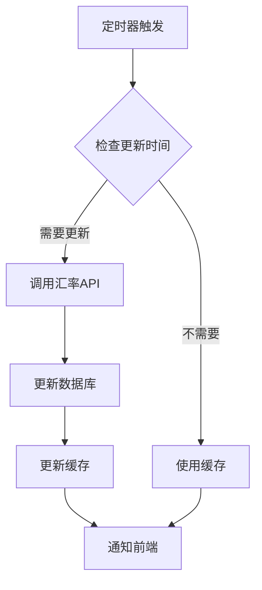
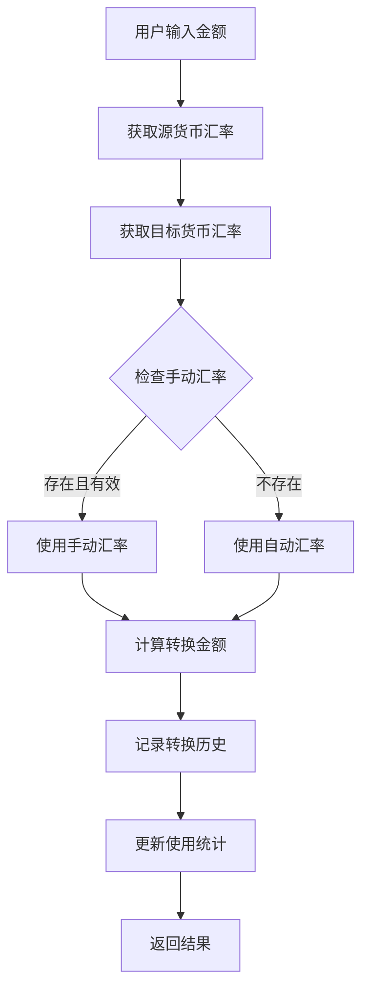

# 多币种功能设计文档

## 目录
1. [功能概述](#功能概述)
2. [系统架构](#系统架构)
3. [核心功能](#核心功能)
4. [用户界面设计](#用户界面设计)
5. [数据流程](#数据流程)
6. [安全性考虑](#安全性考虑)
7. [性能优化](#性能优化)

## 功能概述

Jive Money 多币种功能为用户提供全面的多货币管理解决方案，支持137种法定货币和21种主流加密货币，满足全球用户的财务管理需求。

### 主要特性
- ✅ **全球货币支持**: 支持158种货币（137法定+21加密）
- ✅ **实时汇率**: 自动获取并更新汇率
- ✅ **手动汇率设置**: 支持自定义汇率和有效期
- ✅ **智能货币转换**: 内置汇率转换器
- ✅ **地区合规**: 根据用户地区限制加密货币
- ✅ **灵活显示**: 可选货币符号/代码显示
- ✅ **使用统计**: 追踪货币使用频率

## 系统架构

### 技术栈
```
前端: Flutter + Riverpod
后端: Rust + Actix-web
数据库: PostgreSQL
缓存: Redis
汇率API: ExchangeRate-API / CoinGecko
```

### 架构图
```
┌─────────────────────────────────────────────────────────┐
│                     Flutter 前端                         │
│  ┌──────────────┐  ┌──────────────┐  ┌──────────────┐  │
│  │ 货币设置页面  │  │ 货币选择页面  │  │ 汇率转换器   │  │
│  └──────────────┘  └──────────────┘  └──────────────┘  │
└─────────────────────────┬───────────────────────────────┘
                          │ HTTP/REST
┌─────────────────────────▼───────────────────────────────┐
│                    Rust API 层                           │
│  ┌──────────────┐  ┌──────────────┐  ┌──────────────┐  │
│  │ 认证中间件    │  │ 汇率服务     │  │ 货币服务     │  │
│  └──────────────┘  └──────────────┘  └──────────────┘  │
└─────────────────────────┬───────────────────────────────┘
                          │ SQL
┌─────────────────────────▼───────────────────────────────┐
│                   PostgreSQL 数据库                      │
│  ┌──────────────┐  ┌──────────────┐  ┌──────────────┐  │
│  │ currencies   │  │exchange_rates│  │ crypto_prices│  │
│  └──────────────┘  └──────────────┘  └──────────────┘  │
└──────────────────────────────────────────────────────────┘
```

## 核心功能

### 1. 基础货币设置
**位置**: 设置页面第一行

#### 功能说明
- 用户可选择任意已启用货币作为基础货币
- 所有金额统计以基础货币为准
- 更换基础货币时显示警告提示

#### 更换提示内容
```
更换基础货币注意事项：
1. 已有币种转换的账单保留原转换单位
2. 无币种转换的账单以新币种显示
3. 所有统计数据以新基础货币汇总
请谨慎更换！
```

### 2. 多币种模式
**位置**: 设置页面第二行

#### 启用条件
- 默认关闭，用户手动开启
- 开启后显示"启用加密货币"选项

#### 功能特性
- 单币种模式：只能选择一种货币
- 多币种模式：可选择多种货币进行管理

### 3. 加密货币支持
**显示条件**: 多币种模式开启后

#### 地区限制
不支持加密货币的国家/地区：
- 朝鲜 (KP)
- 伊朗 (IR)
- 古巴 (CU)
- 叙利亚 (SY)
- 苏丹 (SD)

#### 支持的加密货币
```
主流币种: BTC, ETH, USDT, USDC, BNB
DeFi代币: UNI, AAVE, COMP, MKR, SUSHI
Layer 2: MATIC, ARB, OP
其他: XRP, ADA, SOL, DOT, DOGE, SHIB, AVAX, LINK, LTC, TRX
```

### 4. 货币管理页面

#### 4.1 法定货币管理
**功能列表**:
- 搜索货币（代码/名称/符号）
- 显示国旗/货币信息
- 基础货币始终置顶
- 已选货币优先显示
- 手动/自动汇率切换
- 汇率有效期设置

#### 4.2 加密货币管理
**功能列表**:
- 搜索加密货币
- 显示币种图标/信息
- 实时价格更新（5分钟）
- 24h/7d/30d涨跌幅
- 市值/交易量显示

### 5. 汇率管理

#### 自动更新
- 法定货币：15分钟更新
- 加密货币：5分钟更新
- 页面打开时自动获取

#### 手动设置
- 支持自定义汇率
- 设置有效期（默认至次日UTC 00:00）
- 手动汇率优先级高于自动

### 6. 显示设置

#### 显示选项
- [ ] 显示货币符号
- [ ] 显示货币代码

#### 显示效果
- 仅符号: ¥1,234.56
- 仅代码: 1,234.56 CNY
- 双显示: ¥1,234.56 CNY

### 7. 汇率转换器

#### 功能特性
- 实时转换计算
- 货币快速切换
- 转换历史记录（最近10条）
- 热门货币对推荐

## 用户界面设计

### 主设置页面布局
```
┌──────────────────────────────┐
│ 🌟 基础货币                   │
│ ┌────────────────────────┐   │
│ │ 🇨🇳 CNY 人民币 ¥        │ > │
│ └────────────────────────┘   │
├──────────────────────────────┤
│ 🌍 启用多币种          [开关] │
│ ├─ 💰 启用加密货币    [开关] │
├──────────────────────────────┤
│ 💼 已选货币 (5)               │
│ ├─ 管理法定货币          >   │
│ ├─ 管理加密货币          >   │
├──────────────────────────────┤
│ 👁️ 显示设置                   │
│ ├─ ☑ 显示货币符号            │
│ ├─ ☑ 显示货币代码            │
├──────────────────────────────┤
│ 🔄 汇率管理                   │
│ ├─ [自动更新] [手动设置]      │
│ ├─ 汇率转换器           >    │
└──────────────────────────────┘
```

### 货币选择页面布局
```
┌──────────────────────────────┐
│ 🔍 搜索货币...                │
├──────────────────────────────┤
│ ℹ️ 勾选要使用的货币           │
├──────────────────────────────┤
│ ┌────────────────────────┐   │
│ │ 🇨🇳 CNY ¥ 人民币   [基础]│ ☑ │
│ └────────────────────────┘   │
│ ┌────────────────────────┐   │
│ │ 🇺🇸 USD $ 美元         │ ☑ │
│ │ └─ 汇率: 1 CNY = 0.14  │   │
│ │   [自动] [手动] [保存]  │   │
│ └────────────────────────┘   │
│ ┌────────────────────────┐   │
│ │ 🇪🇺 EUR € 欧元         │ ☐ │
│ └────────────────────────┘   │
└──────────────────────────────┘
```

## 数据流程

### 汇率更新流程


### 货币转换流程


## 安全性考虑

### 1. 地区合规
- 根据用户IP/注册地区自动判断
- 限制地区无法启用加密货币
- 遵守当地金融法规

### 2. 数据安全
- 汇率数据加密传输
- 用户偏好设置加密存储
- API调用限流保护

### 3. 防欺诈
- 异常汇率检测
- 大额转换警告
- 操作日志记录

## 性能优化

### 1. 缓存策略
```
- Redis缓存汇率数据
- 本地缓存用户偏好
- 智能预加载常用货币
```

### 2. 数据库优化
```sql
-- 关键索引
CREATE INDEX idx_exchange_rates_lookup 
ON exchange_rates(base_currency, target_currency, is_manual);

CREATE INDEX idx_user_currencies 
ON user_selected_currencies(user_id, is_base_currency);
```

### 3. API优化
- 批量请求汇率
- 增量更新机制
- WebSocket实时推送

## 未来扩展

### 第二阶段功能
- [ ] 汇率走势图表
- [ ] 汇率变动提醒
- [ ] 多账户币种管理
- [ ] 导入/导出汇率数据

### 第三阶段功能
- [ ] AI汇率预测
- [ ] 自定义汇率提供商
- [ ] 跨境支付集成
- [ ] 多语言货币名称

## 测试要点

### 功能测试
1. 基础货币切换
2. 多币种启用/禁用
3. 加密货币地区限制
4. 手动汇率设置
5. 汇率转换准确性

### 性能测试
1. 大量货币加载
2. 频繁汇率更新
3. 并发转换请求
4. 缓存命中率

### 兼容性测试
1. 不同屏幕尺寸
2. 多语言显示
3. 离线功能
4. 低网速环境

## 相关文档
- [API接口文档](./multi-currency-api.md)
- [数据库设计文档](./multi-currency-database.md)
- [用户使用指南](./multi-currency-user-guide.md)