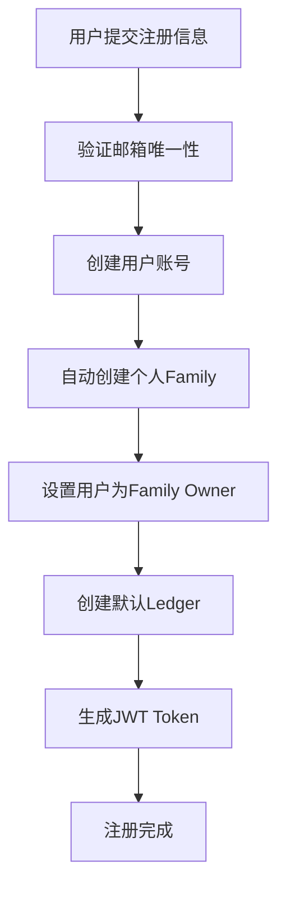
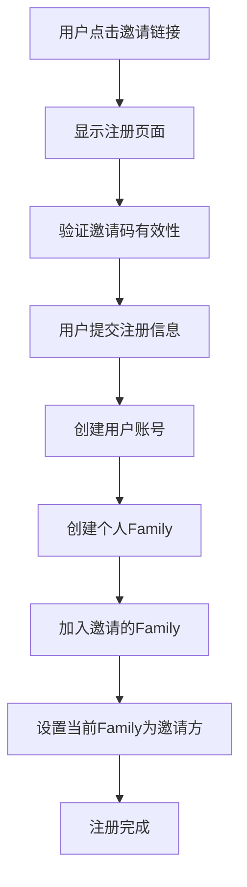
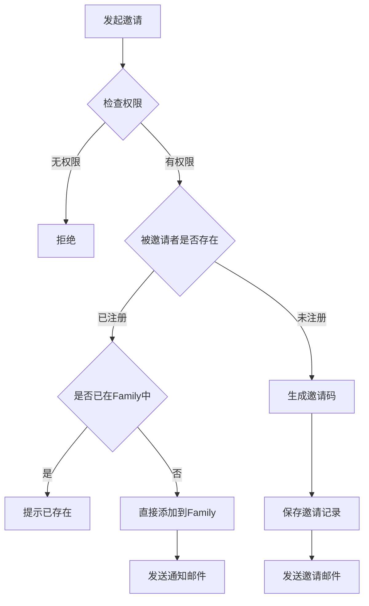

# Jive 用户角色模型逻辑设计

## 📋 概述

本文档定义了 Jive 系统中的用户角色模型、Family 管理逻辑、权限体系和邀请机制。系统采用多租户架构，每个用户可以属于多个 Family，在不同 Family 中拥有不同的角色和权限。

## 🎯 核心设计原则

1. **每个用户都有个人 Family**
   - 用户注册时自动创建个人 Family
   - 用户是个人 Family 的 Owner
   - 个人 Family 不可删除，随用户账号一起销毁

2. **用户可属于多个 Family**
   - 一个用户可以加入多个 Family
   - 在不同 Family 中可以有不同角色
   - 可以在 Family 之间自由切换

3. **邀请机制智能化**
   - 自动识别被邀请者是否已注册
   - 已注册用户直接加入，未注册用户收到邀请链接
   - 支持邀请码和邀请链接两种方式

4. **角色权限继承**
   - 权限严格按照角色等级：Owner > Admin > Member > Viewer
   - 下级角色不能操作上级角色的权限
   - Owner 角色不可变更和删除

## 🔐 角色定义

### 系统级角色
仅用于系统管理，不参与 Family 内部权限

| 角色 | 说明 | 权限范围 |
|-----|------|----------|
| superadmin | 超级管理员 | 系统所有功能，包括管理其他用户 |
| admin | 系统管理员 | 管理系统配置，不能管理其他管理员 |
| user | 普通用户 | 使用系统功能，创建和管理自己的 Family |

### Family 级角色
用户在特定 Family 中的角色

| 角色 | 说明 | 获得方式 | 权限范围 |
|-----|------|----------|----------|
| Owner | 所有者 | 创建 Family 时自动成为 Owner | 所有权限，包括删除 Family |
| Admin | 管理员 | Owner 或其他 Admin 指定 | 除删除 Family 外的所有权限 |
| Member | 成员 | 默认邀请角色 | 查看和编辑数据，不能管理成员 |
| Viewer | 观察者 | 特别指定 | 只能查看数据，不能编辑 |

## 👤 用户注册流程

### 场景 1：自主注册（无邀请）



**代码实现逻辑**：
```rust
// 1. 创建用户
let user = User {
    id: Uuid::new_v4(),
    email: request.email,
    name: request.name,
    role: "user", // 系统角色
    ...
};

// 2. 创建个人 Family
let family = Family {
    id: Uuid::new_v4(),
    name: format!("{}的个人账本", user.name),
    owner_id: user.id,
    ...
};

// 3. 创建成员关系
let membership = FamilyMembership {
    user_id: user.id,
    family_id: family.id,
    role: FamilyRole::Owner,
    ...
};

// 4. 设置当前 Family
user.current_family_id = Some(family.id);
```

### 场景 2：通过邀请注册



**代码实现逻辑**：
```rust
// 1. 验证邀请
let invitation = verify_invitation(invite_code)?;

// 2. 创建用户和个人 Family（同场景1）
let user = create_user_with_personal_family(request);

// 3. 加入邀请的 Family
let invited_membership = FamilyMembership {
    user_id: user.id,
    family_id: invitation.family_id,
    role: invitation.role, // 邀请时指定的角色
    invited_by: Some(invitation.inviter_id),
    ...
};

// 4. 设置当前 Family 为邀请方
user.current_family_id = Some(invitation.family_id);
```

## 🤝 邀请机制

### 邀请流程



### 邀请权限规则

| 邀请者角色 | 可邀请的角色 | 说明 |
|-----------|-------------|------|
| Owner | Owner*, Admin, Member, Viewer | *需要特殊确认 |
| Admin | Admin, Member, Viewer | 不能邀请 Owner |
| Member | 无 | 不能邀请 |
| Viewer | 无 | 不能邀请 |

### 邀请码设计

```rust
pub struct Invitation {
    pub id: Uuid,
    pub family_id: Uuid,
    pub inviter_id: Uuid,
    pub invitee_email: String,
    pub role: FamilyRole,
    pub invite_code: String,      // 6-8位随机码
    pub invite_token: String,     // UUID for URL
    pub expires_at: DateTime<Utc>, // 默认7天
    pub status: InvitationStatus,
    pub created_at: DateTime<Utc>,
    pub accepted_at: Option<DateTime<Utc>>,
}

pub enum InvitationStatus {
    Pending,   // 待接受
    Accepted,  // 已接受
    Expired,   // 已过期
    Cancelled, // 已取消
}
```

## 🔑 权限矩阵

### 细粒度权限定义

```rust
pub enum Permission {
    // Family 管理
    ViewFamilyInfo,
    UpdateFamilyInfo,
    DeleteFamily,
    
    // 成员管理
    ViewMembers,
    InviteMembers,
    RemoveMembers,
    UpdateMemberRoles,
    
    // 账户权限
    ViewAccounts,
    CreateAccounts,
    EditAccounts,
    DeleteAccounts,
    
    // 交易权限
    ViewTransactions,
    CreateTransactions,
    EditTransactions,
    DeleteTransactions,
    BulkEditTransactions,
    
    // 分类权限
    ViewCategories,
    ManageCategories,
    
    // 预算权限
    ViewBudgets,
    ManageBudgets,
    
    // 报表权限
    ViewReports,
    ExportData,
    
    // 高级权限
    ViewAuditLog,
    ManageIntegrations,
    ManageSettings,
}
```

### 角色默认权限映射

| 权限 | Owner | Admin | Member | Viewer |
|------|-------|-------|---------|---------|
| **Family管理** |
| ViewFamilyInfo | ✅ | ✅ | ✅ | ✅ |
| UpdateFamilyInfo | ✅ | ✅ | ❌ | ❌ |
| DeleteFamily | ✅ | ❌ | ❌ | ❌ |
| **成员管理** |
| ViewMembers | ✅ | ✅ | ✅ | ✅ |
| InviteMembers | ✅ | ✅ | ❌ | ❌ |
| RemoveMembers | ✅ | ✅* | ❌ | ❌ |
| UpdateMemberRoles | ✅ | ✅* | ❌ | ❌ |
| **数据操作** |
| View* | ✅ | ✅ | ✅ | ✅ |
| Create* | ✅ | ✅ | ✅ | ❌ |
| Edit* | ✅ | ✅ | ✅ | ❌ |
| Delete* | ✅ | ✅ | ❌ | ❌ |
| **高级功能** |
| ExportData | ✅ | ✅ | ✅ | ❌ |
| ViewAuditLog | ✅ | ✅ | ❌ | ❌ |
| ManageSettings | ✅ | ✅ | ❌ | ❌ |

*Admin 不能操作 Owner 和其他 Admin

## 🔄 Family 切换机制

### 切换流程

```rust
pub async fn switch_family(
    user_id: Uuid,
    target_family_id: Uuid,
) -> Result<ServiceContext> {
    // 1. 验证用户是该 Family 的成员
    let membership = get_membership(user_id, target_family_id)?;
    if !membership.is_active {
        return Err("Membership is not active");
    }
    
    // 2. 更新用户的当前 Family
    update_user_current_family(user_id, target_family_id)?;
    
    // 3. 加载新的权限上下文
    let permissions = get_permissions_for_role(membership.role);
    
    // 4. 生成新的 JWT Token（包含新的 family_id 和权限）
    let new_token = generate_token_with_context(
        user_id,
        target_family_id,
        membership.role,
        permissions,
    );
    
    // 5. 返回新的上下文
    Ok(ServiceContext {
        user_id,
        family_id: target_family_id,
        role: membership.role,
        permissions,
        token: new_token,
    })
}
```

## 📊 典型使用场景

### 场景 1：个人理财用户
```
张三注册 → 自动创建"张三的个人账本"(Owner)
使用个人账本记录日常开支
无需邀请他人，独立使用
```

### 场景 2：家庭共同理财
```
1. 爸爸注册 → 创建"爸爸的个人账本"(Owner)
2. 爸爸创建"家庭账本" → 成为Owner
3. 爸爸邀请妈妈(Admin) → 妈妈可以管理账本
4. 爸爸邀请孩子(Member) → 孩子可以记账
5. 每个人都有：
   - 自己的个人账本(Owner)
   - 家庭账本(不同角色)
```

### 场景 3：小团队财务管理
```
1. 创始人注册 → 创建"公司账本"(Owner)
2. 邀请财务(Admin) → 全权管理
3. 邀请员工(Member) → 提交报销
4. 邀请老板(Viewer) → 只看报表
```

## 🔒 安全考虑

### 权限检查原则

1. **每个 API 请求都要检查权限**
   ```rust
   // 在 handler 层
   context.require_permission(Permission::CreateTransactions)?;
   ```

2. **数据查询自动加入 Family 过滤**
   ```rust
   // 在 repository 层
   query.filter(family_id.eq(context.family_id))
   ```

3. **防止越权操作**
   ```rust
   // 不能操作更高级别的角色
   if target_role >= operator_role {
       return Err("Cannot operate on higher or equal role");
   }
   ```

4. **敏感操作二次确认**
   - 删除 Family
   - 转移 Owner 权限
   - 批量删除数据

## 🚀 实施路线图

### Phase 1: 基础架构（第1-2天）
- ✅ 数据库结构调整
- ✅ 领域模型定义
- ✅ 基础服务框架

### Phase 2: 核心功能（第3-4天）
- ✅ 用户注册流程改造
- ✅ Family CRUD
- ✅ 基础邀请机制

### Phase 3: 权限系统（第5天）
- ✅ 权限中间件
- ✅ 角色权限映射
- ✅ API 权限保护

### Phase 4: 完善功能（第6-7天）
- ✅ Family 切换
- ✅ 智能邀请
- ✅ 数据隔离

### Phase 5: 测试优化（第8天）
- ✅ 单元测试
- ✅ 集成测试
- ✅ 文档完善

## 📝 注意事项

1. **向后兼容**
   - 现有用户数据需要迁移脚本
   - 为现有用户创建默认 Family

2. **性能优化**
   - Family 信息缓存
   - 权限缓存
   - 减少数据库查询

3. **用户体验**
   - 清晰的角色标识
   - 便捷的 Family 切换
   - 友好的邀请流程

---

**文档版本**: 1.0.0  
**更新日期**: 2025-09-03  
**作者**: Jive 开发团队